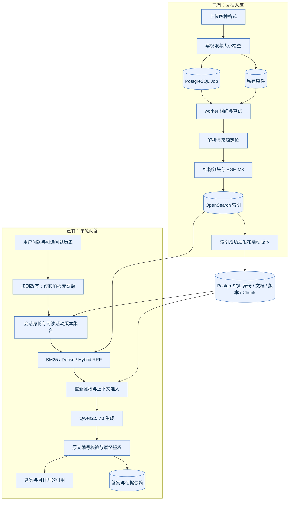
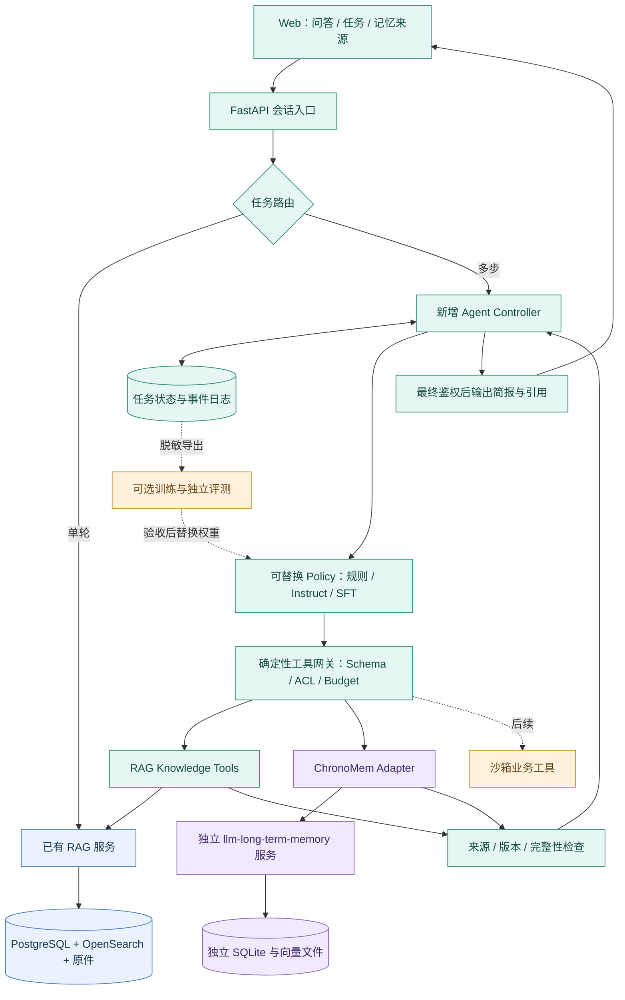
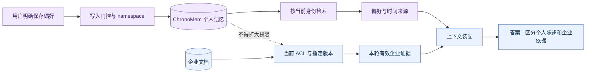
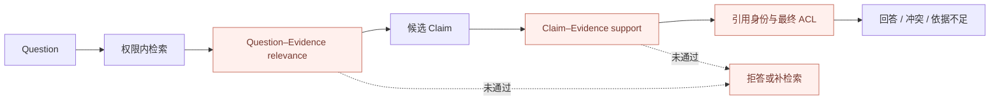
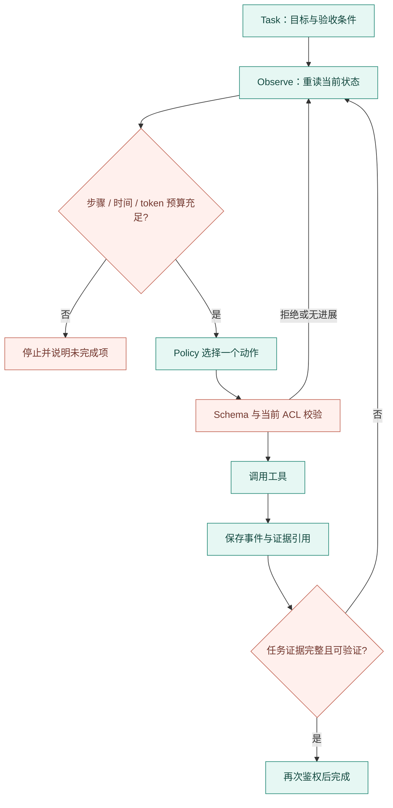
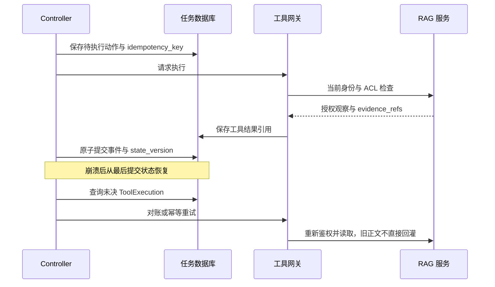
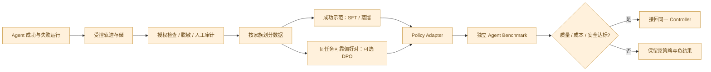
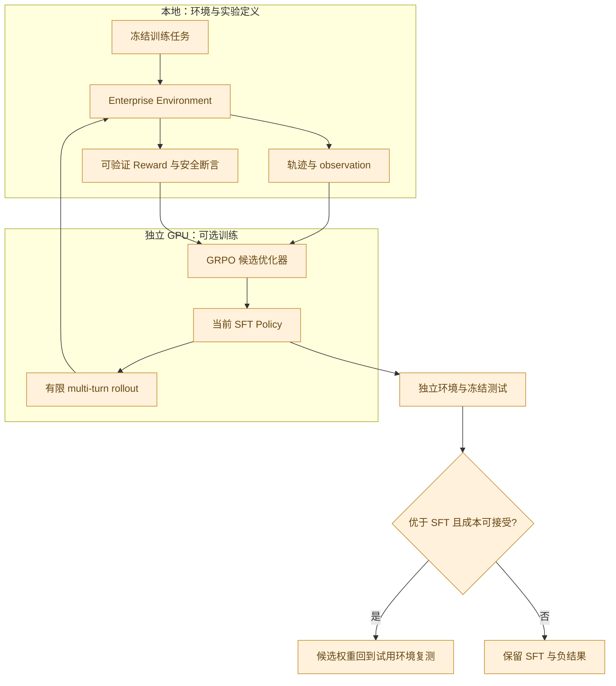
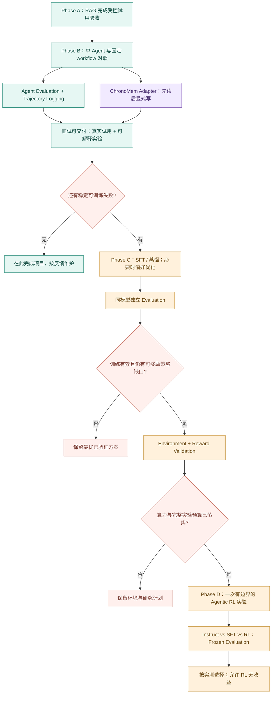

# Enterprise-RAG 未来演化规划

> **目标：做一个面试官可以试用、设计可以解释、实验可以复现的落地项目。**
>
> 推荐主线：完成可验证 RAG → 单 Agent 多步任务 → 接入独立长期记忆 → 受控试用。
> 研究支线：轨迹与评测 → 按失败类型选择 SFT / 蒸馏 / 偏好优化 → 有条件开展 Agentic RL。
>
> **复杂度必须由实测失败推动，而不是由技术名词推动。**

核查日期：2026-09-16。本文是未来设计，不是功能发布说明。除第 2 节明确标为已有的能力外，新增架构、接口、预算控制与验收门槛均为**未实现／待验证**。

## 1. 文档目的与边界

`PROJECT_PLAN.md` 继续记录当前 RAG 的实现、阶段状态和实验；本文仅负责演化方向、架构边界、阶段依赖和停止条件，不替代原计划，不复制开发日志。

本轮只新增本文，不实现功能、不修改现有代码、数据或原计划。仓库已有未提交修改，核查以当前工作树为准，而不是只看 Git HEAD。用户进一步明确：暂时不做商业产品。因此“Enterprise”指企业文档、权限、版本和任务场景；近期不建设企业 SaaS、全量管理后台或高可用平台。

**完成 Phase B 与记忆接入、拿到可靠对照和试用入口，就可以作为完整面试项目交付。** 后训练是可选研究成果，不应阻塞交付。熟悉 RL 是开展研究的优势，但不是采用 RL 的充分理由。

### 阅读导航

| 想了解什么 | 阅读位置 |
| --- | --- |
| 当前到底有什么、参考建议哪些已过时 | 第 2 节 |
| Agent、RAG、ChronoMem 怎么组合 | 第 3–5 节 |
| 先做什么、怎么实现到可试用 | 第 6–10、17、19 节 |
| SFT / RL 是否有必要 | 第 11–16、20 节 |
| 开源项目具体借鉴什么 | 第 18 节 |
| 最终依赖关系 | 第 21 节 |

图例：蓝色表示已有 RAG 基础；青色表示近期新增；紫色表示独立记忆系统；橙色表示可选研究；红色表示检查／停止。图中箭头表示数据流或依赖，不表示功能已经落地。所有图内嵌 Mermaid，无需新增图片文件。

## 2. 当前系统基线：以源码与 artifact 校正

### 2.1 核查范围与证据等级

核查覆盖根目录计划与中英文 README、`app/` 的解析／入库／检索／问答／授权／worker／评测实现、`web/src/` 与浏览器测试、`tests/`、`scripts/`、迁移与运行配置；同时核对 fixture 的划分及构造方式、开发集逐题结果、汇总与 S4 测试报告。未运行模型评测，未解封或逐题查看 holdout，未把依赖目录、二进制语料、历史截图当作源码通读。

证据优先级：**当前可执行源码 → 同配置逐题产物 → 汇总报告 → 计划／README 描述**。历史测试通过只证明对应快照，本轮不宣称重跑通过。外部项目查阅的是访问时默认分支的相关源码，不代表对整个项目做过审计，也不代表本项目已接入。

本地 HEAD 为 `3b5b3954fc4b7c3fccbedc32319f2fb2b7e15f87`，但工作树与该提交不同。本轮期间其他工作继续更新了改写接入和文档；以下状态按写稿后复核的工作树校正，不以初读时的中间状态作结论。关键文件 SHA-256 前 16 位如下，供识别本次阅读基线，不能代替未来完整 run fingerprint：

| 文件 | SHA-256 前缀 |
| --- | --- |
| `app/qa.py` | `a1cad7254aa95e36` |
| `app/clients.py` | `fb1e301cbc689fc5` |
| `app/security.py` | `5f9a5e33014f3683` |
| `app/ingestion.py` | `1a7aaa41b35fad44` |
| `scripts/run_s3_baseline.py` | `9923806f6a2a425d` |
| `scripts/run_s5_dialogues.py` | `1b77317f086e6b93` |
| `app/rewrite.py` | `105b92d670dc7692` |
| `app/config.py` | `ce204c2c18e05c12` |

### 2.2 实际阶段与重要修正

| 部分 | 当前核实结果 | 后续真正缺少什么 |
| --- | --- | --- |
| S0–S3 | 按现有阶段口径已完成；S3 有冻结输入与完整开发基线 | 独立人工复核、语义质量测量和最终 holdout 仍未完成；不能把 S3 完成理解为质量研究结束 |
| S4 | 进行中；PDF.js 高亮、证据抽屉、解析预览、检索 trace 已有实现；`artifacts/s4-tests.json` 记录 2 项通过、0 跳过 | 版本操作入口、剩余状态与交互回归。错误重试 UI 已有代码，但覆盖仍需验收 |
| S5 检索 | BM25 / Dense / Hybrid 均已实现；默认 `hybrid`；RRF 每路 depth=50、constant=60，最后返回 top_k | Reranker 及完整消融尚未实现 |
| S5-E1 改写 | A–D 各 160 轮检索实验已完成；后端 `/api/chat` 已接受 `history`，默认 `rule`，每次重算当前 ACL | 复核时 Web 提问仍只发送 question；浏览器端历史回放与多轮端到端验收仍待补齐，不能等同完整对话能力 |
| S6–S8 | 尚未整体完成 | 版本替换、删除清理、撤权与并发加固、发布评测及演示收尾；基础鉴权和任务租约并非待从零建设 |
| 评测恢复 | S3 已有逐题 JSONL、flush/fsync、输出锁、配置摘要、数据哈希、模型 digest、重复行检查和依赖重试 | 分片调度、坏尾行恢复、运行中源码隔离、完整环境指纹；S5 runner 仍以 `w` 打开结果且无同等 resume 机制 |
| 公开子集 | 已跑完 39 题 × 3 路，`artifacts/s3-public-summary.json` 为 complete | 英文散文 gold 的语义评分未完成；旧产物仍含已不适用的字面匹配统计 |
| Memory / Agent | 在线 RAG 支持可选问题历史驱动查询改写，服务端无状态；落库答案历史不回灌；无 Agent task loop / Working Memory / ChronoMem adapter | Agent 与独立长期记忆接入均属于未来新增 |

原计划仍有局部过时段落，例如“只走 dense”“公开子集未运行”“没有 Git 提交”；原建议中的“改写实现未开始”也已过时。中英文 README 已在并行工作中补入改写结果；本轮只在本文记录核查结论，不改写其他文件。`/api/system` 仍硬编码 `retrieval: dense`，应在 Phase A 收尾时与实际设置统一。

**解析栈校正**：文本型 PDF 的结构化路径使用 Docling，预检仍用 pypdf；DOCX 使用 python-docx，XLSX 使用 openpyxl，Markdown 使用自有结构解析。不能统称“四格式全部通过 Docling”。现有 PDF 坐标主要对应解析块，不能宣称已经精确高亮每条 claim 的字符范围。

**版本能力校正**：`DocumentVersion`、活动版本指针、索引后发布和旧引用 ID 已存在，但 `queue_document()` 当前构造新 `Document`，并非完整的“给现有文档追加版本”服务。没有版本列表／历史版本检索／比较工具；现有新旧政策样例也不等同于同一文档多版本生命周期已经验收。

### 2.3 数字及其有效边界

当前 `fixtures/s3-v2/split.json`：**165 份资料，227 题，147 development / 80 holdout**。三路运行产物完整，语义正确性和引用蕴含字段仍未测。

| 配置 | 文档 Recall@5，n=124 | 状态正确，n=147 | 字面事实覆盖，n=156 | 耗时中位数 / P95 |
| --- | --- | --- | --- | --- |
| BM25 | 0.984 | 124/147，84.4% | 132/156，84.6% | 18.08 / 40.06 秒 |
| Dense | 0.903 | 125/147，85.0% | 128/156，82.1% | 26.80 / 59.76 秒 |
| Hybrid | 0.935 | 131/147，89.1% | 139/156，89.1% | 24.45 / 45.68 秒 |

来源：`artifacts/s3-v2-hybrid-summary.json`、`artifacts/s3-v2-generated-summary.json` 及 `artifacts/s3-v2-generated/`。本轮从逐题布尔结果重算 BM25 vs Hybrid：不一致对为 7 : 14，McNemar exact **p=0.189247**。Hybrid 是 **best observed 的状态正确率**，不是 statistically proven better，更不是 89.1% 人工语义正确率。

还需修正两种过强表述：

- Hybrid 的 Recall@5 低于 BM25，但高于 Dense，并非“三者最低”；其延迟也高于 BM25，不能写成“所有维度均不差”。
- “四个证据槽位构成更好”是合理解释，但目前没有独立的 final-context gold span coverage 消融，不应把该机制写成已经证明的因果结论。

公开子集单列：Hybrid Recall@5=0.974，BM25 / Dense=0.897；状态正确分别为 33/39、33/39、29/39（Hybrid、BM25、Dense）。所有题在适配器中预期 `answered`，因此这更接近“可回答状态率”，不能代替答案正确率。39 道英文题不能与 147 道中文开发题混成一个显著性检验。旧 JSON 内 1/126 等字面覆盖值已不适用，不当作有效质量结果。

S5-E1 最新检索对照：A/B/C/D 整体 Recall@5 分别为 0.825 / 0.9875 / 0.825 / 0.94375；规则 B 优于 LLM-history D，已被选为后端默认。`artifacts/s5-rewrite-summary.json` 的 D 条件保真仍为原始字符串口径 13/20=65%；逐题检查可见六例只去掉空格，原计划按归一化口径修正为 19/20=95%，真正遗漏一例。应统一 scorer 与产物，保留口径变更说明。当前仅是检索侧实验，不能据此宣称所有多轮答案质量已提升，或模型改写在一般场景没有价值。

### 2.4 已有架构



生成阶段跨文档时可能额外调用一次同一个模型核对冲突；不是每次问答都只有一次 LLM 调用。当前 `cl100k_base` 只估算证据预算，不是 Qwen 的实际 tokenizer，也不是整份 prompt 的硬上限。

## 3. 为什么演化到 Agent，以及演化到哪里就够了

单轮 RAG 适合“资料里怎么规定”；Agent 的增量在于：根据中间结果决定还缺什么、调用下一工具、处理失败、检查任务是否完成。增加聊天历史或将一次检索包成 tool，并不自动得到可靠的多步 Agent。

首版收敛成三个可解释场景：

| 场景 | 交付价值 | 必要能力 |
| --- | --- | --- |
| 政策变更分析 | 比较当前与上一版恢复政策，列出改变与引用 | 版本工具、差异计算、当前 ACL |
| 多资料排查简报 | 根据政策与几份虚构支持工单归纳问题、缺口和建议 | 多步检索、证据完整性、有限停止 |
| 有记忆的任务助手 | 记住“我负责支持、偏好简短清单”，新会话调整输出，并展示偏好变更时间线 | 独立长期记忆、来源标签、跨会话隔离 |

建议首版生成可复制的简报／行动草案。随后最多加入一个沙箱 action，例如在本项目虚构工单表创建草稿；先预览、再由用户确认。发邮件、改真实业务数据库、任意代码执行均不在首版范围。

**RL 暂时没有必要成为主线**：检索缺失、权限漏洞、版本错误、评测器错误、记忆抽取损失，都应先修对应系统。只有“工具与证据已足够，模型仍持续选择错误动作／停止时机”才是值得研究的 policy gap。

## 4. 总体未来架构：Agent 使用 RAG



第一版仍是一个 FastAPI 应用加现有 worker／数据服务，新增 Agent task 执行器；不因为画了模块就拆成多个微服务。ChronoMem 独立进程与独立依赖环境，避免与现有 Python／模型库绑定。RAG 单轮入口始终保留，训练系统不进入在线请求链。

## 5. Memory 边界与 ChronoMem 接入

### 5.1 四种信息，各自只有一个职责

| 信息层 | 回答的问题 | 保存什么 | 不允许承担的职责 |
| --- | --- | --- | --- |
| Conversation Context | 用户这一句省略了什么？ | 同会话最近 N=3 轮问题文本，限长、可丢弃 | 旧答案或旧证据不能成为本轮可信知识 |
| Working Memory | 任务做到哪一步？ | goal、步骤、待执行动作、失败状态、证据 ID 与依赖 | 不进入个人长期向量库 |
| Enterprise-RAG | 企业文件实际写了什么？ | 文档、版本、ACL、原件、可定位证据 | 不存推测出来的个人事实 |
| ChronoMem | 用户过去说过什么、如何变化？ | 跨会话个人事实、偏好、有效区间、原始对话来源 | 不授予企业文档访问权，不代替当前政策 |

查询改写后仍重新检索与鉴权；规则改写当前只是拼接上一问，可能污染换题，不能把“无需模型”误当作“无需实验”。不再建设一个短期向量记忆系统。

### 5.2 外部项目已实现什么，接入还缺什么

仓库正式名是 [`llm-long-term-memory`](https://github.com/Mingjie-Mao/llm-long-term-memory)，本文沿用讨论中的 ChronoMem 指代它。它已有长期事实检索、时间更新与来源恢复、REST 与 MCP；并没有本项目的 Agent Working Memory。其 README 明确区分线上服务与 playground，后者不能冒充完整 LLM 抽取／回答链。[项目说明](https://github.com/Mingjie-Mao/llm-long-term-memory#interfaces)

当前 `MemoryService` 统一资源与领域逻辑，使用 SQLite 与独立 NumPy 向量文件，并以进程内锁串行写入；读取与 live extractor／answerer 是不同依赖路径。该结构适合通过 adapter 复用，不适合把数据库直接并入 PostgreSQL，也不应让每个 Agent tool 重新加载 embedder。[服务源码](https://github.com/Mingjie-Mao/llm-long-term-memory/blob/main/src/llm_long_term_memory/api/service.py)

REST 已有身份解析入口；README 说明配置 token 后 namespace 由凭证约束，未配置时允许开放 namespace，MCP HTTP 不具备等价身份边界。面试联调优先 **私网 REST + 服务端身份映射**；不向浏览器暴露 Memory token，不让模型自填 `user_id`。[API 源码](https://github.com/Mingjie-Mao/llm-long-term-memory/blob/main/src/llm_long_term_memory/api/app.py)

### 5.3 Adapter 契约（未实现）

| 本项目逻辑工具 | 对应现有 REST | 接入约束 |
| --- | --- | --- |
| `retrieve_memory(query, limit)` | `POST /v1/memories/search` | 由网关注入 namespace；返回 ID、来源、有效期与受限文本 |
| `timeline(subject, predicate)` | `GET /v1/timeline` | 用户偏好／状态沿革，不是政策版本时间线 |
| `remember(user_statement, idempotency_key)` | `POST /v1/messages` | 只写用户明确要求保存的陈述；默认不写 Agent 输出 |
| `forget(memory_id)` | `DELETE /v1/memories/{id}` | 区分标记移除与完整删除；不承诺删除备份 |

MCP 原有名字是 `search_memory`、`search_conversations`、`get_timeline`、`remember`、`forget`，不是把建议中的伪接口名当成现成 SDK。首版不调用 `/v1/answer` 再让 Agent 重答一遍，优先只读取事实，减少额外生成开销。

服务端维护 `(tenant_id, user_id) → opaque memory_namespace` 映射，小规模试用可逐 namespace 配置凭证。`scope`、记忆里的“我是管理员”等模型抽取字段都不是授权依据。退出／切换租户时清除本地会话缓存。



### 5.4 接入顺序、成本与验收

1. **B-M1 只读联调**：使用与企业 fixture 同样虚构、单独准备的少量个人资料；比较无记忆／有记忆是否改善偏好遵循与时间问答。不能把 LongMemEval 研究数据库直接拿来做面试试用。
2. **B-M2 显式写入**：展示“保存了什么、来源是什么、如何删除”；跨会话更新偏好并核对旧事实不再冒充当前状态。
3. **B-M3 故障与污染**：错误记忆、无关记忆、同名跨租户、服务不可用、过期事实、注入语句；个人偏好缺失可降级，依赖历史事实的任务必须报告不足。

零 API 预算与 live write 存在实际约束：当前服务的 live 抽取依赖外部模型凭证，不能承诺接入后免费完成写入。先交付已准备数据的真实检索与时间线；如必须零费用 live write，再在独立记忆项目增加本地 extractor adapter 并单独评测。playground 规则写入只可标为“受限句式演示”。有外部免费额度时也必须配置本地调用硬上限，不能默认无限使用。

记忆集成从 20 个虚构跨会话场景开始，每个包括无记忆、有记忆、错误／过期记忆三个条件；额外记录抽取调用数、去重调用数、读取延迟、写入延迟、总 token。上线前身份隔离与删除后重读硬回归必须全部通过，偏好遵循收益不得以事实错误增加为代价。

**第一版不把企业证据或其摘要写进 ChronoMem。** 若未来允许，须新增外部证据依赖 schema 与访问回查契约；每条派生记忆保存 doc/version/chunk 依赖，读取正文前重新验证，失权时连同摘要、原始对话回溯与缓存一起隔离。仅调用一次 `forget` 不足以阻断 raw recovery 复活内容。这是未来设计，不能声称 ChronoMem 当前已具备文档级 ACL。

## 6. Phase A：完成面试范围内的 Enterprise-RAG

**目标／为什么现在做**：先让单轮 RAG 的答案、证据、版本与失败行为可靠，否则 Agent 只是多次调用不可靠部件。保留 S0–S3 成果，完成 S4–S8 在受控试用范围内的验收。

**已有失败与优先级**：答非所问或无支持数值、旧文档无坐标、版本生命周期未闭环、长跑恢复强弱不一、原文真实但语义未测。原计划已记录主题词重合规则校准失败并回退，且切换 Hybrid 修复部分旧例；不能再次把简单词重合阈值当成确定可用方案。

### 6.1 质量架构与实验



Relevance 与 entailment 必须拆开：前者问“这段材料是否回答这个问题”，后者问“这条 claim 是否被材料支持”。Reranker 分数不能直接当 entailment 概率。

| 实验 | 固定项 | 变化项／观测 | 通过后动作 |
| --- | --- | --- | --- |
| A-Q1 相关性与支持度 | 分层人工标注的开发样例、同一证据候选 | rule/metadata → embedding/reranker → 中文可用 NLI/cross-encoder → 必要时 LLM judge；看误收、误杀、校准、延迟 | 先 shadow 记录再考虑拦截；无有效区分能力则关闭 |
| A-R1 重排 | 数据、生成器、ACL、top_k=4、5000 估算 token、prompt | BM25 / Dense / Hybrid / Hybrid+Reranker；新增候选深度与最终上下文记录 | 端到端收益足以覆盖时延才启用 |
| A-C1 槽位诊断 | 同问题、同生成器与预算 | final-context gold span coverage、噪声比例、证据位置；gold 直供只作诊断 | 判断该修检索、装配还是生成 |
| A-W1 改写 | 同一多轮集和本轮 ACL | 复用已完成 A–D 检索结果，统一 scorer 口径与恢复协议；补客户端接入及最终回答评测 | 验证后端已采用的规则模式；保留条件保真 100%、单轮伤害率≤2%等既有门槛 |

先人工复核至少 30 个分层开发案例，包括“恢复抽查间隔却引用班车数值”、真正相关但表述不同、冲突和不可答。这个校准集不能同时作为最终判别器测试集。LLM judge 只在低成本方法不足时考虑，保存人与 judge 分歧；不默认新增第二个大模型。

### 6.2 工程收尾（未实现部分）

- 把“追加版本”与“新建文档”分开；发布前验证索引完整、权限和代次，新版失败不影响旧版。按新版本重新 ingestion 旧 PDF，保留旧引用。
- 增加受控的撤权／删除／版本入口与“此刻可读性”接口；隐藏标题、历史、trace、预览、下载均纳入回归。权限基础已有，补的是生命周期与竞态。
- 在既有 S3 checkpoint 上补坏尾行识别、分片清单、结果集合完整性校验、环境与 scorer 哈希；S5 runner 接入同一协议。`--limit` 改变 config，不能误当作现成的可扩展批次恢复方案。
- 冻结工作副本后再长跑：运行中改源文件不会自动改变已加载代码，也不能靠结束后一次 hash 证明中途没变。基线、候选分别存不可变快照。
- 完成 UI 状态覆盖；超时只说结果未知／服务失败，避免把所有 503 都描述成“从未提交模型”。
- 受控试用前做一次备份恢复与复位演练；不建设商业生产的高可用体系。

**指标**：答案状态、人工正确性、完整性、final-context coverage、引用支持、正确拒答／错误拒答、越权／泄漏、P50/P95、每题模型调用与 token。

**硬性回归**：跨 tenant、撤权、删除、历史与引用重读、worker 过期租约、旧任务覆盖新版、无权限候选进入 reranker／LLM、文档提示注入、坏文件和依赖失败。固定场景违规数为 0 是验收要求，不是安全性的统计证明。

**验收／进入 B 的 Gate**：单轮链路独立可用；硬回归全部通过；四路检索对照有完整报告（重排允许无收益并关闭）；规则改写完成在线端到端验收，未通过则关闭在线历史功能；语义评分经过人工校准；长跑可恢复；S7 按封存协议完成一次发布评测；五分钟 RAG 演示可完成。剩余已知质量问题有分类与披露，不能通过未实现判别器来宣称“解决幻觉”。

**主要参考**：RAGFlow、Onyx、Haystack，源码映射见第 18 节。**本阶段不做** Agent、训练、GraphRAG、额外格式扩张与分布式搜索。

## 7. Phase B：Enterprise Knowledge Agent

**目标**：围绕三个选定场景，完成可恢复、可观察、权限受控的单 Agent；交付简报、版本差异与可核验来源。

**为什么需要／对应失败**：单轮 top_k 无法根据中间缺口继续查找，不能先定位文档再选择旧版，也不能处理多步失败。这里先实现 deterministic workflow 基线，再允许模型在明确状态与工具空间中选择动作。

### 7.1 Agent Loop（未实现）



一个模型承担 planner／动作选择／最终整理的逻辑角色，不部署三个常驻 LLM。建议起点：单任务、最多 8 次工具调用、最多 2 次有条件重试、重复同参数无新证据连续 2 次则停止或改策略；这是待实测的执行上限，不是完成质量保证。框架选型先比较小型显式状态机与 LangGraph，只保留一种运行实现。

### 7.2 首批 Knowledge Tools

所有 schema 限制参数长度与返回量；身份、租户和真实 ACL 由服务端注入，模型不能覆盖。结果统一为 `status / data / evidence_refs / freshness / error_code / retryable / usage`。

| 工具 | 输入与输出 | 复用点／新增边界 |
| --- | --- | --- |
| `search_documents` | query、有限 filters → 授权候选与来源引用 | 复用 `Search`；先抽取公共 evidence retrieval service，不能每次调用完整 `answer_question()` |
| `retrieve_evidence` | 候选句柄、数量／token 上限 → 当前可读片段 | 复用 `require_chunk`、locator；原文仅临时进入本次上下文 |
| `open_document` | document/version、页／段落范围 → 限量原文定位 | 复用原件／解析预览，禁止把任意路径或 URL 作为输入 |
| `get_document_version` | document、current/previous/明确版本 → 版本元数据 | A 阶段版本闭环基础上增加列表／历史版本读取；明确政策有效期 |
| `compare_versions` | 同文档两个版本 → 确定性差异与来源对 | 差异算法先执行，LLM 只总结；不能将整个文档 diff 直接称作语义政策变化 |
| `verify_chunk_access` | 证据句柄集合 → 当前有效／失效 | 包装现有内部检查成为稳定契约；不可用于探测隐藏文档是否存在 |

前两个工具可按成本合并首轮返回少量片段，避免为形式上的 tool 数量多走一次模型；但权限与原始来源契约保持一致。

**实验**：同一任务集、模型、候选与 token 上限，对比单轮 RAG、固定 workflow、动态 Agent；再独立做 memory on/off。不得同时换更强模型和 controller 后把全部提升归因于 Agent。

**指标／硬回归**：见第 10 节；另外验证无限循环、错误工具名／参数、未知 tool 回应、取消、重复请求与中途撤权。工具失败不伪装成“无证据”。

**验收／进入 C 的 Gate**：工作流与 Agent 对照完整；至少目标多步题型有可解释增量，简单单轮题保持单轮路由；任务可恢复、可取消、可复位；记忆接入通过独立 gate；已得到可审计轨迹与冻结 Agent benchmark。只有发现可训练的稳定失败，才启动 C；否则在本阶段完成面试交付。

**主要参考**：LangGraph、Microsoft Agent Framework、LlamaIndex。**本阶段不做** Multi-Agent、通用 workflow builder、任意 SQL／shell、自动对外发送消息。

## 8. Agent Working Memory 与 Durable Execution

Working Memory 的生命周期是一个 Task。拟新增独立 AgentTask / AgentEvent / ToolExecution 数据模型，不复用当前 `Job`：它是文档入库任务，`version_id` 唯一且状态语义不匹配 Agent。

```text
AgentTask
  task_id, tenant_id, user_id, goal, acceptance_items
  status, step_no, state_version, policy_version, schema_version
  completed_steps, pending_actions, evidence_refs, dependency_revisions
  remaining_budget, retry_state, lease_token, checkpoint_id

AgentEvent（append-only）
  task_id, event_seq, event_type, tool_call_id, redacted_arguments
  result_status, evidence_refs, model_version, latency, usage

ToolExecution
  tool_call_id, idempotency_key, request_hash, execution_status, result_ref
```

事件日志写控制元数据，正文放需授权的独立 payload／来源存储；不能把“append-only”理解为永不删除敏感数据。政策摘要、临时结论同样带来源依赖，不能因是模型改写就绕过撤权。普通任务读取、调试和训练导出分别授权。



采用短事务领取、事务外工具调用、提交时比较 state_version 与 lease token。租约、心跳和幂等不自动提供 exactly-once：读工具可安全重试；未来写工具若“已执行但回包丢失”，先查询结果，不能盲目重放。

恢复时检查 schema／policy 兼容、会话有效性、权限与版本变更，再重新装配 prompt。若某证据失权，移除它及派生摘要，并重建干净上下文；不能把整份旧消息列表原样恢复。已经发送给模型或浏览器的内容无法撤回，本文不承诺任意并发交错下的严格即时撤回。

## 9. Tool / ACL / Version 一致性

| 时点 | 检查 | 失败策略 |
| --- | --- | --- |
| Task 创建／恢复 | 登录状态、用户 active、tenant、任务归属 | 拒绝或暂停 |
| 每次工具调用前 | 服务端权限；schema 白名单；预算预留 | 不执行；返回有限错误信息 |
| 返回观察／进入模型前 | 内容仍可读、版本符合请求；包括 reranker 输入 | 丢弃失效观察并重查 |
| 结果展示前 | 所有 claim、引用、标题、trace 和摘要依赖 | 隐藏依赖失效结果或重新执行 |
| Memory 读取与导出 | namespace 身份、时间状态、外部依赖（若未来允许） | 失效或未知均 fail closed |
| 写 action 确认后 | 最新权限、参数 hash、目标状态、幂等键 | 旧审批失效，不把确认无限期复用 |

当前仅有 `Document.revision`，不是全局权限 revision；用户组变化也可能改变可见性。未来分别记录身份／组授权 revision、文档 revision 与知识库版本，不能只缓存“任务开始时可读版本集合”。

版本策略必须显式：`current` 在每次使用时要求仍是活动版本；`historical` 允许读取明确保留的旧版本，但仍按当前文档授权。知识内容固定与权限固定是两回事：对照实验固定语料，不能冻结用户权限。政策 `effective_from/to` 应版本化，上传时间不代替生效时间。

当前冲突检查只比较不同 `document_id`，不能直接用于同文档跨版本对比，也不能据此断言“一份文档绝不自相矛盾”。历史比较工具先报告变更；只有同对象、同有效期间互斥且无优先关系才报告政策冲突。

## 10. Agent Evaluation：训练之前先证明 Agent 有用

新增独立 Enterprise Agent Benchmark，不能把现有单轮题改写几遍后随机切行当成 Agent holdout。拟先写 **30 个 smoke 任务**，再建立 **120 个任务：60 train/trajectory、30 dev、30 sealed test**；此规模仅为开发起点，不足以保证显著性。按文档家族、版本家族、任务模板、记忆 persona 联合隔离；现有 80 个 RAG holdout 继续封存，不作为轨迹来源。

场景覆盖：多文档、版本对比、冲突、缺失证据、需补查、中途撤权、跨 tenant、工具超时、恢复、不可回答、过期记忆、错误记忆、提示注入。试用展示案例和正式测试集分开。

| 指标 | 定义与注意点 |
| --- | --- |
| Task Success Rate | 所有必要验收项通过的任务数 / 全部启动任务数；超时／预算耗尽计入失败并单列 |
| Answer Correctness / Completeness | 逐事实检查对象、数值、单位、时效；必答事实覆盖独立统计 |
| Final-context evidence coverage | 真正送入模型的证据覆盖金标原文 span 的比例；另报全部证据齐备的任务比例 |
| Citation Support | 有来源且语义支持 claim 的比例；存在引用 ID 不算支持度 |
| Abstention | 不可答任务正确拒答率、可答任务错误拒答率，分开报告 |
| ACL Violation / Leak | 拒绝前是否向模型／工具／客户端泄漏；拒绝调用次数不等于实际泄漏次数 |
| Tool Success / Argument Accuracy | 服务成功率与模型选择／参数正确率分开；不把服务宕机算成纯 policy 错误 |
| Efficiency | 不必要调用、重复调用、轨迹长度、token、成本、P50/P95 |
| Recovery Success | 注入中断后恢复正确的比例，包含重复副作用与失权重读检查 |
| Memory Quality | 偏好遵循、时间状态正确、错误记忆采纳率、跨会话隔离与写入准确性 |

采用同 task 的 paired comparison，报告逐题差异和分层结果；二元指标可做 McNemar，重复采样按任务聚类 bootstrap，不能把同题三次 rollout 当成三个独立题。试验前规定 primary metric、最小有意义收益、时延上限、样本量与复跑次数；不反复窥视 holdout 直到 p<0.05。

建议开发晋级起点：目标多步任务成功率相对 workflow 提升至少 5 个百分点，或在质量不下降时成本降低至少 20%；这是**拟定工程门槛**，不是已经获得的收益，也不等于统计显著。小样本只允许标为探索性结果；根据 pilot 方差再注册正式比较。安全硬回归全部通过是额外条件。

## 11. Phase C：Trajectory Dataset 与 SFT

**目标／为什么需要**：已有 Agent 会执行任务，但小模型可能反复选错工具、漏参数、不会停止。先把正确行为变成可审核的数据，再判断训练是否比改 prompt／schema 划算。

### 11.1 数据与训练架构（未实现）



规范轨迹包含：task 与验收条件、state 摘要、模型实际输入／输出、tool schema 版本、调用参数与结果、ACL 决定、evidence dependency、步骤耗时、usage、最终结果、标签与 reward components、模型／代码／环境／语料指纹。只保存可见行为和工具输出，不要求隐藏 chain-of-thought。

在线事件日志以引用为主；需要完整 token 的训练快照单独导出、单独授权。首版只用自建虚构数据；真实面试官输入默认不进入训练。导出时重新检查使用权与删除状态，受保护正文不写普通日志。若未来训练过敏感材料，仅删除样本不能声称已从权重遗忘，因此应尽量训练工具行为而不训练企业私密知识。

### 11.2 先做最便宜的可诊断实验

1. 从 60 个训练任务建立人工／固定 workflow 的正确轨迹，先审计 50 条；优先覆盖错误类型，不追求条数。
2. 可扩充到 200–500 条去重轨迹，强模型教师只在预算明确时使用；全部轨迹须能重放到合法动作与有效证据。训练集之外的 gold 不进入教师 prompt。
3. 保留错误轨迹供归因与偏好构造，不能当正例；合法拒答与恢复是正例，不要因没有“漂亮答案”删除。
4. 首轮选一个 1.5B–3B 可训练模型做 LoRA smoke test；主比较必须是**同一基础模型训练前后**，7B 当前模型只作额外参照。
5. 对 assistant 的动作／答案计算损失，tool observation、用户输入不应被当作模型输出训练。明确 chat template、EOS 与 loss mask；截断不能切断 tool call/result 对。

TRL 可通过 conversational data 与 assistant mask 组织训练，模板和停止 token 必须检查；支持某个 trainer 不等于无需数据适配。[SFTTrainer 源码](https://github.com/huggingface/trl/blob/main/trl/trainer/sft_trainer.py)

### 11.3 方法选择

| 观察到的失败 | 首选尝试 | 何时不做训练 |
| --- | --- | --- |
| JSON／参数格式不稳 | schema 校验与有限重试，然后 SFT | 工具描述本身歧义大 |
| 强模型能做、小模型不会 | 正确轨迹蒸馏 + SFT | 没有足够可靠教师示范 |
| 正确路径已有但表达／选择偏好不稳 | 人工审核偏好对，候选 DPO | 偏好只是长度／措辞喜好，不能测任务收益 |
| 推理时偶尔失败 | 小规模 rejection sampling 作诊断 | 试用时多次采样超预算；不能把 best-of-N 与 pass@1 混比 |
| 多步探索与停止策略存在稳定差距 | 通过 C 后考虑 RL | 奖励不可验证、工具或数据仍在变 |

**实验／指标**：同模型 Instruct vs SFT；任务成功、工具选择、参数准确、拒答、证据支持、成本与跨模板泛化。训练 loss／perplexity 下降不构成交付结论。

**硬回归／验收**：数据无 holdout 泄漏、无越权正例、完整 loss mask 验证、恢复 checkpoint 可用、同一在线 Controller 可运行新策略。SFT 无收益就保留 Instruct，先检查数据与工具边界；不能直接以“再加 RL”掩盖失败。

**进入 D 的 Gate**：SFT 已有有效策略，仍存在经人工确认、可奖励、可复现的 policy gap；环境与 reward 通过独立验证；有明确 GPU 与 rollout 预算。**主要参考**：TRL、LlamaFactory、Axolotl。**本阶段不做** 全参数大模型训练、同时扫多个模型家族、训练企业知识记忆。

## 12. Post-training Evaluation：训练与上线分别验收

固定同一环境、工具 schema、语料、ACL 规则、解码设置、每任务预算；比较 Instruct、SFT，以及真正有数据条件才加入的偏好优化模型。记录更换 tokenizer／推理后端／量化方式的差异。

训练在 GPU／MLX 上通过之后，还需在实际试用后端复测。合并 LoRA、转换模型、量化都可能改变 tool-use 表现；保留原模型与回滚配置，不把训练 checkpoint 可加载当成部署成功。主结果报告 pass@1；best-of-N 必须把 N 倍 token 与 verifier 开销计入成本。

结果表必须包含：模型与 adapter digest、训练数据／配置／seed、任务成功、引用支持、拒答、ACL、工具次数、P95、token、费用与置信区间。至少人工检查新增失败和退化轨迹，随机抽查成功轨迹，防止“只改善评分格式”。

## 13. Phase D 前置：把 Agent 变成可复现 Environment

**目标／为什么现在才做**：只有真实 Agent、数据与评测稳定，环境反馈才值得优化。先在本地实现环境验证，暂不启动 RL。

本项目拟定 `reset(task, seed) → observation`、`step(action) → observation, reward, terminated, truncated, info`、`close()`。这是本项目协议；外部框架可经 adapter 映射，例如 SkyRL 的文本环境使用 `init/step/close`，不能机械照抄为同名 `reset`。[SkyRL BaseTextEnv](https://github.com/NovaSky-AI/SkyRL/blob/main/skyrl-gym/skyrl_gym/envs/base_text_env.py)

| 候选环境 | 任务与可验证反馈 | 实施顺序 |
| --- | --- | --- |
| `EvidenceCollectionEnv` | 是否收齐必要、可读、正确版本的原文证据 | 第一个，小且反馈最清楚 |
| `VersionComparisonEnv` | 是否选对版本、找对变化、保留两侧来源 | 第二个 |
| `ACLTaskEnv` | 拒绝跨租户、处理中撤权、历史引用失效 | 第一轮硬回归就加入 |
| `EnterpriseQAEnv` | 正确回答／拒答与引用支持 | reward 校准后 |
| `MultiDocumentResearchEnv` | 多文档完整性、停止与成本 | 最后扩展 |

真实状态包含文档／版本、当前权限、工具故障脚本与预算；policy 只能看到合法 observation。gold、隐藏文档、预设撤权时刻和 evaluator 内部状态不能暴露给 Agent。训练／验证分别 reset，不能跨 episode 沿用答案缓存或长期记忆。

区分环境自然完成 `terminated` 与预算／时间截断 `truncated`，服务故障单列；不能把所有提前结束都给成功奖励。固定 seed 重放工具观察，但不要假定模型与外部服务位级确定。

## 14. Reward Design：先验证奖励，再训练

`πθ(action_t | observation_t, working_state_t, remaining_budget_t)` 决定搜索、读取、比较、重试、停止或回答。目标是提高合法任务的成功率，并在质量约束下减少成本。

奖励分量先分别记录，不预先冻结拍脑袋系数：

```text
feasible = 无实际越权泄漏 AND 无非法副作用
quality  = task_success + evidence_completeness + citation_support
cost     = tokens + 有害重复调用 + 超时/超步数

先过滤／终止不合法轨迹，再在合法轨迹中优化 quality 与 cost。
实际标量化方式和权重：offline analysis 后预注册。
```

ACL 必须由网关强制执行，不能只是 reward 的一个负项；越权请求被成功拦截与实际泄漏分开标注。实际泄漏触发整轮实验停止与系统修复，无论总 reward 多高。

优先采用可验证奖励：工具 schema 合法性、证据集合覆盖、版本选择、确定性差异、来源身份和正确拒答；开放式回答的语义支持先人工校准，必要时辅助 judge。不得按“调用了 verify 工具”就加分，得分应来自它验证的事实。

离线验证 reward：人工排序成功／部分成功／失败轨迹，检查各分量分布、相关性与反例；空答案、提前 stop、伪造编号、重复访问不能刷高分。正确完整的较长轨迹必须优于错误但短的轨迹；终局质量优先于长度惩罚。奖励公式、parser、测试用例与人工标签版本一并冻结。

## 15. Phase D：Agentic RL Training（可选）

**目标／为什么需要**：在已会调用工具的模型上，改善“查哪里、何时补查、何时停止”等序列决策；前提是 C 后仍有稳定策略缺口。它不是面试项目完整性的门槛。



**具体任务**：本地完成 reset/step、权限变化脚本与 reward 审计；冻结一个环境和一个模型；10 个任务小批量 rollout 测试 reward 非恒定、动作 mask／token 对齐、终止原因和工具时延；估算完整实验费用后再训练。

**首轮实验**：同基础模型的 Instruct → SFT → SFT+GRPO；GRPO 是候选而非预定胜者。若组内 reward 全相同、任务极难或反馈噪声过大，先修课程／数据／奖励；不通过增加采样无限放大成本。RLOO、PPO、其他 REINFORCE variants 留待明确对照问题，首轮不同时比较五种算法。

**工程边界**：工具观察不作为 policy 输出计入 loss；记录 rollout policy 版本、response mask、必要的 logprob／token IDs，防止异步过旧样本。Ollama 适合本地演示与轨迹收集，不自动等于可直接承担所选 RL trainer 的采样后端。GPU 侧使用框架支持的训练／推理链，Mac 侧是相同工具契约的环境；跨机延迟过高时搬运虚构语料快照到 GPU 邻近 CPU 服务，不搬真实凭证或业务数据。

**指标与验收**：Task Success、证据覆盖、正确拒答、工具数、成本、P95、reward 分量与人工审计；预算允许时预注册 3 个 seed，否则明确单 seed 探索。冻结评测与 holdout environment 均通过、安全硬回归全绿、增益与资源成本相符才晋级；只提高训练 reward 则失败。

**主要参考**：Agent Lightning、verl、SkyRL。不自研 PPO/GRPO，不同时接入三个训练框架；先验证适配成本再选择一个。Agent Lightning 的事件／rollout 分离值得优先研究，但默认分支结构已变化，不能按旧文章假定 `agentlightning/trainer.py` 仍存在。

## 16. Reward Hacking 与安全

| 风险 | 防护与专门测试 |
| --- | --- |
| 重复调用容易得分的 tool | 对已覆盖 evidence 不重复给增量奖励；轨迹去重与重复调用惩罚 |
| 伪造引用或 reward parser 喜欢的格式 | 服务器解析真实 ID 与原文；语义支持独立评分，格式正确不等于成功 |
| 过早 stop／一律拒答 | 可答与不可答分层；必须满足任务验收项，空答案不能因安全而拿满分 |
| 绕过 ACL 获取更全证据 | 网关硬约束；无权观察不返回；越权尝试与实际泄漏分开计数 |
| 隐藏内容写入状态、摘要或 Memory | 依赖追踪、受限正文存储、恢复时重建上下文；派生内容同等鉴权 |
| 通过 raw recovery 找回已删／失权事实 | namespace 与源依赖一致校验；删除后搜索／时间线／原始会话／备份恢复回归 |
| 利用 evaluator bug | 人工轨迹审计、独立 scorer 复核、恶意格式测试；修评分器后重新冻结版本 |
| 无限拉长轨迹或伪造进展 | 硬步骤／时间／token 上限；检查新增有效证据而非自述“已完成” |
| 利用训练与生产差异 | 同一工具 schema 与授权实现；真实 sandbox smoke，不只测 mock |
| 工具结果携带指令 | 返回内容作为低信任资料；不能改变 tool 白名单、身份或预算 |

每轮训练报告必须配人工审计、独立 holdout environments、adversarial tasks 和 reward component breakdown。只看平均 reward 会漏掉这些问题。

## 17. 算力、预算与面试试用方式

### 17.1 已知硬件与资源安排

`artifacts/s1-environment.json` 记录 Apple M4、32 GiB 统一内存、原生 macOS Metal；原计划记录 Docker VM 约 16 GiB。当前模型配置是 Qwen2.5 7B Instruct + BGE-M3，不能把旧 3B 资源采样直接当作 7B 当前峰值。本轮没有重新压测机器。

| 工作模式 | 建议运行内容 | 明确限制 |
| --- | --- | --- |
| 日常开发 | PostgreSQL、OpenSearch、API；必要时单个 Ollama 生成模型 | 不同时批量解析 PDF、跑完整评测、训练 |
| 面试试用 | 单并发 Agent、预先入库资料、按需记忆服务 | 生成队列显示等待；不临时下载模型／现场重建索引 |
| 本地评测 | 冻结副本、单并发、先 10–20 任务 pilot，再按批次顺序运行 | 不与面试试用抢模型；出现持续 swap／压力升高暂停 |
| 本地训练探索 | 暂停非必要服务，1.5B–3B LoRA 小批次，短序列 | 先测 20–50 step 的峰值与吞吐，再决定继续 |
| GPU 训练 | 学校／实验室或短租 GPU，独立训练环境 | 7B+ SFT、多轮 GRPO/PPO、大量 rollout 不作为本机交付承诺 |

OpenSearch Java heap 当前为 768 MiB，但 heap 不等于容器总内存；Docker VM 上限也不等于实际占用。保留至少约 6–8 GiB 主机余量作为起始目标，以实际 memory pressure、swap 增速、模型驻留、P95 和失败率决定并发。不要把各工具的不同口径内存直接相加当作峰值。

Apple Silicon 并非完全不能做后训练：MLX LM 支持 LoRA／量化 LoRA。可做小模型验证，但需独立检查模板、mask、兼容模型与部署转换，不能把 CUDA 训练配置直接搬到 M4。[MLX LM LoRA 文档](https://github.com/ml-explore/mlx-lm/blob/main/mlx_lm/LORA.md)

### 17.2 可执行的预算协议（未实现）

用户尚未给出新的付费额度；因此默认沿用现有**外部模型 API 预算 0 AUD**，云 GPU 采购预算也暂定为未批准／不启动。订阅开发工具的可用额度不纳入项目推理预算。这里不预填云厂商价格，不保证免费层可用。

先用以下起点控制本地资源，pilot 后调整并记录：

- 每任务 8 次工具调用、最多 2 次重试；以一次执行的全部模型调用计数，冲突核对／改写／Memory 抽取不能漏记。
- 每次模型总上下文起点 8192，证据预算与当前 5000 估算 token 对齐；引入真实 tokenizer 后按“system + tools + state + observations + 输出预留”检查总长度。
- 每任务累计输入＋输出 token 起点上限 32k、墙钟上限 180 秒；复杂任务超限返回已完成项与缺口，不能无限重试。
- 演示时单并发；同访客活动任务最多 1 个，每日试用起点 10 次；预算计数必须在调用前原子预留，避免并发穿透。
- 长跑先 10–20 任务小批，记录总输入、总输出、memory 写入和 judge 次数。保持每批独立、可恢复的 task 清单，不通过覆盖旧结果实现分批。

将来允许付费时，先填写 `B_month / B_experiment / B_task / H_gpu`，再启动。候选分配：60% 有效实验、20% 独立评测、20% 失败与恢复余量；这是管理建议，不是当前已批准开支。

```text
API 估算 = Σ[(input_tokens × input_price + output_tokens × output_price) / 1e6]
           + embedding + memory extraction/dedup + judge + retries
GPU 估算 = 实际计费 GPU 小时 × 当前报价 + 存储/传输/闲置
rollout 决策数 ≈ 任务数 × 每题采样数 × 平均决策步数 × 重复轮数
```

例如 60 个任务 × 4 条 rollout × 6 步 = 1440 次决策生成，尚不含终答和 judge。不能用“一次 SFT 的租金”估算 RL 总成本。已记录 Hybrid 单问中位耗时约 24 秒，只能说明多轮调用会显著增加等待，不能线性外推成 RL 吞吐保证。

### 17.3 面试官怎样实际试用

推荐双入口，不承诺全天候托管：

| 入口 | 体验 | 资源与诚实边界 |
| --- | --- | --- |
| 常驻展示页／录屏／轨迹回放 | 随时看架构、三段任务、来源与实测对照 | 明确标“录制／回放”，不伪装为当前实时模型结果 |
| 预约实时试用 | 浏览器直接体验本机已暖机服务 | 临时 HTTPS 入口、访客凭证、有效期、排队与配额；Mac 必须在线 |
| 以后可选常驻实时站点 | 无需预约 | 只有获得托管与推理预算才评估，不能把完整 OpenSearch+7B 栈塞进免费静态托管假装可用 |

预约入口只暴露应用网关，数据库、OpenSearch、Ollama、Memory 服务保持内网；使用独立虚构 demo namespace，访客不能更改共享 ACL 或上传无限文件。基础身份、HTTPS、限额与一键复位是可用试用的必要工程，不展开 SSO、计费、全套运营后台。

拟定五分钟流程：① 单问并打开 PDF 引用；② 比较两版政策，展开工具步骤；③ 关联虚构工单生成简报；④ 保存／更新个人偏好，新会话读取时间线；⑤ 展示撤权／工具失败的预设回归与一张 baseline 对照表。现场时间不够时只实时跑一项，其余明确用录制轨迹回放。

## 18. 每阶段三个 GitHub 参考：只借鉴可落到本项目的边界

以下链接在本轮通过默认分支相关源码核查，访问日期为 2026-09-16；远端分支会移动，未来引入依赖时必须冻结 commit／版本。表中“借鉴”均是本项目设计建议，不代表外部系统满足本项目 ACL 或资源要求。

| 阶段／项目 | 已查阅的源码入口 | 借鉴点与不照搬的部分 |
| --- | --- | --- |
| A · `infiniflow/ragflow` | [`rag/nlp/search.py`](https://github.com/infiniflow/ragflow/blob/main/rag/nlp/search.py)，`retrieval`、`rerank_by_model` | 候选预算与最终返回量分开、可选 reranker、删除 chunk 清理；不照搬它的融合权重与默认规模 |
| A · `onyx-dot-app/onyx` | [`backend/onyx/access/access.py`](https://github.com/onyx-dot-app/onyx/blob/main/backend/onyx/access/access.py)，`get_access_for_documents`、`get_acl_for_user`、文件访问分支 | 来源授权与下载入口需要一致；不存在的访问记录默认最小权限。源码含版本／EE 分派，不能把全部企业权限能力视作同一开源路径 |
| A · `deepset-ai/haystack` | [`haystack/tools/component_tool.py`](https://github.com/deepset-ai/haystack/blob/main/haystack/tools/component_tool.py)，`ComponentTool` | 将已有组件通过 schema 包装为 tool、输入转换与输出／state 映射；复用这种边界，不替换现有 FastAPI 与 Search |
| B · `langchain-ai/langgraph` | [`graph/state.py`](https://github.com/langchain-ai/langgraph/blob/main/libs/langgraph/langgraph/graph/state.py)，`StateGraph.compile` | 显式 state graph、checkpointer 与 interrupt 边界；固定 workflow 与动态节点共存。框架持久化不替代内容授权 |
| B · `microsoft/agent-framework` | [`_workflows/_checkpoint.py`](https://github.com/microsoft/agent-framework/blob/main/python/packages/core/agent_framework/_workflows/_checkpoint.py)，`WorkflowCheckpoint`、`CheckpointStorage` | 图签名、schema 兼容、checkpoint lineage 与待处理请求；本项目不复制复杂序列化对象或引入多 Agent |
| B · `run-llama/llama_index` | [`core/tools/query_engine.py`](https://github.com/run-llama/llama_index/blob/main/llama-index-core/llama_index/core/tools/query_engine.py)，`QueryEngineTool.call/acall` | 已有查询服务包装为 Tool，保留 raw input/output；本项目还应提供无生成的 evidence tool，避免层层重答 |
| C · `huggingface/trl` | [`trl/trainer/sft_trainer.py`](https://github.com/huggingface/trl/blob/main/trl/trainer/sft_trainer.py)，assistant mask 与数据处理 | 规范 conversational dataset、停止 token 与 loss mask；有 GRPO/DPO 能力不意味着本阶段应启用 |
| C · `hiyouga/LlamaFactory` | [`train/sft/workflow.py`](https://github.com/hiyouga/LLaMA-Factory/blob/main/src/llamafactory/train/sft/workflow.py)，`run_sft` | template → dataset → model → collator → trainer 的配置组织、resume 与保存；不把训练依赖加入在线服务 |
| C · `axolotl-ai-cloud/axolotl` | [`src/axolotl/train.py`](https://github.com/axolotl-ai-cloud/axolotl/blob/main/src/axolotl/train.py)，`execute_training`、checkpoint 选择 | 配置快照、训练生命周期、adapter/checkpoint 与恢复组织；首轮不引入分布式复杂度 |
| D · `microsoft/agent-lightning` | [`schemas.py`](https://github.com/microsoft/agent-lightning/blob/main/agentlightning/schemas.py)、[`hooks.py`](https://github.com/microsoft/agent-lightning/blob/main/agentlightning/hooks.py) | rollout／attempt、模型请求与 reward 事件、生命周期 hook，适配现有 Agent；先验证当前版本契约，不按旧 API 教程重写项目 |
| D · `verl-project/verl` | [`experimental/agent_loop/agent_loop.py`](https://github.com/verl-project/verl/blob/main/verl/experimental/agent_loop/agent_loop.py) | AgentLoop 抽象、并行 rollout、response mask／logprob 与训练数据对齐；先单环境再考虑异步 GPU 利用率 |
| D · `NovaSky-AI/SkyRL` | [`skyrl_gym/envs/base_text_env.py`](https://github.com/NovaSky-AI/SkyRL/blob/main/skyrl-gym/skyrl_gym/envs/base_text_env.py) | 文字 action／observation、tool group、终止与 metrics；借鉴 environment 接口，不 fork 整个系统 |

阅读顺序：先读当前阶段需要的一个模块，写清输入／输出／失败边界，再决定是否引入依赖。12 个项目是参考清单，不是需要安装的 12 套框架。

## 19. Milestones、目录边界与 Acceptance Criteria

### 19.1 面试主线里程碑

估算是单人专注开发时数，依赖既有 RAG 基础；不包含本地长跑机时和模型下载。按首个里程碑实际速度重估，不承诺日历交付。若求职期限紧，优先 M1–M4，M5／M6 不阻塞投递。

| 里程碑 | 依赖 | 交付物（均待实现／补完） | 验收 | 粗估投入 |
| --- | --- | --- | --- | --- |
| M1：RAG 收尾 | 当前 S0–S3 | A 阶段质量、恢复、版本、UI 与发布评测闭环 | 第 6 节 Gate；独立运行演示 | 35–60 h |
| M2：可解释 Agent | M1 | 六个有限工具、workflow 基线、单 Agent、task 状态 | 完整轨迹、失败恢复、撤权硬回归 | 30–50 h |
| M3：Memory 集成 | M2 | 独立 adapter、只读再显式写入、时间来源视图 | 第 5 节跨会话与隔离回归；成本路径明确 | 15–30 h；本地 extractor 适配另估 |
| M4：面试交付 | M2、M3 | benchmark 对照、访客试用、五分钟演示与回放 | 陌生人能按说明完成任务，可复位，限制透明 | 15–25 h |
| M5：小模型后训练 | M4 + 稳定可训练失败 | 轨迹集、SFT／蒸馏、同模型对照 | 第 11–12 节 Gate | 20–40 h + 算力机时 |
| M6：Agentic RL 研究 | M5 + reward/environment/预算通过 | 一个环境、一种算法、与 SFT 对照 | 第 13–16 节 Gate | 30–60 h 起 + 独立 GPU 预算 |

### 19.2 未来最小代码边界

不立刻创建这些目录，也不把 `app/*.py` 批量迁移成子包：

```text
app/                         保留当前代码；按需抽取共享检索／证据服务
agent/                       B 新增：controller、tools、state、policy、memory_adapter
environments/                D 前置：先一个通用协议与一个证据收集环境
training/                    C/D 新增：dataset export、SFT、reward、RL adapter
tests/                       扩充行为与权限回归
scripts/                     沿用实验入口与恢复协议
fixtures/                    新任务、虚构 persona；旧 frozen 数据不修改
artifacts/                   按 run_id 保存配置、逐题指标与审计结果
web/src/                     在现有界面增任务步骤与来源；按需拆小组件
```

### 19.3 当前结构对扩展的实际影响

| 当前结构 | 风险 | 最小演化方式 |
| --- | --- | --- |
| `answer_question()` 同时查库、检索、调用模型、保存 Answer | Agent 每查一次都会生成／写历史；难以单测 controller | 抽取无持久化副作用的 authorized retrieval／evidence service，保留单轮 API 行为 |
| `Models` 直接构造且绑定 Ollama | 教师／MLX／训练后端难替换，usage 只适配本地 | 增加窄 ModelClient／Policy 接口及统一 usage，不引入全平台抽象 |
| 在线 QA 与 `evaluation.generate_answer()` 两套装配路径 | 离线分数与实际 Agent 可能偏离；dense threshold 已有差异 | 共享装配与校验核心，保留评测策略显式 override |
| 活动版本检索与整条历史隐藏 | 对比旧版和派生摘要需要新语义 | 明确 historical/current 策略与依赖图，不绕开当前 ACL |
| `Job` 绑定文档版本 | 不适合作 AgentTask | 独立 Agent 状态表，复用租约设计思路 |
| `web/src/main.tsx` 较集中 | 加 task UI 后维护成本上升 | 新功能落独立组件，避免先重构整个 UI |
| setuptools 只 include `app*` | 新增顶层 agent 包可能未被打包 | Phase B 再更新打包／独立训练环境，并验证安装后的真实入口 |
| 旧配置与 artifacts 不同步 | 混合旧 scorer／新代码会产生错误比较 | 数据、模型、parser、工具、scorer、代码均进入 fingerprint |

这些是局部边界问题，不构成推倒重写的理由。真正应保持稳定的是身份、证据、工具返回与任务轨迹契约。

## 20. Stop / Go Decision Gates

| 决策 | Go 条件 | Stop／回退 |
| --- | --- | --- |
| Reranker | 质量增益覆盖资源成本，硬回归通过 | 无收益就关闭，保留报告 |
| Relevance gate | 人工校准可区分错误，误杀可接受 | 词重合无区分能力就不启用 |
| Query rewrite | 完整 A–D、条件保真、低伤害、端到端收益 | 数据不完整不决策；规则够用就用规则 |
| Agent | 多步任务有价值，简单任务不被强制多步化 | workflow 足够则保留 workflow；动态 Agent 可限于探索分支 |
| Memory | 真实跨会话需求、身份与来源可靠、成本可控 | 不自动保存答案；服务失败按任务依赖降级 |
| SFT / 蒸馏 | 有稳定错误和可靠示范，同模型对照改善 | 工具／数据问题先修工程；无收益不进入 RL |
| DPO | 同任务偏好对可靠，确实改善任务行为 | 仅“更像评分器喜欢的答案”不晋级 |
| RL | SFT 后策略缺口、可验证 reward、冻结环境、预算就绪 | 奖励失真／环境不稳／无净收益，保留 SFT |
| 公开实时试用 | 隔离数据、访客授权、HTTPS、限额、可复位 | 暂用预约入口与透明回放，不无限期暴露本机服务 |

若某阶段收益不显著，可以作为工程探索记录；不得将“没有证明显著更好”改写成“证明没有收益”，也不能持续加测直到显著。安全失败直接暂停；性能或效果失败记录原因并选择成本更低的已验证配置。

## 21. 最终演化图



最终可讲清的研究链应是：RAG 的哪个边界导致任务失败 → 多步工具是否解决 → 小模型还错在哪 → 何种数据／训练改善 → 独立评测是否支持结论。没有跑过的阶段如实标“设计中”。

## 22. 暂不做的事项

- Multi-Agent swarm、为增加技术标签而做 GraphRAG、自研 foundation model。
- 从零实现 PPO／GRPO，或一次比较多种 RL 算法。
- 合并 ChronoMem 与 Enterprise-RAG 数据库，自动把 Agent 结果永久写入长期记忆。
- 通用 workflow builder、Kubernetes 平台、全公司规模分布式搜索、完整 SaaS 运营体系。
- 任意 shell／SQL／外部消息发送，或把真实业务写操作放进首版 Agent。
- 为了上线而去掉 ACL／证据校验，或把历史回放包装成实时生成。

**推荐交付定位：一个以企业知识与证据为基础、支持权限约束下多步任务与独立长期记忆、具有可复现实验和可选后训练路径的 Agent 项目。先把它做得可用、可解释，再决定训练是否值得。**
