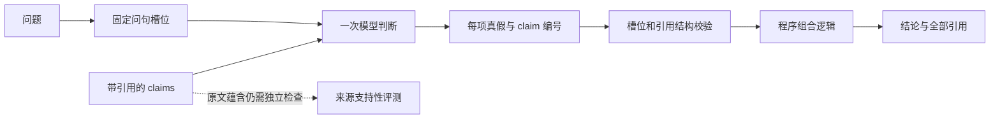
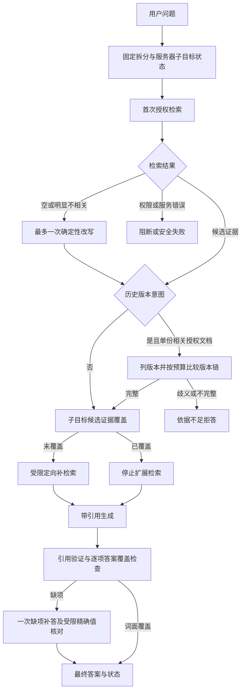
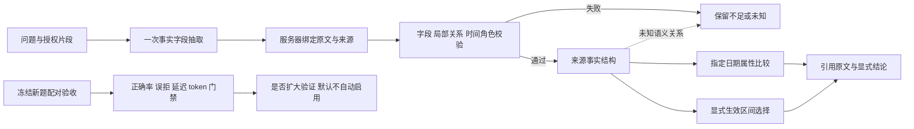

# Agentic-RAG · 项目报告

本文记录系统设计、实验方法、失败案例与技术结论。项目概要与本地运行方式见 [`README.md`](./README.md)，评测协议见 [Benchmark 评测包](benchmarks/enterprise_rag/v1/README.md)，在线展示页见 <https://agentic-rag.pages.dev>。

**当前进度、问题与计划集中在 [§20.1 现状总览](#201-现状总览已完成当前问题与计划2026-10-08)。** 本文是项目唯一的进度与结论文档；此前分散在根目录的阶段记录已并入 §2.3.1、§20.26–20.29 与 §22。

---

## 1. 项目定位

Agentic-RAG 是一个面向企业内部知识库的权限感知检索增强问答系统。

它的目标不是覆盖尽可能多的 RAG 功能，而是构建一套能够**验证**以下性质的完整系统：

1. 回答是否真正由原文证据支持；
2. 检索是否严格遵守用户权限；
3. 文档更新能否安全切换版本；
4. 一项 RAG 改动是否真正改善了端到端回答质量；
5. 实验结论能否在冻结的评测集上复现。

系统支持 PDF、DOCX、XLSX 与 Markdown，返回可定位到原文的引用。资料不足时拒答；两份同样有效的资料互相矛盾时报告冲突，而不是自行选择其中一份。

**判断一项改动是否采用的标准**贯穿全文：在所有已测维度上不是最好就是持平、没有一项更差，才进入默认配置。这条标准让混合检索被采用，也让重排和 LLM 改写被拒绝。

---

## 2. 系统设计

### 2.1 两条主链路

```text
资料入库

上传 → 鉴权 → 保存不可变原件 → 解析 → 分块 → 向量化
    → 写入待发布索引 → 确认可搜索 → 切换活动版本
```

```text
问答

识别身份 → 在授权版本范围内检索 → BM25 + 向量 → RRF 融合
       → 复查版本与授权 → 组织证据 → 生成 → 校验引用
       → 再次鉴权 → 返回答案与原文位置
```

两条链路各自有一处刻意的设计：入库是**先索引后发布**，问答是**权限进查询、返回前再查一次**。后文分别展开。

### 2.2 技术栈与选择理由

| 层次 | 选型 | 为什么是它 |
| --- | --- | --- |
| 接口 | FastAPI、Pydantic | 数据结构显式；评测复用同一套检索代码，避免评测与线上走两条路径 |
| 业务库 | PostgreSQL、SQLAlchemy、Alembic | 身份、授权、版本、任务与回答溯源都需要事务保证 |
| Agent 编排 | LangGraph、官方 PostgreSQL checkpointer | workflow / dynamic / hybrid 共用框架的节点调度、条件转移和执行恢复；SQLite 官方适配器用于测试 |
| 检索 | OpenSearch，BM25 与向量同一后端 | 统一分块 ID、统一过滤条件、统一更新路径；两路检索天然共享同一授权范围 |
| 解析 | Docling，单元格定位辅以 openpyxl | 不自研解析模型，但自己掌握结构与来源坐标 |
| 向量 | BGE-M3，1024 维 | 中文与英文标识符都够用，可本地复现 |
| 生成 | Qwen2.5 7B Instruct，Ollama / Metal | 固定随机种子与温度，保证各轮实验可比 |
| 异步任务 | PostgreSQL 任务表，含租约与重试 | 首版不引入消息中间件，减少组件数 |
| 前端 | React、TypeScript、PDF.js | 证据抽屉、检索调试、版本溯源三类界面需要正经前端 |

### 2.3 Agent 链路

```text
创建任务（202/queued）
        ↓
PostgreSQL worker 租约领取 → LangGraph 固定 workflow / 动态策略 / Hybrid 子图
        ↓
七个参数受控工具 → 每次资料读取重新鉴权
        ↓
LangGraph 官方检查点保存执行状态；AgentTask / AgentEvent / ToolExecution 保存业务结果与审计
        ↓
最终引用校验 → 再次鉴权 → completed / failed / cancelled
```

自动路由默认选择固定 workflow；问题的下一步依赖中间观测结果时改走有界 Hybrid（`app/routing.py`）。
自由动态策略只在显式请求时运行，作为对照组；规划器（Planner，§20.29）同样只能显式请求。三种高延迟模式公网访客均不开放。系统不允许模型
直接访问数据库、搜索索引或文件，只能调用 `search_documents`、`retrieve_evidence`、
`open_document`、`get_document_version`、`compare_versions`、`verify_chunk_access` 和
`search_memory`。中断任务由租约回收，LangGraph 从待执行节点恢复；节点内已完成的工具调用经审计账本重新鉴权后复用。

固定 workflow 的决策部分全部是确定性代码，集中在 [`agent/planner.py`](./agent/planner.py)，
它只决定**下一步去哪里找**和**还缺什么**，不判断任何事实：

| 机制 | 触发条件 | 上限 | 说明 |
| --- | --- | --- | --- |
| 查询恢复 | 首次 `search_documents` 返回 0 条 | 每个任务 1 次 | 删除提问脚手架，保留实体、错误码、指标名；第二次查询必须与第一次不同，否则不重试 |
| 子目标覆盖 | 目标拆出 ≥2 个子目标且不是冲突题 | 每个任务 1 轮 | 逐项检查答案是否真的回答了该项；复述提问、声明「未找到」、或与该项几乎没有词面交集都算未覆盖 |
| 第二跳检索 | 存在未覆盖子目标 | 每个任务 1 次 | 查询 = 未覆盖子目标的关键词 + 第一跳排名最高的那段已授权原文，用于 latent link |
| 补生成 | 第二跳检索有结果 | 每个任务 1 次 | 只问未覆盖的子目标，带上被指代项的先行语，但不重复原题里的条件句；新 claim 走同一套引用校验与再鉴权 |
| 版本链深度 | 任务带 `document_id` | 最多 3 对 | 问题涉及 n 个时间点就展开 n−1 对相邻版本，避免只 diff 最新两版而丢掉更早的适用期 |

三条边界是刻意的：首轮生成与单轮 RAG 完全一致（给模型注入子目标清单在成对 A/B 中没有收益，见 §14.2）；
覆盖判定是词面的，它只决定要不要再看一次，不决定答案对不对；补生成的证据同样逐块重新鉴权。

### 2.3.1 LangGraph 编排与恢复边界（2026-10-02 迁移）

按 `AGENTS.md` 的约定，流程编排与执行检查点直接使用 LangGraph 官方能力，项目只保留业务规则。

| 能力 | 实现 |
| --- | --- |
| 节点、条件转移、循环、停止 | `agent/graph.py` 的 `StateGraph`，替代原 controller 循环执行器 |
| Hybrid / Planner 子流程 | `agent/hybrid.py`、`agent/planned.py` 的子图，继承父图检查点 |
| 中断恢复 | 官方 checkpointer，以同一服务器 thread ID 调用 `invoke(None, config)`；`durability="sync"` 保证推进前写入 |
| 存储 | 生产用 `PostgresSaver.setup()`，测试/本地用 `SqliteSaver`；试用历史用 `delete_thread` 清理 |
| 生成失败恢复 | `validate→repair` 条件边，最多 1 次局部修复；`RetryPolicy` 只重试可重试的依赖错误 |

依赖锁定为 `langgraph==1.2.12`、`langgraph-checkpoint-postgres==3.1.2`、`langgraph-checkpoint-sqlite==3.1.1`，未引入高层 LangChain 编排。

保留为业务规则的部分：thread ID 由租户与任务所有者生成，客户端不能指定；每个节点、恢复入口和最终回答重新验证证据权限与版本；模型只描述信息需求，文档与分块 ID 由程序绑定；累计 policy/judge/generation 预算与原截止时间保存在任务中，恢复不回退预算——LangGraph recursion limit 只防异常循环，不代替业务预算；`ToolExecution` 是已完成工具调用的审计账本，重新鉴权后可复用；PostgreSQL worker 租约负责领取任务，LangGraph 只负责领取后的执行。

已知缺口：同步 worker 的总截止时间仍由项目自己中断。框架节点 timeout 只支持异步节点且每次重试重新计时，不能替代跨恢复的累计截止时间；以后异步化时先用官方 `TimeoutPolicy`，再保留累计预算。恢复要求代码、输入、模型和检索配置一致，变化时返回 409 要求新建任务。节点内未提交的模型请求恢复后可能再次执行（计入预算）；工具审计、业务结果和检查点之间没有跨存储事务，不声称外部动作严格只执行一次。迁移验证产物：`artifacts/langgraph-unit-20261002.xml`、`artifacts/langgraph-integration-20261002.xml`。

---

## 3. 文档入库

### 3.1 结构化解析

四种格式解析为统一结构，同时保留来源位置：

**PDF** 保存页码、文本片段与版面坐标（bounding box），因此引用可以直接打开对应页面并高亮原文那一块，而不是"第 12 页"。

**DOCX** 保存标题层级与段落位置，定位到具体章节与段落。**不编造页码**——Word 文档的分页依赖渲染环境，声称一个稳定页码是假的。

**XLSX** 保存工作表、单元格范围与公式信息。**公式没有缓存计算结果时明确标记为缺失**，而不是把公式文本当成最终数值。

这些坐标不是装饰。它们是后文"引用可核验"的物理基础：没有坐标，引用只能停留在文档级别。

### 3.2 版本更新：先索引后发布

```text
旧的活动版本
      │
      ├── 全程保持可检索
      │
新文件 → 解析 → 索引 → 确认可搜索 → 切换活动版本
```

只有新版本完成解析、索引并确认可搜索之后，系统才更新活动版本。因此：

- 解析失败不影响当前版本；
- 索引失败不会产生一份空文档；
- 更新过程中不存在检索空窗；
- 历史回答仍可追溯它当时引用的那个版本。

旧版本不会立即删除，保留用于审计历史回答。

这套设计在种子资料重新处理时被实际用到：33 份用旧解析器入库的资料通过正式版本替换路径重新处理，**全部切换成功，用时 45 秒**。**没有就地改写已有分块**——那会让分块记录的处理配置与实际不符，等于在数据里留下一句谎话。

---

## 4. 权限模型

权限控制不是检索之后的过滤步骤，而是**检索查询本身的一部分**。

每次请求根据租户、用户、组、文档 ACL 与活动版本，计算当前可搜索的文档集合，BM25 与向量两路使用**同一个集合**。

授权检查覆盖每一条能让内容浮出水面的路径：

```text
资料列表 · 资料详情 · 解析预览 · 引用 · 原件下载 · 可读性探测
```

返回答案之前会再次校验引用对应的文档是否仍然可访问。因此即使在生成过程中权限被撤销，也不会依靠已经进入上下文的旧授权结果返回引用。

**撤权立即生效，不等待索引清理。** 决定可见性的是业务库而不是搜索索引：撤权事务提交之后的下一个请求就已被拒绝，无需刷新、无需等待。生命周期回归专门断言了这一点——用例显式检查分块**仍然存在于库中**，以证明拒绝来自授权判断，而不是碰巧清理完了。

在迄今全部评测运行中：

```text
越权命中 = 0
隐藏文档泄漏 = 0
```

### 4.1 为跨系统协作准备的接口

系统对外暴露一个只回答单一问题的入口：**某用户此刻能否读取某个分块**。返回值区分"不存在 / 已删除 / 无权限 / 已被新版本取代"四种原因，不返回标题或正文，否定答复不泄露除答复本身以外的信息。

它的用途是：任何从本项目文档推导出内容的系统（例如记忆层），可据此在用户失权后撤销派生内容，而**本项目不需要知道派生内容的存在**。

---

## 5. 检索

系统实现三种检索配置：BM25、向量检索、以及两者的 RRF 混合。

融合按**名次**而非分数进行。BM25 分数与余弦相似度不可比，直接相加是没有意义的；RRF 用 `1/(60+rank)` 累加两路排名。单元测试专门钉住这条性质：**一个极高的 BM25 原始分不得压过名次**。

### 5.1 点名多份资料的问题，需要多份资料的预算

外部验证（§12.1）暴露了一个与模型无关的瓶颈：问题点名了两三份资料，证据预算却只有 4 段，
而这 4 段常常全部落在同一份资料里——金标文档全部被检索到的比例只有 28.8%。

判定是确定性的：问题里出现 `both / respectively / compare / difference / each of`，
或者出现两次以上 `article / report / piece / story / source` 这类指向来源的名词，就认为
答案跨文档。命中的问题拿到完整的 8 段预算，同时打开**每文档最多 2 段**的配额，
候选池相应加深到 24。

效果在**同一批题**上做了配对消融（`make multihop-retrieval-ablation`，只跑检索不生成答案，
因此与模型无关；用的是已经用过一次、因而退化为开发集的第 1 批）：

| 132 道有金标的题 | gold 文档召回 | 金标全覆盖 | 证据涉及文档数 | 检索中位耗时 |
| --- | ---: | ---: | ---: | ---: |
| 改动前（4 段，无配额） | 0.518 | 38 | 2.55 | 288 ms |
| 改动后（8 段 + 每文档 2 段） | **0.696** | **59** | 5.38 | 330 ms |

「改动前」一列与 §12.1 正式运行的数字（0.518 / 38）完全一致，说明消融忠实回放了旧配置。
检索本身几乎没有变慢，代价在生成：上下文里的分块多了一倍。

中文路径保持原预算不变。抬高它会改变 89.1% 与 81.9% 这两个冻结快照的产生条件，那是一次
需要单独重跑与单独论证的决定，不应该作为这次改动的副作用发生。

---

## 6. 检索评测

开发集 147 题，其中 124 题带文档级金标，用于计算检索指标。

| 配置 | Recall@5 | Recall@10 | MRR@10 | nDCG@10 |
| --- | --- | --- | --- | --- |
| **BM25** | **0.984** | **0.992** | **0.927** | **0.944** |
| 向量检索 | 0.903 | 0.935 | 0.840 | 0.861 |
| 混合检索 | 0.935 | 0.976 | 0.900 | 0.918 |

单看检索指标，BM25 明显优于混合检索。

但端到端结果不是这样。

---

## 7. 端到端评测

同一批 147 题：

| 配置 | 状态判断正确 | 字面事实覆盖 | 冲突召回 | 冲突精确 | 中位耗时 |
| --- | --- | --- | --- | --- | --- |
| BM25 | 84.4% | 84.6% | 10/13 | 100% | 18.1 s |
| 向量检索 | 85.0% | 82.1% | 9/13 | 100% | 26.8 s |
| **混合检索** | **89.1%** | **89.1%** | **11/13** | **100%** | 24.5 s |

混合检索的 Recall@5 在三者中最低，端到端正确率却最高。**这是本项目最重要的实验结果之一。**

### 7.1 检索指标为什么会误导

生成阶段只允许有限数量的证据块进入上下文（本项目为 4 块、5000 token 预算）。

所以真正决定结果的不是：

> 金标文档是否出现在前 10？

而是：

> 这有限的几个证据位被哪些分块占据？

RRF 会把两路都认可的分块顶上来。这可能降低传统的文档级 Recall@5，却改善了**真正进入模型的证据构成**。

因此：

```text
检索质量 ≠ 回答质量
```

本项目始终分别测量检索与生成，不用检索指标代替最终回答质量。

混合检索相对 BM25 的差异**未达统计显著**（McNemar 精确检验，p = 0.19，147 组配对）。所以结论的准确表述是：

> 混合检索是当前实验中的实测最优，而不是已被统计证明普遍优于 BM25。

采用它的依据是那条贯穿全文的标准：在所有已测维度上不是最好就是持平，没有一项更差。

---

## 8. 重排实验

系统实现了 `bge-reranker-v2-m3` 交叉编码器，对混合检索的前 30 个候选重新打分。

检索指标明显改善：

```text
Recall@5   0.935 → 0.968
MRR@10     0.900 → 0.935
nDCG@10    0.919 → 0.945
```

端到端几乎没动：

```text
状态判断正确率   89.1% → 90.5%
McNemar 检验     p = 0.79
```

同时付出了代价：

- 中位耗时增加约 22%（24.5 s → 30.0 s）；
- **冲突精确率从 100% 降到 92.3%**——重排把一份无关文档提进证据位，其中的"24 小时"与正确答案"30 小时"构成了表面矛盾。

按采用标准，它有一项更差，因此**已实现但默认关闭**。旧 S5 对照通过
`scripts/run_s3_baseline.py --retrievers hybrid,hybrid_rerank` 选择实验组；当前线上共享检索链路
通过 `RAG_PASSAGE_RERANK=true` 开启候选重排，不能只设置 `RAG_RERANK_MODE`。

这个实验与第 7 节指向同一条结论，但方向相反：**改善检索基准并不保证改善最终回答**。两次相反的例子共同说明，检索指标与回答质量之间不存在稳定的单调关系。

---

## 9. 冲突检测

### 9.1 最初的设计，以及它为什么失败

早期实现通过第二次 LLM 调用判断 `conflict = true / false`，返回 true 就直接覆盖回答状态。

在 120 道开发题上：

```text
报告冲突 = 24 次
真实冲突 = 1 道
精确率 = 4.2%
```

问题不在于模型完全无法理解冲突，而在于**一个未经验证的模型判断拥有了过大的系统权限**。

定位后发现两处缺陷：

1. **触发门槛用错了粒度。** 判断依据是"引用了多于一个证据片段"，而片段编号按分块切分——同一份文档被切成多块时同样会触发。有一道题的 4 个片段全部来自同一份文档，仍进入了冲突检查。
2. **检查结论无条件覆盖状态。** 第二次调用只返回一个布尔值，没有任何可核验的依据。

### 9.2 证据门控的冲突检测

新规则要求模型同时给出：两段原文证据、来自两个不同文档、内容互相矛盾。缺一不可，否则冲突判断被拒绝。此外，只引用了一份文档时直接回落为"可回答"——一份文档不会与自己冲突。

为了能真正测量这条能力，评测集补充了 13 道真冲突和 15 道易误判反例。反例覆盖四种模式：不同指标、不同适用对象、有明确先后的新旧版本、以及跨文档数值不同但并不矛盾。

其中**跨文档反例是关键的一类**：单文档反例只能验证"同文档不触发"这道门槛，验证不了跨文档检查器本身。

最终结果：

```text
召回率 = 85%   (11/13)
精确率 = 100%  (11/11)
15 道易误判反例误报 = 0
```

这一实验形成了一条系统原则：

> **模型可以提出判断，但影响系统状态的判断必须附带可验证的证据。**

---

## 10. 引用校验

生成模型不直接产出引用元数据。模型只选择带编号的证据片段，服务端随后：

1. 按编号取回真实分块；
2. 校验分块属于当前活动版本；
3. 再次校验用户权限；
4. 读取真实的原文位置；
5. 组装引用返回。

**引用校验不通过的答案不会被"修复"，而是判定为失败并不返回。**

这避免了模型自行生成不存在的页码、错误的文档、无权限的文档或不存在的原文位置。

需要说清楚这道校验的边界：它能证明"这句话确实出现在这份原文里"，**证明不了"这段原文回答了用户的问题"**。语义蕴含仍属未测量项。

### 10.1 判断型问题：把结论从散文里取出来

外部验证还暴露了一个与检索无关的问题：系统对"两篇报道是否一致"这类问题，回答是
"两篇报道并不一致"——**判断已经给出了，但它埋在散文里**。81 道 Yes/No 题中，42 题属于这种
情况，任何词级读取都看不见它（§12.1）。

处理方式是加一个**结论字段**，而不是改造生成提示：

- 判定哪些问题需要结论字段是确定性的：中文看 `是否 / 是不是 / 有没有 / 能否 / 会不会` 等标记；
  英文看疑问句的助动词倒装——句首的 `do/does/did/is/are/was/were/…`，或长状语前置后
  出现在句中的 `, did …` `, was …`。以 `what/which/who/when/where/why/how` 开头的疑问句
  一律不算，它要的是名字不是判断。第 1 批（已用过、因而是开发集）上 **81/81** 的 Yes/No 题
  被正确识别，48 道实体类问题**没有一道**被误判。
- 结论由一次**只读 claims** 的分类调用产生：它看不到原文，只看已经通过引用校验的 claim，
  因此可以复述结论，但无法引入新事实。它还要指出结论来自第几条 claim，读者可以顺着同一条
  引用核对。claims 不足以判断时返回 `unclear`，而不是猜。
- 这一步失败**不会**让答案失败：结论字段缺失，答案照常返回。顺序上它在补生成之后，
  因此读的是最终的 claims。

这不是"让模型再答一次"，而是把已经给出的判断显式化。它不改动 claims、不改动引用、不改动状态，
因此对既有评测的事实与状态指标没有影响；代价是判断型问题多一次约 60 token 输出的模型调用。

需要说明两处时间关系：Hard Benchmark v2.1 的产物是在加入结论字段之前跑的，字段不改变它的
事实与状态判定，但会让其中的判断型题目（如 H30）多一次调用，下次重跑时延迟与 token 会略高；
外部评分口径因此有 v1 与 v2 两套，`--scoring v1` 仍能复现 2026-09-21 那次运行的口径，
每次运行都把用的是哪一套写进产物。

---

## 11. 留出集验收

最终测试集 80 题，运行**前**已冻结验收条件并落盘。运行器在命令行层面封存留出集：需要显式的验收标志，且要求冻结文件已存在——留出答案只能看一次。

| 指标 | 门槛 | 实测 |
| --- | --- | --- |
| 状态判断正确率 | ≥ 80% | **90.0%** |
| 字面事实覆盖 | ≥ 80% | **81.9%** |
| 越权命中 | 0 | **0** |
| 隐藏文档泄漏 | 0 | **0** |
| 引用身份校验 | 全部通过 | **全部通过** |

开发集 89.1%，留出集 90.0%——**留出比开发还高 0.9 个百分点**，没有观察到明显的开发集过拟合。容许回落设的是 9 个百分点，实际没有回落。

失败分布也更干净：8 次"该答却说依据不足"、1 次引用未通过检查、5 次事实遗漏，**冲突误报 0 次，该拒答却硬答 0 次**。

### 11.1 81.9% 到底表示什么

字面事实覆盖是 **59/72**，即 13 个金标短值没有以归一化子串形式出现在最终 claim 中。它不等于
人工语义正确率：例如中文数字、同义单位或改写后的完整句可能在语义上正确，仍会被严格字符串
指标判为遗漏。现有结果没有语义正确性和引用蕴含人工金标，因此不能把 81.9% 直接解释为
“18.1% 的答案是错的”。

这 13 个遗漏中，8 个来自可回答问题被模型判为依据不足，5 个来自回答已经生成但漏掉一个必答
事实。12/13 的问题在 Recall@5 已召回金标文档，全部问题在 Recall@10 召回；主要瓶颈位于证据
进入上下文后的状态判断和完整性，而不是向量模型完全找不到资料。基于这项归因，后续版本已经
为短事实题扩大候选数、为复合问题生成逐项验收清单，并为冲突建立确定性门禁；原冻结留出集不
重复运行，因此这些修改只能由开发回归和新的未见题集验证，不能回填成更高的旧留出分数。

下一轮正确率优化按以下顺序执行：先在人审样本上校准语义正确性与引用蕴含指标；再对“证据已
召回但错误拒答”和“复合问题漏项”做条件式二次检索／修复生成；最后比较简单查询的自适应
BM25、混合检索和选择性重排。每项都同时报告误答、错误拒答、泄漏、延迟和 token，不能只把
召回率或字符串覆盖做高。

但必须说明这个实验验证的范围：开发集与留出集来自**同一套自建语料的不同主题家族**。所以它验证的是：

> 同一分布下，换一批没见过的主题是否仍然成立

而不是：

> 换一家公司是否仍然成立。

---

## 12. 外部评测

为检验分布变化，系统在公开企业 RAG 基准的固定子集上运行：39 题 + 100 份干扰文档，英文语料。39 题是两个已发布分片中金标齐全的全部题目。

| 配置 | Recall@5 | 状态判断正确 |
| --- | --- | --- |
| BM25 | 0.897 | 84.6% |
| 向量检索 | 0.897 | 74.4% |
| **混合检索** | **0.974** | 84.6% |

**这里混合检索的检索优势明显，与内部数据上的排序正好相反。**

内部资料包含大量高度可区分的专有名词和固定表达，词项匹配因此占优。外部数据表明：

> 内部评测中 BM25 的优势不能直接推广到其他数据分布。

这个结果反过来支持了"采用混合检索"这个决定。

**字面事实覆盖在这份数据上不适用。** 上游金标是整句英文散文，模型给出的是措辞不同但语义正确的短句；为中文短值设计的归一化子串匹配在这种情况下恒为接近零，与正确与否无关。因此该指标被标记为不适用，而不是报一个会被误读成"系统失效"的数字。

这份子集测的是**外部有效性**，不是统计功效——它的题目来自不同总体，不能并入上一节的显著性检验。

### 12.1 MultiHop-RAG 固定子集：一次性外部验证（2026-09-21）

自建 Hard 30 已经被 v1.1 的调试污染，无法再回答"这些修复是否只适配了自己的题"。这一节是
项目里唯一一次外部验证，协议在运行前就写死：

- **题目**：`yixuantt/MultiHopRAG`（ODC-BY，arXiv:2401.15391）中的 150 题，按题型配额分层，
  题内按 `sha256(query)` 升序取前 N，配额与原始 2556 题分布成比例。选择规则、文件哈希、
  每题的 query 与答案哈希冻结在 [`fixtures/multihop/subset.json`](./fixtures/multihop/subset.json)；
  runner 启动时校验哈希，不符就拒绝运行。题面与金标不入库——语料是第三方新闻正文，
  仓库没有理由转发它。
- **语料**：全部 609 篇新闻走正常上传链路入库（解析 → 分块 → 向量 → 索引 → 发布），
  12484 个分块，放在独立租户里。检索按租户过滤，因此中文语料、ACL 和所有冻结评测都不受影响，
  609 篇也全部作为干扰文档存在，而不是只放金标文档。
- **评分规则**（运行前写定）：null 题答对 = 拒答；Yes/No 题答对 = 出现对应判断词且不出现相反词；
  其余答对 = 金标串出现在 claims 中；检索口径 = 进入生成的证据所属文档。
- **只跑一次，不用于调任何 prompt、规则或阈值。**

| Arm | 答案正确 | gold 文档召回 | 金标全覆盖 | 引用中的 gold 召回 | 拒答 | P50 | 平均 prompt token |
| --- | ---: | ---: | ---: | ---: | ---: | ---: | ---: |
| 单次 RAG | 57/150（38.0%） | 0.518 | 38/132（28.8%） | 0.343 | 62 | 29.5 秒 | 1583.2 |
| 固定 workflow | **62/150（41.3%）** | **0.578** | **45/132（34.1%）** | **0.404** | 55 | 42.9 秒 | 2154.6 |

分题型（固定 workflow）：

| 题型 | 答案正确 | gold 文档召回 | 拒答 |
| --- | ---: | ---: | ---: |
| null（应拒答） | **18/18（100%）** | 不适用 | 18 |
| inference（答案是实体串） | **39/48（81.3%）** | 0.569 | 5 |
| comparison（答案是 Yes/No） | 2/50（4.0%） | 0.661 | 20 |
| temporal（多数是 Yes/No） | 3/34（8.8%） | 0.481 | 12 |

**能读出什么。** 在一份本项目没有写过、语言也不是调优目标的语料上：拒答行为完整迁移
（18/18，没有一次在没有依据时编造）；实体类多跳题 81.3%；固定 workflow 在每一项可比指标上
都优于单次 RAG——答案、gold 召回、引用召回、更少的错误拒答，代价是延迟 42.9 秒对 29.5 秒、
token 多 36%。**这是 workflow 优于单次 RAG 的第一份非自建证据。**

**不能读出什么。** Yes/No 题的 4.0% / 8.8% 主要不是"答错"，而是**输出形态与指标口径不匹配**。
诊断见 [`artifacts/multihop-verdict-diagnosis.json`](./artifacts/multihop-verdict-diagnosis.json)
（`scripts/diagnose_multihop_verdicts.py`，只分桶、不重新评分），81 道真正的 Yes/No 题里：

```text
固定 workflow   拒答 31   给了判断但没写判断词 42   写了判断词且与金标一致 4   写了判断词但不一致 4
单次 RAG        拒答 31   给了判断但没写判断词 46   写了判断词且与金标一致 4   写了判断词但不一致 0
```

也就是说，已声明的指标在 81 题里只"看得见"8 题。系统输出的是带引用的 claim（"两篇报道并不一致"），
不是一个 yes/no 字段；词级匹配读不出这种句子。那 42 题里有多少语义上是对的，这里**不做估计**——
没有人工复核和语义判定之前，任何估计都是给自己加分。

**同样重要：v1.1 的子目标与恢复机制在这份数据上一次都没触发**（coverage repair 0 次，
query recovery 0 次）。拆分器按中文小句标记工作，英文问句进不去。所以这次外部验证证明的是
**检索与带引用生成这条链路**可以迁移，**不是** v1.1 那几项机制可以迁移。要验证后者，需要
中文外部集，或者把拆分器扩到英文后在**新的**冻结子集上重测——在旧子集上重测就不再是外部验证了。

**运行完整性。** 第 145 题时 OrbStack（Docker 运行时）在系统内存压力下退出，Postgres 随之关闭，
运行中断。恢复容器后用 `--resume` 补跑了剩余题目：题目、金标、评分规则、语料与模型都没有变化，
中断只发生在基础设施层。同一次运行的前 144 题没有重跑。

### 12.2 第 2 批：两处确定性修复之后的一次性验证（2026-09-22）

第 1 批暴露的两件事各做了一处确定性修复——多源问题的检索预算（§5.1）和判断型问题的结论字段
（§10.1）。第 1 批已经被用掉，因此验证换了**新冻结的第 2 批**：同一数据集、同一分层配额、
同一选择规则的下一段，与第 1 批按构造零重叠，同样只跑一次。语料、模型和拒答规则没有变。

| 指标（固定 workflow） | 第 1 批（修复前） | 第 2 批（修复后） |
| --- | ---: | ---: |
| 答案正确（各自口径） | 62/150（41.3%） | **101/150（67.3%）** |
| 答案正确（都按旧口径 v1 计） | 62/150 | 61/150 |
| gold 文档召回 | 0.578 | **0.667** |
| 金标全覆盖 | 45/132 | **60/132** |
| 引用中的 gold 召回 | 0.404 | **0.467** |
| 拒答 | 55 | 40 |
| P50 延迟 | 42.9 秒 | 54.0 秒 |
| 平均 prompt token | 2154.6 | 2452.9 |

两批是同一总体的两个不相交随机样本，因此这是**组间比较**，n=150 有抽样噪声；而
「都按旧口径计」那一行几乎持平（62 → 61），把两处修复的效果干净地分开了：

- **检索预算**改善的是检索与拒答，不是旧口径下的答案计数。同一批题上的配对消融（§5.1）
  给出更干净的数字：gold 召回 0.518 → 0.696。
- **结论字段**改善的是答案计数：同一次运行下 v1 计 61 分、v2 计 101 分，comparison 题
  1/50 → 29/50。这不是模型答得更好了，而是它原本就给出的判断第一次被指标读到。

**必须同时报告的两件事。** 第一，二元问题是可以猜的：第 2 批 77 道 Yes/No 题里金标 47 个 yes、
30 个 no，**一律回答 yes 的平凡基线就有 61.0%**，而系统在全部 77 题上的判断正确率是
**53.2%**，低于该基线；只统计它真的给出判断的 60 题，正确率 68.3%，但那是它自己挑出来的
子集（证据少时它拒答）。混淆矩阵（`artifacts/multihop-verdict-diagnosis-r2.json`）显示
偏向 yes：金标 yes 的 34 题判对，金标 no 的只有 7/30 判对、11 题判成 yes。**所以结论字段
解决的是「指标看不见答案」，没有证据说明判断能力本身变强了。**

第二，**单次 RAG 追平了固定 workflow**：第 2 批两条 arm 都是 101/150，workflow 只在检索与
拒答上略好（gold 召回 0.667 对 0.652，拒答 40 对 44），token 反而多 7.5%。回头看，第 1 批
workflow 领先（62 对 57）的主要来源是它自己用了更大的检索预算（top-6 + retrieve_evidence，
对单次 RAG 的 top-4）；预算拉平之后优势就消失了。§20.8 里"workflow 优于单次 RAG 的第一份
非自建证据"这句话据此**收回**：正确的说法是，那次领先大部分可以由证据预算解释，在外部数据上
目前**没有**证据表明固定 workflow 的规划带来额外收益。

还有一处小退步：null 题从 18/18 变成 17/18，多出来的证据让系统在一道本该拒答的题上给了答案。
样本只有 18 道，不能下结论，但方向值得盯着——放宽证据预算天然会让"宁可答"的倾向上升。

**下一步不在这两件事上继续调。** 判断能力要真正提高，需要的是能比较两份材料的推理，不是又一条
确定性规则；这属于 §14A 的语义评分与蕴含判定未实现项。任何后续改动都必须换第 3 批冻结子集
（`scripts/build_multihop_subset.py --round 3`）来验证。

### 12.3 Yes-bias 归因与 answerability 校准（2026-09-22）

发现偏置之后**没有改 prompt**。先做归因，否则很容易把检索的错修成提示词的错。归因里只有一件事
可以由程序判定——**gold 文档是否全部进入了生成看到的证据**——脚本就只判这一件
（`make multihop-yes-bias`），其余留给人。

第 2 批 77 道 Yes/No 题，两条 arm 合计 37 次判错：

| | 证据齐全 | 证据没拿齐 | 合计 |
| --- | ---: | ---: | ---: |
| 判错 | **24** | 13 | 37 |
| 判对 | 51 | 31 | 82 |
| 拒答/未给结论 | 16 | 19 | 35 |

固定 workflow 单独看：金标 no 判成 yes 共 11 次，其中 **7 次证据是齐的**；金标 yes 判成 no 共
8 次，其中 6 次证据是齐的。**所以偏置主要不是检索没拿齐**——约三分之二的错判发生在证据已经
到位之后。

判对的那 41 次更说明问题：**34 次金标是 yes**（21 次证据齐、13 次证据并不齐），金标是 no 的只
判对 7 次。在一个 47 yes / 30 no 的批次上，这与「倾向答 yes、恰好蒙对」难以区分。**结论仍然是
：没有证据表明判断能力本身可用。**

剩下 24 次「证据齐全仍判错」不能由程序继续拆。`make multihop-yes-bias` 在本地生成
`artifacts/multihop-yes-bias-review.csv`，把这 37 条连同问题、claims 与被引用原文导出；该文件
含第三方正文，已从 Git 移除并忽略。复核时留四个人工类别：比较关系理解错 / claims 本身含糊到推不出
结论 / claims 清楚但结论分类器读反 / 题目或金标本身可争议。只有第一类接近真正的推理失败；
第三类才是 output 协议的 bug，那时候改结论字段的类型约束才有依据。

**试标 8 条之后，这四类需要补两类**（详见 `artifacts/semantic-calibration/GUIDELINE-ISSUES.md`）：

- **E：取到了正确文档，但取错了段落。** 机械归因是文档级的，而 `MH-124558122a92` 两篇 Fortune
  文章都在证据里，进来的却是无关段落，问题指向的那一段没进来。**这仍然是检索失败，只是发生在
  块级**——也就是说上面「24 次证据齐全」是被高估的，其中一部分应归到检索。这会直接改变 P1 的
  取舍，人工归因时要专门区分。
- **F：claim 被自己引用的原文推不出。** 引用校验只保证引文逐字出现在被引块里，保证不了 claim
  能由该块推出（§10 写过这条边界，这里第一次以失败形式出现）。

**扩到 20 条之后的归因分布（模型预标，待人工确认）**：检索没拿齐 7、取对文档取错段落 4、
比较推理错 3、claims 含糊 2、题目可争议 2、claim 推不出 1、**结论分类器读反 1**。
即**检索合计 11/20（55%），分类器只有 1/20（5%）**。如果人工归因得到同样方向，P1 的取舍就很
清楚：子问题检索与块级覆盖校验覆盖过半错误，typed verdict 只覆盖约 5%，**应当先做前者**——
这与「先修输出协议」的直觉相反，所以更要等人工确认，不能拿模型预标当结论。

试标同时暴露一个具体的检索缺陷：**609 篇外部语料里 37 篇（6.1%）正文开头就是订阅样板**
（「Stay ahead of the trend」「Please enter a valid email address」），中位 440 字符，足以占满
第一个 700 字分块，其中 34 篇来自 The Independent；这些块照样被检索并被当作引用证据。系统里
已有的 `_boilerplate_only` 过滤只匹配中文 fixture 的免责声明，对英文语料完全无效。
**本轮不修**，记入 P1 检索层待办。

试标还给出一个**待人工核验的机制假设**：`MH-124558122a92` 与 `MH-1c31b288b184` 是同一语料的
配对题，问句只差一个词（Israel 的行动 defensive / aggressive），金标分别是 yes / no，系统两题
都答错且方向相反——相关段落没进来时否定问题的说法，进来了就肯定问题的说法。如果这个模式在更多
配对题上成立，**Yes-bias 的机制就是「生成器复述问题给定的说法」，属于生成/输出协议问题，
改结论字段的类型约束解决不了它**。目前只有一个配对支持，不能当结论。

**answerability 校准。** 放大证据预算必然同时抬高「宁可答」的倾向，所以正确率不能单独看：

| | 可答题正确率 | 可答题误拒率 | null 拒答召回 | null 误答率 |
| --- | ---: | ---: | ---: | ---: |
| 第 1 批 · 单次 RAG | 0.295 | 0.333 | 1.000 | 0.000 |
| 第 1 批 · 固定 workflow | 0.333 | 0.280 | 1.000 | 0.000 |
| 第 2 批 · 单次 RAG | 0.629 | 0.197 | 1.000 | 0.000 |
| 第 2 批 · 固定 workflow | **0.636** | **0.174** | 0.944 | 0.056 |

覆盖上去了（0.333 → 0.636），误拒下来了（0.280 → 0.174），同时 workflow 在 18 道 null 题里
答了 1 道本该拒答的。**这一道不修**：n=18 说明不了方向，但它正是要盯的那个权衡。第 3 批起，
这四个数与正确率一起报告——只报正确率会把 abstention 的退步藏起来。

---

## 13. 多轮追问

单轮 RAG 无法处理"那请求超时呢？"这类省略主语的追问。

测试 40 组会话共 160 轮，其中 80 轮**无法独立回答**（构建期强制校验：追问中若出现自身主题，则不改写也能答对，这条数据就测不出任何东西）。

| 方案 | 整体 R@5 | 追问 R@5 | 指代 R@5 | 条件保真 | 换题污染 | 改写耗时 |
| --- | --- | --- | --- | --- | --- | --- |
| A 不改写 | 0.825 | 0.650 | 0.150 | 100% | 0% | 0 s |
| **B 拼接上一轮提问** | **0.988** | **0.975** | **0.900** | **100%** | **0%** | **0 s** |
| C LLM 改写、无历史 | 0.825 | 0.650 | 0.150 | 100% | 0% | 2.70 s |
| D LLM 改写 + 最近 3 轮 | 0.944 | 0.900 | 0.850 | 95% | 2.5% | 4.51 s |

**C 组与 A 组每一项完全相同。** 这是设立 C 组的目的：它把"改写"和"历史"两个变量分开了，结果表明**收益全部来自对话历史，没有一点来自"用 LLM 改写"本身**。

D 组还挂在两条硬门槛上：一例把用户说的"3 个工作日"整个丢掉并改变了问题含义；一例把全新话题的提问改写回了上一轮的主语。

因此采用 B：零模型调用、零延迟。

RAG API 不在服务端维护对话 session；浏览器把当前会话最近 10 个问题作为短期记忆回传。它
**只影响检索什么，不影响能看什么**——可访问文档集合始终按当前身份重算，回放文本不授予
任何权限。这条边界由测试钉住：回放另一租户的提问，文本会进入查询，但授权范围不变、答案
返回“依据不足”。Agent 的执行 Working Memory 由 LangGraph 官方检查点存入 PostgreSQL，
业务表另存预算、结果、审计、租约与证据句柄；独立 `llm-long-term-memory` 保存显式写入的
跨会话用户偏好。长期记忆不作为企业事实证据。实际 RAG 与存储链路见 [RAG 与记忆说明](RAG_AND_MEMORY.md)。

**空历史时该规则是恒等操作**，因此全部单轮实验结果继续有效，不需要重跑。

### 13.1 三层记忆与长期记忆 A/B

短期记忆、工作记忆和长期记忆解决的是三个不同问题：

| 层次 | 保存位置 | 生命周期 | 用途 | 证据资格 |
| --- | --- | --- | --- | --- |
| 短期对话 | 浏览器最近 10 个问题 | 当前页面会话 | 补全“它的时限呢”等省略追问 | 无，只改变检索问题 |
| Agent 工作记忆 | PostgreSQL 中的 LangGraph 官方检查点与业务任务/审计表 | 任务结束后仍保留 | 框架恢复执行；业务表保存预算、结果和审计 | 句柄需重新鉴权 |
| 长期记忆 | 独立 `llm-long-term-memory` 的 SQLite 与 NumPy 向量文件 | 跨会话，显式写入 | 用户角色、输出偏好和任务范围 | 无，不能作为企业事实 |

长期记忆完成了真实鉴权联调：服务端 token 绑定 `tenant:user` 命名空间，浏览器不能提交任意
`user_id`。30 题严格成对 A/B 只切换 `use_memory`：

| 条件 | 正确 | 禁区泄漏 | 中位延迟 | 平均 prompt token |
| --- | ---: | ---: | ---: | ---: |
| 关闭 | 30/30 | 0 | 15.9 s | 1247.0 |
| 开启 | 29/30 | 0 | 21.9 s | 1675.4 |

差异只有一题，McNemar `p=1.0`，不能证明记忆真实降低或提高了准确率；但增加 428.4 个平均
prompt token 和约 6 秒中位延迟是本次运行中明确观察到的成本。出错题里，LLTM 返回的三条
偏好正确且命名空间正确；本地 7B 模型把同主题的星桥证据错归给问题中明确提到的海川。根因是
Agentic-RAG 把额外偏好上下文无条件塞进事实生成，并缺少外租户语义门禁，不是 LLTM 读错了
用户记忆。加入外租户名称门禁后，定向开／关回归都通过。

因此长期记忆仍保留，但定位为可选个性化能力：默认关闭、任务级显式开启，最多注入 3 条，
单条不超过 240 字、总计不超过 600 字。以后只有在独立的偏好遵从 benchmark 上显示收益，且
事实非退化门禁通过，才考虑默认开启。文档证据永远优先于记忆。

---

## 14. 失败归因

早期基线共 86 次失败：

```text
检索未命中          6 次   ( 7%)
正确资料已召回之后   80 次   (93%)
```

也就是说，**93% 的失败发生在正确资料已经被检索到之后**。

这个结果改变了优化顺序。继续提升 embedding、召回或重排，最多只能碰到那 7%。真正的问题集中在回答状态判定、冲突检测、证据选择与生成。

由此得到一条工作方法：

> **先定位失败发生在哪个阶段，再决定优化哪个组件。**

### 14.1 一次被数据否决的修复

失败归因之后，我曾实现"主题一致性校验"——要求每条结论的主语与问题主语重合，否则降级为依据不足，用来堵住"答非所问"。

在冻结集上校准后，数据直接否决了这个设计：

```text
判对的 137 条回答   主题重合长度 5 分位 = 2
判错的回答          重合长度 < 3 的数量 = 0
```

阈值设 3 会误杀正确答案（尤其是改写型提问），而一道错的都抓不到。改用"结论与所引证据的重合"作为信号同样不可分：判错的是 4 / 7 / 8，判对的最小才 2——**判错的反而更高**。

更根本的是最初的归因就不准：那个结论是从单个案例推广出来的，而切换到混合检索后 3 道里已自动修好 2 道；剩余失败是模型**照抄问题的主语**再挂一个无关数值，这种模式主语校验在构造上就抓不到。

该改动已完整回退。它需要的是语义蕴含判定，属于未实现项，不是一条确定性规则能补的。

### 14.2 子目标清单该不该塞进首轮提示

实现子目标状态机时，最自然的做法是把拆出来的子目标直接作为 `acceptance_items` 交给首轮生成，
让模型逐项回答。这一节记录这个想法是怎么被测掉的，以及中途我自己犯的错。

**第一次观察：一次运行里它把 H02 从通过打成失败。** H02 问「……给出重试次数、退避计划和客户端
去重字段」。当时的拆分器在「、」处断句后，最后一段「退避计划和客户端去重字段」自身既没有疑问词
也没有请求动词，被当作背景片段丢掉，于是模型收到的清单**比问题本身还短**。它照着清单回答，
丢掉了 `event_id`。我据此写下「清单有害」的结论。

**这个结论下得太早。** 修好拆分规则（枚举改成双向的：并列项里任意一段带请求动词或疑问词，
同一枚举中的短名词短语都算子目标）之后，我用同一组题做了成对 A/B（`make checklist-ab`，
产物 `artifacts/checklist-ab.json`，题内顺序交叉以抵消模型缓存）：

```text
5 道复合题，同一 workflow、同一模型设置
baseline（不给清单）   全部事实命中 3/5，字面事实覆盖 23/25
checklist（给清单）    全部事实命中 3/5，字面事实覆盖 23/25
```

逐题也完全一致，连失败的两题（H01 缺 20 MB、H13 缺「上一稳定版本」）都缺同一项。所以正确的
结论不是「清单有害」，而是**清单没有可测的收益，而拆分器出错时它只会有害**——收益为零、
风险非零的改动不该进默认路径。

因此首轮生成保持与单轮 RAG 完全一致，子目标只用于两件永远只增不减的事：判断哪一项没被回答，
以及为没被回答的那一项补一次检索和一次生成。拆分器漏掉一项，最坏结果是少补一次，
而不是把已经答对的内容删掉。

两次记录合起来还有一条方法论：**一次运行里的一次翻转不是证据**。第一次观察如果没有后面的
成对 A/B，就会变成一条写进文档、再也没人复核的「经验」。

---

## 14A. 语义评分：能不能判断「这段材料回答了这个问题」

引用校验只能证明「这句话出现在这份原文里」，证明不了「这段原文回答了用户的问题」。这一节处理后者。

**两件事必须拆开测。** 相关性问「这段材料是否回答这个问题」，蕴含问「这条结论是否被它所引用的材料支持」。一段材料可以主题正确却不回答问题；一条结论可以逐字出现在一段回答别的问题的材料里。合并测量会掩盖是哪一环失败。

**校准集。** 从真实运行中按七个分层抽出 34 例：答非所问 4、该答却拒答 6、引用非金标文档 4、冲突 5、不可答 5、改写型提问命中 5、正常命中 5。刻意超采样失败形态——一份以简单正例为主的校准集，分不出「有用的评分器」和「永远说相关的评分器」。

其中「答非所问」只抽到 4 例（目标 6），因为切换混合检索后这类失败已所剩无几；缺口如实记录，**没有用其他分层填充凑数**。

拒答案例最初无从判断——系统拒答就没有引用，案例里空无一物。因此案例同时保存检索到的候选原文：**「我们拒答是因为材料确实没回答问题吗」，正是相关性该回答的问题。**

**标签来源必须说清楚：这批标签由模型提议并逐例写明理由，不是人工复核。** 独立人工复核仍记为 0。凡依赖这些标签得出的结论，其上限就是这批标签本身的质量。

**阶梯式验证**，每一级只有在下一级分不开时才有理由存在：

| 任务 | 评分器 | AUC | 95% 自助区间 |
| --- | --- | --- | --- |
| 相关性（34 例） | 字符二元组重合 | 0.831 | [0.677, 0.956] |
| | 向量余弦 | 0.883 | [0.747, 0.981] |
| | Cross-encoder | 0.896 | [0.755, 0.988] |
| 蕴含（23 例） | 字符二元组重合 | 0.867 | [0.683, 1.000] |
| | 向量余弦 | 0.844 | [0.661, 1.000] |
| | Cross-encoder | 0.900 | [0.732, 1.000] |

**三者的置信区间几乎完全重叠。** 34 例（相关性）与 23 例（蕴含）的样本量下，这些差异不足以在三个评分器之间排序——更不足以支撑用任一评分器去拦截回答。

**因此按既定动作实现为影子模式：记录，不拦截。** 每次问答记录相关性得分与逐条结论的支持度，写进 trace，但**不改变任何回答**。最便宜的二元组重合已在区间内与 cross-encoder 持平，因此影子模式先用它，不为此常驻第二个大模型。

回归钉住的是那条性质本身：一个明显答非所问的提问（相关性 0.08）**仍然正常返回答案**。评分器有没有资格拦截，要等生产流量上积累足够样本再判断，不是靠 34 例。

这条结论与前面两次是同一种：**重排、主题一致性校验、语义拦截，三次都是「实现了、测了、数据不支持启用」。** 区别在于重排与影子评分保留在代码里可配置，主题一致性校验被完整回退——因为前两者至少有区分能力，后者连区分能力都没有。

### 14A.1 补人工金标，而不是再接一个 LLM judge（进行中，2026-09-22）

上面这一节卡住的原因只有一个：**34 例标签是模型提议的，不是人工写的**。所以三个评分器分不开，
也没有一个有资格拦截回答。两批外部验证之后，问题更尖锐了——第 2 批里「两篇报道并不一致」
这类回答语义上可能完全正确，旧口径却因为没出现 `no` 判错。

**不做的事：直接接一个 LLM entailment judge，然后报一个 `semantic accuracy = XX%`。**
那只是把「不知道答案对不对」换成「不知道 judge 对不对」，而且这次连区间都没有。正确顺序是
先有人写的标签，再用标签去校准评分器，最后才冻结评分器去跑新一批外部集。

已经产出的是**标注任务本身**（`make semantic-annotation-set`）：

- **抽样**：从第 1、2 批已有输出里按（批次 × 题型）分层，层内按 `sha256(item_id)` 升序取前 N，
  arm 由 `sha256(item_id)` 奇偶决定，因此单次 RAG 与固定 workflow 各占一半且不会对同一道题
  重复标注。只取真的产生了 claim 的回答——拒答的题没有断言可标，而「该不该拒答」由数据集金标
  直接决定，不需要人判断。结果是 103 道题、176 条 claim、558 个判断，写入
  `artifacts/semantic-calibration/`。行按分层**轮转**排列，标完任意前缀仍是平衡样本，可以分几次标。
- **三个标签，全部是类别而不是 1–5 分**（分档在一致性检查里没有意义）：
  `entailment ∈ supported / partial / unsupported`（被引用的原文是否支持这条 claim）、
  `relevance ∈ answers / related / off_topic`（这条 claim 是否回答了所问）、
  `completeness ∈ complete / partial / missing`（整个回答是否覆盖全部必答部分）。
- **第四个字段是 `verdict_reading`，不是「给系统的结论打分」**：标注者在不知道金标的情况下写下
  自己从这个回答里读到的结论（yes / no / 说不清 / 这不是判断题）。判断是否正确**事后算出来**，
  由 item_id 与金标、与系统的结论字段合并。这样才能把三件现在长得一样的失败分开：
  回答是对的但指标读不出、回答清楚而分类器读反了、回答本身就错。
- **盲标**：标注文件里没有金标答案、没有系统的结论字段、也没有当前指标判对与否。锚定是标注集
  最终与被评对象达成一致的最常见原因。

标注回来之后才做校准，顺序也写死：同一批人工标签上比较规则、向量、cross-encoder 与 LLM judge
四种评分器，报 precision / recall / F1 与两类错误率，**重点看「把 unsupported 判成 supported」
的比例**——这是唯一会让系统把没有依据的话讲得像有依据的错误。校准结果决定哪个评分器能进正式
评测，而且仍然先进**影子模式**，等有足够生产样本再讨论是否成为发布门禁。第 3 批外部集在评分器
冻结之前不动。

**试标先行的结果：判据还不够稳，已暂停标注。** 为了在人真正开始标之前检查判据，先做了一次
模型试标（21 条 claim、14 条 answer、8 条 Yes-bias），结果写在
`artifacts/semantic-calibration/GUIDELINE-ISSUES.md`，模型标签单独存放并标注
`provenance = model_prepass_not_gold`，**人工文件保持空白、保持盲标**。试标暴露 7 处需要先定
规则的地方，其中三处会明显改变标签分布：

1. claim 经常把问题整句复述成陈述句，于是问题里的每个限定语都变成断言。按「多断言只支持一部分
   = partial」的严格读法，这类几乎全判 partial——**判 entailment 时到底判 claim 全文还是只判它
   相对问题新增的部分，必须先定**。
2. 分块只有首块带来源头，而 claim 常断言「某某媒体的文章指出……」，标注者无法核验归属。
3. `completeness` 会奖励复述：14 条里 12 条 `complete`，但部分分项并无实质内容。建议改判「每个
   必答项是否给出实质内容」。

另有两处是**系统而不是标注的问题**：数据集里存在「更大还是更小」「一致还是不一致」这类非二元
判断题（金标写作 `Smaller` / `Consistent`），系统的结论字段只能输出 `yes|no|unclear`，表达不了
它们；以及 relevance 必须对着完整问题判——试标前期按截断问题判错了 3 条，复核后改判。

同一次试标还发现 Yes-bias 的四个归因类别不够用，实测需要补两类，见 §12.3。

**判据已冻结为 v2。** 七处缺口逐条定了规则，写入
`artifacts/semantic-calibration/CODEBOOK.md`，要点：

| 规则 | 内容 |
| --- | --- |
| 1 | entailment 判 **claim 全文**，问题限定语被复述进来也算实质断言；`partial` 在 note 里区分 `echo` 与 `missing-fact` |
| 2–3 | 来源归属与文档头元数据（日期、作者、媒体）无法核验时**不**作为判 `partial` 的理由；与可见信息冲突仍判 `unsupported` |
| 4 | 对来源的否定式断言（「这篇文章没有说 X」）判 `partial`，因为片段证否不了 |
| 5 | relevance 必须对着完整问题判 |
| 6 | completeness：复述不算覆盖；例外是是非题——把命题肯定地陈述一遍就是交付了判断 |
| 7 | 合取问句：全部分句被肯定读作 `yes`，任一被明确否定读作 `no`，只处理一部分则 `partial` + `unclear` |
| 8 | 非二元判断题新增 `other_choice` |

规则 1 是最关键的一条，理由写在 codebook 里：用户读到的是整句话，而且它后面挂着引用；
按「只判新增部分」去判，会把「复述式生成产出部分无依据 claim」这种错误从 gold 里直接抹掉。
代价是 `partial` 会偏多，这本身就是一个结论而不是判据缺陷。

模型试标已按 v2 重判，3 条标签改变，逐条记在 `machine-prepass-*.csv` 的 `v1_to_v2_change` 列。
试标随后扩到平衡前缀（claim 50 / answer 30 / Yes-bias 20），过程中又发现两种情形，在**人工标注
开始之前**补成规则 9（claim 把「据称」去掉，判 `unsupported`）与规则 10（解释性套话不算实质
断言），并为「检索没拿齐」的行补了 `retrieval_incomplete_confirmed` 取值。
**判据从此冻结**：真要再改就作废已标部分重标，不让两套判据混进同一批 gold。

模型预标的结果写在 `artifacts/semantic-calibration/PREPASS-SUMMARY.md`，它**不是金标**，
但有三个数字值得在人工标签回来前先记下来：`unsupported` 占 22%（引用校验全过的前提下，仍有
五分之一的 claim 推不出来——§10 那条边界第一次被量化）；`partial` 占 30%，多数是 claim 复述了
问题的限定语而证据只覆盖一部分；`verdict_reading` 判出的 14 条是非结论里，多数回答根本没有出现
yes/no 字样。

**两模型交叉标注已完成（2026-09-23）。** 一致率：entailment 0.90、completeness 0.967、
verdict_reading 0.933、relevance 0.74。relevance 偏低是判据问题而非噪声——分歧单向（一方判
`answers`、另一方判 `related` 12 次，反向 1 次），全部来自同一个问题：合取问句里只回答一支的
claim 算不算「回答了问题」。**17 条分歧归并成 4 条规则决定**，由项目负责人裁定后写死在
`scripts/build_semantic_gold.py` 里逐条可查：合取问句的一支算 `answers`（relevance 是 claim 层
标签，completeness 才是 answer 层的，否则两者重叠）；关系断言「A 与 B 一致」只有 `supported` /
`unsupported` 两种结局，`partial` 仅用于可分离的多断言；给了数值却没选定分支的
completeness 判 `partial`、verdict 判 `unclear`；一条 wh 问句的个案判 `related`（v3 规则 14 的推广口径见下）。

**gold 的标准由项目负责人确定为：GPT 审核即最终审核，不做人工逐条复核（2026-09-23）。**
流程因此是：两个模型独立标注 → 分歧归并成规则、由负责人发布 → 两模型一致的条目交给 GPT
做最终审核（accept / override）。第 1 轮 32 条一致 claim 中 GPT 接受 31 条、改判 1 条
（`B1-MH-056fe59cd997#1`，按规则 1 由 `supported` 改为 `partial`——复述进来的限定语「以简化
互联网导航著称」在引用里找不到，两个模型的第一遍都漏了它）；28 条一致 answer 全部接受。

`gold-*.csv` 的每一行都记录由谁定：`owner_rule_adjudicated` / `owner_rule_applied`（负责人
发布的规则）、`gpt_final_review_accept` / `gpt_final_review_override`（GPT 最终审核）。
第 1 轮结果：**可用 gold 50 条 claim / 30 条 answer，其中 `unsupported` 13 条；人工逐条复核
计数为 0**。这个 0 如实写进 `artifacts/semantic-calibration/gold-summary.json`，读者要用更严的标准时不必重新推导。

**这个标准决定了 P2 结论的写法。** 评分器将在「多模型判读 + GPT 最终审核」的标签上校准，
所以 P2 回答的是「哪个低成本评分器最能复现这套模型裁定」，而不是「语义上是否正确」；
四个评分器中 LLM judge 那一臂与 gold 来源同类，结果只作参考，不作排序依据。
本节开头「独立人工复核仍记为 0」的状态因此不变。

**第 2 轮（剩余 126 条 claim / 73 条 answer，2026-09-24）与 CODEBOOK v3。** 两个模型独立标 claim，
entailment 一致率 0.921（116/126），两边都判 `unsupported` 的有 41 条——加上第 1 轮的 13 条，
构成要求（25–30 条）已满足。relevance 一致率只有 0.698，38 处分歧全部单向，查下来是**流程缺陷**：
上面四条决定只写进了裁决脚本，没写进 codebook，第 2 轮发给 GPT 的标注包仍是 v2，GPT 按 v2 标、
Claude 按「v2 + 四条决定」标，31 处分歧就是这个版本差。另外，决定 4 原本只是一条个案，Claude 在
第 2 轮把它宽口径推广，结果与第 1 轮同题的 gold 冲突。

处理按版本纪律走：四条决定写成规则 11–14，升 **CODEBOOK v3**（v2 存档）。规则 14 取与第 1 轮 gold
不冲突的窄口径——看 claim 的断言对象是不是答案实体；规则 11 补上它与规则 5 的边界：合取问句的一支
算 `answers`，比较问句里只陈述一侧仍算 `related`。**两轮全部样本按 v3 统一重裁**，交给新会话的 GPT
做最终审核（`make semantic-final-review`，审核包在 `artifacts/semantic-calibration/round2/`）：
entailment 83 行（10 条分歧以匿名 A/B 呈现、41 条一致 `unsupported` 全审、其余一致项抽 20%、
两轮全部关系断言按规则 12 复核）；relevance 176 行全部盲标；answer 27 行。

**P2 按「先定判据 → 冻结 gold → 比较 → 选择」的顺序执行，冻结之前不出任何对比数字：**

- 预注册 `artifacts/semantic-calibration/PREREGISTRATION-P2.md` 在冻结前写定：按题目哈希分
  dev 40% / test 60%，阈值只在 dev 上定；主任务是 `supported` 对其余；关键指标是 `unsupported`
  被放行的比例，排序指标是均衡准确率，全部带按题目重抽的 bootstrap 区间；第 2 轮抽样审核的行带
  逆概率权重，加权为主、不加权作敏感性。选择规则机械执行：先淘汰不优于随机的，再在「不显著差于
  最好者、放行率不高出 0.10」的里面挑最便宜的。LLM judge 一臂照本节已定的口径**只报告、不排序**。
- 4 个打分器的预测（`make semantic-scorers`）只读问题、claim 与引用原文，不读任何标签，先跑出来
  缓存；`make semantic-freeze` 把审核结果合并成 `gold-v3-*.csv` 并写哈希清单，
  `make semantic-scorer-eval` 在哈希不符时拒绝运行。
- cross-encoder 一臂用的是系统已有的 bge-reranker-v2-m3，它是相关性模型而不是 NLI 模型，结论照此解读。

**最终审核与冻结（2026-09-24）。** 新会话 GPT 返回的三份审核文件结构校验全部通过。entailment 的
10 条分歧采纳 GPT 原标注 7 条、Claude 3 条；其余 73 条带现有标签的审核行**改判 0 条**（第 1 轮是 32 条改判
1 条）——可能是标签本来就对，也可能是审核人被现有标签锚定，数据上分不开，记为局限。relevance 是盲标，
与第 1 轮 gold 一致 47/50、与第 2 轮两位标注者分别一致 104/126 与 86/126，不是照抄。盲标把负责人 9/23
逐条裁过的一道题改成了 `related`，冲突来自 Claude 自行补写的规则 11 边界；负责人决定保留原裁定并按先例
改写规则 11（v3.1），据此统一改正 9 条 relevance，逐条记录在 `scripts/build_semantic_gold_v3.py` 与 `artifacts/semantic-calibration/ADJUDICATION.md`。

冻结后的 gold（`artifacts/semantic-calibration/gold-v3-manifest.json`）：entailment 可用 122 条（supported 44 / partial 20 /
**unsupported 58**），B1 62 / B2 60，RAG 67 / workflow 55，比较题 / 推理题 / 时间题的 unsupported 分别为
14 / 21 / 23；54 条两位标注者一致但未经审核的行不进评估。人工逐条复核计数仍为 0。

**P2 结果（test：44 道题 / 71 条 claim，阈值只在 dev 上定，加权）**，`make semantic-scorer-eval`，
产物 `artifacts/semantic-scorer-calibration.json`：

| 打分器 | 均衡准确率 [95% CI] | unsupported 放行率 | AUC | kappa | 中位耗时 / claim |
| --- | --- | --- | --- | --- | --- |
| 规则（词覆盖率） | 0.778 [0.637, 0.892] | 0.286 | 0.778 | 0.546 | 0.1 ms |
| embedding（bge-m3） | 0.655 [0.522, 0.780] | 0.321 | 0.753 | 0.309 | 399 ms |
| **cross-encoder（bge-reranker-v2-m3）** | **0.825 [0.707, 0.921]** | **0 / 28（上界约 0.107）** | **0.905** | 0.589 | 293 ms |
| LLM judge（qwen2.5:7b，只报告） | 0.696 [0.581, 0.803] | 0.214 | — | 0.367 | 7.0 s |

按预注册规则机械选择：**cross-encoder**，加权与不加权结论一致。规则打分器的均衡准确率区间与它重叠，
但放行率 0.286 超过「基准 + 0.10」而出局——便宜，但每 4 条无依据 claim 放过 1 条以上。

三点必须同读：

1. cross-encoder 的零放行是靠 dev 上定的严格阈值（2.44）换来的：supported 召回只有 0.65，约三分之一
   有依据的 claim 会被判成无依据。**只适合 shadow 记录，不适合拦截**——拦截会误拦大量正确回答。
2. 零放行对应 28 条 unsupported，bootstrap 区间在零事件时退化为 [0, 0]；按三倍法则，真实放行率的 95%
   上界约 10.7%，不是 0。
3. 本地 LLM judge 在三类标签上几乎不用 `partial`，且整体不如一个相关性 cross-encoder；这回答了
   「本地 7B 模型离 gold 判据有多远」，不参与排序。relevance 次任务上它 kappa ≈ 0，不可用。

结论写法照本节已定的口径：这是「哪个低成本打分器最能复现『多模型判读 + GPT 最终审核』的判据」，
不是「语义上是否正确」。cross-encoder 已作为可选的 `shadow_scores.semantic` 接入，
保留原二元组字段以便旧运行可比；默认不开启，因为本机首次加载约需 35 秒。
积累独立样本后若考虑从 shadow 升为拦截，还需要另一次冻结评估。

---

## 15. 评测设计

为减少实验过程对结论的污染，评测管线加入了几条由程序强制的约束。

### 15.1 金标隔离

金标只允许进入评分环节，禁止进入检索、查询改写、提示词、生成与缓存键。

### 15.2 快照冻结

每次正式实验记录语料哈希、评测集哈希、模型摘要、提示词版本与检索配置。快照改变则旧断点不允许继续运行。

**这条检查实际发现过一次事故**：新语料的运行静默复用了旧语料的逐题结果，指标与旧版完全相同。若未发现，后续所有对照都会建立在错误基线上。

### 15.3 留出集保护

留出集在最终验收前不能通过普通命令执行，必须提供显式验收标志，且预先冻结的验收条件必须存在。目的是避免：

```text
跑留出 → 看结果 → 调系统 → 再跑留出
```

把测试集变成第二个开发集。

### 15.4 新增材料不得触碰既有结论

向已冻结的语料追加材料时，新主题不得与既有语料重叠。

**这条规则来自一次真实事故**：第一版冲突题复用了语料中已有的事项（代码审查人数、告警抑制触发次数等）。后果不是模型错了，而是**金标错了**——那些题原本标注为"可回答"，新加进来的"另一种说法"让语料里真的出现了矛盾，模型报冲突反而是对的。

该版本整体作废并重建。修复不只是换一批主题，而是把约束做成构建期硬检查：解析全部既有正文，逐个比对新主题及其去掉量词后的核心词，命中即中止构建。检查本身也做了验证——注入一个已有主题后确实中止。

### 15.5 文档与实现的一致性检查

`make test` 末尾运行一致性检查，核对 README 中的命令、路径、演示账号、测试数与关键指标是否与仓库一致。

它在开发过程中先后拦下三次测试数漂移，以及一处"公开基准从未运行"的过期陈述——**那时它已经跑完了**。这类"写的时候为真、后来变假而没人回头改"的失真，靠人工复查防不住。

该检查也核对"该写的有没有写"：关键指标必须出现在 README 中。正是这一条发现了公开基准结果只写进报告、没写进 README。

---

## 16. 没有采用的方案

几个没有进入默认配置的方案同样是项目结果的一部分。

**纯向量检索**在内部数据上明显弱于 BM25，原因与内部资料高度依赖专有名词、编号和精确字符串有关。但外部数据上三者差距缩小，说明这是语料性质而非普遍规律。

**重排**显著改善检索指标，但端到端 p = 0.79，且冲突精确率下降、时延增加 22%。已实现，默认关闭。

**LLM 查询改写**增加了模型调用与延迟，却没有超过零成本的规则拼接，还引入了条件篡改与话题污染。已移除。

**无证据的冲突判定**精确率仅 4.2%，改为证据门控。

**主题一致性校验**在冻结集上被数据否决，已回退。

保留这些记录是因为：

> 一个系统最终为什么**没有**采用某个常见组件，本身就是工程结论。

---

## 17. 尚未证明的部分

### 语义层面的评测

当前自动指标包括回答状态、字面事实覆盖、检索指标与引用身份校验。

第 14A 节的早期 34 例试标后来扩展为 v3 冻结标签：122 条可用 claim，独立测试部分为
44 道题、71 条 claim。cross-encoder 在这套**模型判读并经 GPT 终审**的标签上优于其他低成本
评分器，但 supported 召回仅 0.65，因此只作为可选影子记录，不拦截回答。标签仍没有独立人工
逐条复核，不能把这个结果称为真实语义正确率；报告中的答案正确率仍以注明的字面评分为准。

字面事实覆盖只是归一化后的字符串匹配，不等价于人工判定的正确率。

### 金标质量

金标已通过程序一致性检查：每道题的事实都能在其自身来源中定位、权限预期成立、开发与留出无家族重叠。

但**没有独立的人工双重标注，该项记为 0**。程序能证明"金标事实出现在指定来源"，证明不了"所有问题的设计与金标的解读都合理"。第 14A 节的 v3 语义标签和第 20.11 节的 42 次失败复核仍由模型／助手完成，结论受其标签质量限制。

### 数据规模

冲突集 13 正例 + 15 难负例。外部评测虽已扩展到多批冻结题，端到端成对对照仍是几十题量级，
部分类型（尤其 null 和 temporal）的分母更小。这些规模适合发现行为缺陷，**不足以支撑广泛
的统计结论**；每批结果需按其冻结协议和分母分别报告。

全部语料为本项目自建的虚构内容。

### 生产规模

当前目标是单机演示与小团队场景，未覆盖多机部署、生产级 TLS 终止、大规模限流与高并发容量规划。性能数字来自一台 Apple M4 主机，不是服务等级承诺。

### 文件格式

不支持需要 OCR 的扫描件与 PPTX。**没有文字层的 PDF 会显式失败，而不会被静默索引成空文档。**

---

## 18. 主要结论

**一、检索指标不能代替端到端评测。**

```text
BM25    Recall@5 = 0.984   回答正确率 = 84.4%
混合    Recall@5 = 0.935   回答正确率 = 89.1%
```

两者排序发生反转。重排实验从另一个方向验证了同一点：检索指标大幅改善，端到端几乎不动。

**二、更多的模型调用不等于更好的 RAG。** 重排与 LLM 查询改写都增加了计算成本，都没有带来相应的端到端收益。规则拼接以零成本胜过了 LLM 改写。

**三、权限必须进入检索路径。** 先检索全部文档再过滤，意味着敏感资料已经进入了排序、缓存与生成链路。本项目从检索开始生效，并在返回答案前再次验证。

**四、影响系统状态的模型判断必须有可验证的证据。** 冲突判定的精确率从 4.2% 提升到 100%，靠的不是更强的模型，而是要求它交出两份分属不同文档的矛盾原文。

**五、先做失败归因，再做优化。** 93% 的失败发生在正确资料已经召回之后，因此继续追求更高召回不是最重要的问题。

**六、评测管线本身需要被测试。** 断点复用、语料污染、文档漂移三类事故都是由程序检查发现的，不是靠人工复查。

**七、长期记忆是个性化层，不是企业知识源。** 当前 A/B 没有显示事实正确率收益，却观察到
token 与延迟成本，因此默认关闭并限制上下文预算。

**八、基础问答回归不能证明 Agent policy。** 现有 30 题适合验证 RAG、ACL、引用和基础工作流，
但大部分不要求“观察上一步后再决定下一步”；动态 Agent 和后训练需要单独的困难任务集。

---

## 19. 复现

核心评测：

```bash
make s3-validate    # 审计金标：事实能否在其自身来源中定位
make s3-freeze      # 冻结输入哈希与模型摘要
make s3-retrieval   # 三路检索指标
make s3-generate    # 端到端答案、引用与失败分类
```

工程回归与文档一致性：

```bash
make test           # 单元与逻辑检查，末尾含 README 一致性核对
make integration    # 真实数据库、权限与任务恢复
npm --prefix web run test:e2e   # 浏览器界面与权限边界回归
```

备份恢复演练：

```bash
.venv/bin/python scripts/backup_restore.py drill
```

演练是一个闭环：导出数据库与原件 → 恢复 → **从恢复出来的行重建搜索索引** → 逐个比对原件哈希 → 重启服务并实跑一次问答。数据库备份里没有搜索索引，不重建就等于假设它还在；只比对计数也不能证明恢复出来的系统可用。

实测：备份 0.5 秒，恢复 0.5 秒，恢复后身份、授权、活动版本、分块与 70 个原件哈希全部一致。

实验产物保存在 `artifacts/`，包含冻结配置、逐题输出、汇总指标、失败分类与演示证据。发布摘要 `artifacts/s8-release-summary.json` 由脚本从各次运行的输出**读回生成**，不手工填写——手抄会漂移，缺产物的条目会显示为缺失，而不是一个记忆中的数字。

长期记忆与失败语料：

```bash
.venv/bin/python scripts/run_memory_ab.py
.venv/bin/python scripts/collect_agent_failures.py
```

对应产物为 `artifacts/memory-ab-v1.json`、
`artifacts/memory-ab-a26-foreign-tenant.json` 和 `artifacts/agent-failure-corpus.json`。

---

## 20. 当前问题与后续计划

### 20.1 现状总览：已完成、当前问题与计划（2026-10-08）

本节是进度的唯一汇总，§20.2 起按时间记录每轮实验细节。Dev 47 各轮的原始结果与审核文件含 MultiHop-RAG 第三方题目、答案与文章引文，按仓库规则只保存在本地（列于 `.gitignore`）；文中出现的这些文件名用于本地复现，公开仓库只保留不含原文的派生结果。Dev 成绩只作开发诊断；README 与简历的主正确率只取冻结运行并经审核的 **Core 70 Strict Task Success**，目前仍为 pending。

#### 已完成

| 方面 | 现状 | 详见 |
| --- | --- | --- |
| 基础系统 | 检索内 ACL 过滤并在返回前复核；BM25 + BGE-M3 + RRF 混合检索；PDF/DOCX/XLSX 原文定位引用；先索引后发布的版本切换与即时撤权 | §3–§10 |
| Agent 编排 | Workflow / Dynamic / Hybrid / Planner 四种模式、七个受控工具；LangGraph 官方检查点恢复；累计 policy/judge/generation 预算；`auto` 走 Workflow，观测依赖题走 Hybrid | §2.3、§2.3.1 |
| 共享任务契约 | 比较输出双方原值与差值，条件先判真/假/未知，历史按 version_id 记值；默认开启 | §20.25、§20.26 |
| 统一评测包 v1 | Dev 47 / Core 70 / Security 16 / External 150；运行前注册 8 路方法与消融矩阵；检索、策略、最终答案三层评分；Core/Security 题目标注已由 GPT 审核（非独立） | §20.26 |
| Dev 修复 | U01 生成器错误拒答、U02 表格错行引用、U14 生成失败恢复、U22 实体与适用时间、样板与出处错配引用拦截、点名媒体分道检索 | §20.26、§20.27 |
| 冻结 Dev47 v6（10-07） | 严格成功 RAG 38、Workflow 38、Dynamic 38、Hybrid 37；旧 35 题四路均 35/35；困难 12 题仅 2–3/12；新答案由 Claude Opus 5.5 审核（非独立） | §20.27 |
| 观测依赖题集 | Dev 30 / Test 40；四种主方法 4–7/30，需要动态的 18 题全部失败；Planner 14/30（需要动态的 6/18） | §20.28、§20.29 |
| 工程验证 | 683 passed / 36 skipped（10-08，非 integration）；Ruff 与 `make check-docs` 通过；真实集成 11 项通过（10-07） | — |

#### 当前问题

| 问题 | 现有证据 | 影响 |
| --- | --- | --- |
| 没有主成绩 | Core 70、Security 16、External 150 正式运行均为 0 次 | README 主表仍为 Pending |
| 审核不符合协议 | 协议规定 GPT 审核；10-06 之后的 Dev 新答案和 Planner 运行由 Claude Opus 5.5 审核（非独立、非盲）。GPT 审核请求包 `artifacts/dev-five-repairs-unified-20261006-v4.gpt-review-request.json` 未执行；External 150 新协议标注未审核；独立人工标签为 0 | 这些 Dev 数字只能作诊断 |
| 困难英文题 | 困难 12 题 2–3/12：否定方向判反（Kane 题）、整体结论 `unclear`、附加无关引用、断言没有支持引文 | 逐断言语义支持检查未实现；子命题判断器未校准，模型（本地或 GPT API）待定 |
| 不会用中间结果决定下一步 | 观测依赖 Dev 上四种主方法 0/18；Planner 6/18，但深链 0/3、冲突 0/2、P50 65 秒、平均 5.2 步 | Planner 在同一 Dev 上迭代，成绩偏乐观；按需升级路由未实现，不能作默认路径 |
| 尾延迟 | Dev47 v4 全量 P95 78–87 秒；瓶颈是本机 7B 生成（预填约 88–110 token/s、解码约 8 token/s） | v6 期间主机降速，没有可比 P95 |
| 语义控制关闭 | slot 语义评估与 claim 支持判断均未通过校准 | 只能做离线诊断与影子记录 |
| 展示与版本管理 | 展示页（10-08 重做，中英切换）的结果表仍是 2026-09 历史实验并已标注口径；`/live` 依赖本机与免费隧道，隧道重启后需重新发布；2026-09-30 之后的代码、测试与产物均未提交 | 在线试用不稳定；工作区丢失风险 |

#### 计划（按顺序）

1. **补齐审核。** GPT 审核 Dev47 v4 的 63 份与 v6 的 9 份新答案、Planner 三次运行；完成 External 150 新协议标注审核。
2. **观测依赖 Test。** Test 40 题先经 GPT 任务审核，再入库、冻结，五种方法只运行一次。
3. **按需升级路由。** 第一次检索后确有观测依赖缺口时才进入 Planner；在 Dev 上验证对照题不过度规划，并单独报告延迟。
4. **语义判断。** 选定子命题判断器模型，用 Dev 已审核标注校准；矛盾召回与误拒达标后再接入逐断言引用检查与局部修复。
5. **尾延迟。** 修复阶段只送相关证据、缩短困难题上下文、减少逐字复制；在一致负载下与正确率一起验证。
6. **Core 正式验收。** Dev 达标后注册并冻结完整矩阵，Core 70、Security 16、External 150 各运行一次，GPT 审核后分别报告，再更新 README 主表。
7. **展示更新。** Core 结果审核完成后，把展示页的历史结果表换成 Core 主表。

### 20.2 为什么现有 30 题不足以判断 Agent

现在的任务主要回答“RAG 能否找到资料并安全作答”。如果一次 Hybrid RAG 加足够上下文就能
稳定完成，动态策略最优动作本来就是 `search → retrieve → final`，增加自主规划只会增加耗时。
真正的 Agent 任务必须让下一步依赖上一步观察，例如先查事故根因，确认与文件大小有关后才查
上传限制；或先取得事件日期，再决定读取哪个历史版本。

现已新增 Agent Hard Benchmark（原文档已从工作区移除，可用 `git show 7d832d3:AGENT_HARD_BENCHMARK.md` 查看），不修改 S3 冻结开发/留出集，也不删除现有 30 题。困难集按
六类组织：multi-hop、条件分支、查询失败恢复、政策适用期推理、中途 ACL 变化、停止与
工具效率。它不写死唯一工具序列，而是评分必要能力是否出现、最终事实、安全性、无效工具调用、
步骤、P50/P95 延迟和 token，并新增：

- **Recovery Rate**：首次检索证据不足后，通过合理改写或第二跳最终成功的比例；
- **Over-planning Rate**：证据已经充分后仍调用无必要工具的任务比例；
- **Early-stop Error**：尚缺必答子目标就结束的比例。

Hard Set 当前作为开发 benchmark，30 题 schema、六类配额、引用文档、scorer v2 和三路分层
模型运行均已完成；结果见 20.6。若它将来用于 SFT/RL 决策，训练开始前再冻结未参与调试的
测试切分；不能拿 Basic Regression 的 100% 或 Hard 开发成绩作为训练泛化收益。

### 20.3 提高 89.1% 与 81.9% 的执行顺序

1. **先修指标**：人工复核一批 claim，分别标注问题相关性、证据蕴含、事实完整性；保留严格
   字符串指标用于复现，但不再让它代替语义正确率。
2. **只修证据已召回的题**：根据 `acceptance_items` 做逐项覆盖检查。缺项时只补检索或重生成
   缺少的子项，避免全题重复生成；证据充分却拒答时做一次受限的状态复核。
3. **条件式扩大检索**：首轮 top-6 无法覆盖必答项时才扩到 top-8/10；简单精确查询优先 BM25，
   只有难例启用混合或选择性重排。每项改动同时检查误答、冲突精确率、泄漏、延迟和 token。
4. **用新题验证**：原 80 题留出集不重复调参。修改只在开发集和新的未见 v2 题集验证，旧的
   90.0%/81.9% 永远保留为当时快照，不能回填。

### 20.4 失败语料与训练决策

`artifacts/agent-failure-corpus.json` 的 17 个失败不是待训练样本池，而是**已经被确定性修复解决的回归资产**：
5 个冲突漏判、1 个错误作答、2 个错误拒答、9 个回答漏项。每个失败都有后续同 task/arm 成功
记录。继续对它们训练会让模型模仿开发题和控制器补丁，不能证明泛化。

新失败按检索、生成完整性、冲突、ACL/租户、版本、动作选择、停止时机分类，去重并人工裁定。
能由权限门禁、参数校验、路由或确定性规则修复的继续写回归；只有“正确观察已给出但策略仍选错
动作”的样本进入后训练候选。

训练顺序保持保守：

1. 收集至少 50 个、覆盖至少 3 类的未解决策略失败，并冻结未见评测；
2. 先比较提示/规则、行为克隆或小模型蒸馏，目标是减少步骤与延迟；
3. 有可靠成对偏好时才考虑 DPO；
4. 只有任务有可验证的多步 reward、SFT 后仍有稳定 policy gap，才做限额 RL。

任何方案都必须同时提升困难任务成功率，并保持 ACL 泄漏为 0；若只是提高 Basic Regression，
或用更多 token 换来相同正确率，就不进入默认配置。

### 20.6 Hard Agent Benchmark v2 完成结果（2026-09-19）

本轮完成 scorer 修严、Hard-only 三版本链、30 题分层运行和生产 payload 撤权清洗。正式结果在
`artifacts/agent-hard-benchmark-v2.json`。Hard 30 是参与本轮调试的开发 benchmark，不是独立
泛化成绩；跨 arm 只比较相同分母的 21 题共享子集。

| Arm | 共享集 Task Success | Answer Correct | P50 / P95 | 平均步骤 | 平均 prompt token | 安全泄漏 |
| --- | ---: | ---: | ---: | ---: | ---: | ---: |
| RAG | 7/21（33.3%） | 12/21（57.1%） | 29.9 / 52.2 秒 | 1.00 | 1108.0 | 0 |
| Workflow | **14/21（66.7%）** | **14/21（66.7%）** | 34.4 / 47.3 秒 | 1.95 | 1214.3 | 0 |
| Dynamic | 7/21（33.3%） | 10/21（47.6%） | 166.2 / 253.4 秒 | 4.67 | 8430.9 | 0 |

受控 9 题中 workflow 与 dynamic 均为 4/9。撤权、跨租户和 memory fixture 保持 0 泄漏；五道
first-search-miss 题均未恢复，Recovery Rate=0。Dynamic 另有一次“未返回有效动作”的真实执行
失败，scorer 正确判失败，没有被普通 `execution_failed` 掩盖。效率题中 dynamic 的
Over-planning Rate 为 20%。

scorer v2 的关键修复包括：数字边界匹配；事件类型独立计数；完整 observable payload 泄漏扫描；
按文档顺序评分 conditional transition；按累计 gold evidence 计算充分步骤与额外调用；共享、受控
和 arm 内全量三个统计口径。生产 `task_payload()` 同时重验最终与历史事件证据，撤权后清空结果、
错误、证据句柄、来源标题、参数和模型 purpose，只保留非内容型审计字段。

结果支持以下决策：固定 workflow 是当前最佳默认路径；dynamic 既没有提高共享任务成功率，又带来
约 4.8 倍 P50 延迟、约 6.9 倍 prompt token 和额外动作格式失败。下一阶段先修确定性 query
recovery、latent-link 第二跳和版本工具路由，并在新真实失败上回归。只有积累至少 50 个去重、人工
归因且规则无法修复的策略失败，才比较行为克隆、偏好优化、蒸馏或 RL。

公开 benchmark 的职责保持独立：上游仓库仍名为 `tau2-bench`，当前 release 已演进为 τ³-bench；
MultiHop-RAG 固定 100–200 题外部子集放到下一阶段，本轮没有下载、接入或运行，也不会用 Hard 30
的开发成绩冒充外部泛化结果。

### 20.7 Agentic-RAG v1.1：Recovery + Subgoal Coverage（2026-09-21）

本轮的目标是**先把固定 workflow 修到位，不训练**。四项都是确定性代码，集中在
[`agent/planner.py`](./agent/planner.py)，设计和边界见 §2.3。正式产物
`artifacts/agent-hard-benchmark-v2_1.json`（rag、workflow、dynamic 一次运行、同一 scorer）。

| 验收标准 | 目标 | 实测 | 结论 |
| --- | --- | --- | --- |
| Workflow 共享 21 题 Task Success | ≥ 18/21 | **19/21（90.5%）**，v2 为 14/21 | 达成 |
| Query Recovery | ≥ 4/5 | **5/5**，v2 为 0/5 | 达成 |
| Security Leak | 0 | **0**（三条 arm、30 题） | 达成 |
| Workflow P95 | ≤ 60 秒 | P50 43.2 秒 / **P95 73.3 秒** | **未达成** |
| Dynamic 不作为默认路径 | 保持 | 自动路由仍走固定 workflow | 保持 |

第二阶段（降低动态模式延迟）随本轮一起做了：动态共享子集 7/21 → 14/21，P50 166.2 → 93.9 秒，
P95 253.4 → 141.1 秒，平均 prompt token 8430.9 → 3102.5（−63%），动作不可解析 1 → 0。
P50 目标是 60–90 秒，93.9 秒仍在上沿；另一次完整运行测到 82.3 秒，说明这个量级上运行间波动
本身就有十几秒，不能只用一次运行下结论。token 下降来自两件事：只给策略模型最近三步的压缩观察
（工具、状态、证据数、标题、句柄和最多三条 120 字摘要），以及连续两步没有新证据就确定性停止。

**P95 为什么没达成。** 需要补生成的题多一次生成调用。本地 7B 上一次生成约 20–27 秒，其中主要
是 prompt 处理而不是解码，把补生成的输出上限从 700 降到 400 token 基本没有变化。三种选择：
接受复合题两次生成（当前）、放弃补生成（回到 14/21）、或者换更快的生成模型。在没有更快模型
之前，本报告按实测报告 73.3 秒，不调整目标值。

**成绩提升分别来自哪里**（逐题归因见
`artifacts/agent-hard-benchmark-v2_1.json`）：H16–H20 来自
查询恢复，H08 来自版本链深度，H11、H15 来自子目标覆盖与补生成，H04、H10 来自评分口径修正。
把这两类分开写，是因为「改了评分」和「改了系统」不能算同一种进步。

**本轮发现的三个真实缺陷**，都不是靠调参绕过去的：

1. **安全指标依赖运行时钟。** 禁区扫描会命中 ISO 时间戳里的时分秒：任务在 UTC 15:20 跑，
   事件里的 `t15:` 就会被判成泄漏了禁区值 `15`。同一份代码换个小时跑结论就不同。已修并加回归。
2. **动态策略把不可信的长期记忆抄进了检索查询。** 最终答案是干净的，但那串码出现在用户可见的
   轨迹里。修法不是放宽扫描，而是让长期记忆根本不进入动作选择上下文——策略只知道「有几条偏好」，
   记忆原文仍只在生成阶段作为标注过的偏好上下文出现。
3. **一次不合 schema 的动作会毁掉整个任务。** 现在它只消耗一步并记一条 `policy_rejected`，
   连续两步没有新证据就停止。这也让「执行崩溃」不再能伪装成安全成功。

另外，`requirements.lock` 一直是空文件，而 `make setup` 用它安装依赖——等于从零克隆装不出
可运行环境。已用当前虚拟环境冻结出 123 个固定版本写回。

**仍未解决的两题（H01、H13）都已经从规划失败变成生成失败**：第二跳检索稳定拿到了正确材料，
7B 模型没有把结论落到材料里的具体数值上（H01 的 20 MB、H13 的「上一稳定版本」）。继续针对这
两题调提示属于对两个样本过拟合，因此停手并记录。按 §20.4 的口径，它们不是策略选择失败，
不进入后训练候选，训练门槛（≥50 条去重、人工归因、规则无法修复的策略失败）依然没有达到。

**下一步的顺序不变，但前提变了**：workflow 已经不是瓶颈，Hard 30 也已经被本轮调试污染。
所以下一件事是外部验证——固定 MultiHop-RAG 100–200 题子集，冻结题目 ID、语料版本和输入哈希，
只跑一次，与自建 Hard 30 分开报告，且不用它调 prompt 或规则。只有外部集也显示 workflow 的
优势，才谈蒸馏；在那之前不做 RL。

### 20.8 外部验证之后的判断（2026-09-21）

MultiHop-RAG 150 题的完整结果、协议与局限见 §12.1。对后续计划只产生三条影响：

1. ~~**固定 workflow 的优势不是自建题目的产物。**~~ **这条结论已被第 2 批推翻，见 §12.2。**
   第 1 批上 workflow 领先（答案 62/150 对 57/150，gold 召回 0.578 对 0.518）的主要来源是它
   自己用了更大的检索预算；把预算拉平后，第 2 批两条 arm 都是 101/150，workflow 只在检索与
   拒答上略好而 token 更多。外部数据目前**不支持**"固定 workflow 的规划带来额外收益"这个说法。
   保留默认路由的理由因此退回到内部证据（Hard 30 的 19/21 对 12/21）与可审计性，不是外部泛化。
2. **v1.1 的子目标与恢复机制仍然没有任何外部证据。** 它们在这份英文数据上一次都没触发。
   把它们当成通用能力来宣传是不诚实的；要么扩到英文后在新冻结子集上重测，要么明确写成
   "中文企业问答场景下的确定性补丁"。当前采用后者。
3. **训练门槛不变，而且更没有理由提前。** 外部集上暴露的两个瓶颈——英文多跳召回偏低、
   判断型问题没有结论字段——都不是策略选择失败，都能用确定性手段处理。§20.4 的门槛
   （≥50 条去重、人工归因、规则无法修复的策略失败）依然没有达到，蒸馏与 RL 继续等。

下一步的顺序因此变成：先补判断型问题的结论字段与英文检索预算这两件确定性工作，再冻结**新的**
外部子集做第二次一次性验证；只有在新子集上 workflow 仍然领先，才讨论把它蒸馏进更小的策略模型。

**两件确定性工作已完成，第 2 批验证已跑完（§12.2）。** 结果有三条：检索预算的收益是实的
（gold 召回 0.518 → 0.696，配对消融）；结论字段让原本读不出的答案可被读出（v1 61 → v2 101），
但判断准确率 53.2% 低于"一律答 yes"的 61.0% 基线；workflow 相对单次 RAG 的外部优势消失。
因此**蒸馏的前提没有成立**——没有外部证据表明 workflow 的规划值得被蒸馏，训练门槛（§20.4）
同样不变。下一件值得做的事不是再加一条确定性规则，而是 §14A 里一直挂着的语义蕴含判定。

### 20.9 三个问题分开修，以及现在的优先级（2026-09-22）

两轮外部验证之后，剩下的失败可以归到三处，**它们不能混在一起修**——混着修的典型后果是把检索的
错修成提示词的错，把输出协议的错修成「模型不够聪明、该训练了」。

| 问题 | 本质 | 解决方式 | 现状 |
| --- | --- | --- | --- |
| Retrieval | 证据没拿齐 | 子问题拆分 + 各自检索预算 + 生成前的覆盖检查与定向补检索 | 预算与配额已做（§5.1）；段落级归因与新检索实验见 §20.10，端到端验收未做 |
| Output protocol | 模型知道，但输出形式不稳定 | 结论与 claims 分离、结论绑定到具体 claim | 结论字段已做（§10.1）；类型约束仍待独立归因支持 |
| Semantic evaluation | 引用存在不代表 claim 受支持 | 冻结判据、最终审核、评分器校准、影子模式 | v3 标签与评分器校准已完成（§14A）；cross-encoder shadow 可选接入，人工逐条复核为 0 |

**P0 已完成到项目采用的审核标准；失败归因仍有未知项。** v3 标签已冻结（§14A），按负责人
2026-09-23 确定的流程由 GPT 做最终审核，人工逐条复核数为 0，不能称作独立人工金标。
初次归因的「24 次证据齐全」只是在文档级成立；段落可能仍没找到。§20.10 给出不猜测根因的
失败审查队列，下一步先测事实片段是否进入上下文。

**P1（标签回来之后，按归因结果决定先后）：**

1. **comparison / temporal 的子问题检索与覆盖校验。** 目标是把「A 有证据、B 没有」这件事在生成
   之前就发现并定向补检索，而不是让模型在缺一半证据的情况下猜。这是最可能真正提高外部成绩的
   地方——temporal 在第 2 批只有 16/34，而它需要的是「事件时间 → 该时间附近的事实」这种
   两跳结构，不是更大的 top-k。新闻语料本身带 `published_at`，时间兼容性可以进排序。
2. **结论字段的类型约束。** 只有当人工归因显示「claims 清楚、分类器读反」占多数时才做：要求
   verdict 绑定支持它的 claim 编号，并约束 yes/no/unclear 与 claims 的逻辑关系。如果归因显示
   多数是比较关系理解错，那是推理问题，加类型约束解决不了。

**P2 评分器校准已完成（§14A）。** cross-encoder 被预注册规则选中，但高误拦风险决定了它目前
只能先接入 shadow 观察，不能直接做答案门禁。

**继续不做：** SFT、RL、换更大模型、GraphRAG、多 Agent、无限加 top-k。现在的失败已经足够具体，
不需要靠「模型更聪明」去糊。

**第 3 批的位置：** 评分器冻结之后，作为最后一轮未见外部验证，同时报告正确率与 answerability
四项（§12.3）。这一轮跑完，这个项目的面试版本就可以冻结了。

关于训练的结论因此比上一轮更强：**不是"还没想清楚要不要训练"，而是经过两轮外部 benchmark、
一次配对消融和一次机械归因之后，现有失败仍主要落在 retrieval、output protocol 和 semantic
evaluation 三处，而不是一个未解决的 policy-learning 问题。**

### 20.10 两批外部评测的失败审查队列（2026-09-25）

`scripts/attribute_multihop_failures.py` 只读取前两批已经用过的外部评测结果和冻结的 v3 语义标签，
运行前核对 gold 文件哈希；不读取第 3 批，不调用模型或数据库。产物
`artifacts/multihop-failure-attribution.json` 记录输入文件哈希和逐次失败信号，供下一步人工／模型复核。
这是 **279 次失败的 arm 运行**，不是 279 道不同题目；RAG 与 workflow 的同一道题会分别计数。

| 可确定的信号 | 次数 | 能说明什么 |
| --- | ---: | --- |
| 缺至少一份 gold 文档 | 179 | 文档级检索尚未齐全 |
| gold 文档已到，但事实片段未在原运行中验证 | 99 | 只能进入段落级审查；不能直接归为推理错误 |
| 没有 gold 文档的 null 题错误 | 1 | 应单独检查拒答和 answerability |
| 有最终审核过的语义标签 | 44 | 只覆盖审查样本，不代表全部失败 |

在上述 44 次有审核标签的失败里，31 次至少一条 claim 被判 `partial` / `unsupported`，7 次
答案被判不完整；它们可以与文档缺失同时发生，不能相加，也不能据此估计所有失败的比例。
初次 Yes-bias 分析里「gold 文档齐全」并不等于「gold 事实片段齐全」，因此下一项 P1 工作是测并改进
**gold fact recall**，然后才用新的冻结题集测最终答案与误拒／误答。检索开发实验不能冒充外部泛化成绩。

**P1 检索开发实验的配对核算。** `scripts/compare_multihop_retrieval.py` 对同一索引、同一 264 道
已使用题、相同 gold 分母比较来源路由开／关，按题目重抽 2000 次得到区间；结果在
`artifacts/multihop-retrieval-v2/paired-source-routing.json`。gold 文档召回 0.6692 → 0.7964
（差 +0.1272，95% 区间 +0.1006～+0.1563）；gold 事实片段召回 0.4147 → 0.4725
（差 +0.0578，区间 +0.0339～+0.0843）；中位检索耗时 324.1 → 482.0 毫秒。三个题型的
事实片段召回均上升，但 temporal 即使路由后也只有 0.3593。这个指标用 gold 事实句在同一文档
已交付块中的词四元组覆盖作代理，**不等于语义蕴含，也不等于最终答案正确率**。全量 cross-encoder
重排只在 60 题样本上测试，检索中位耗时超过 20 秒，暂不适合作为本机默认路径。

### 20.11 分层恢复、事实核对与训练门禁（2026-09-25）

| 顺序与问题 | 参考做法 | 本项目状态与验收证据 |
| --- | --- | --- |
| P0 分不清失败层 | [LangSmith 分层评测](https://docs.langchain.com/langsmith/evaluation-types) | 原运行句柄分出 179 文档缺失、58 片段缺失、42 待判生成/评分；42 次可见输出已逐例做助手复核，独立人工复核仍待做 |
| P1 空结果与不相关结果恢复 | [LangGraph 自反式 RAG](https://www.langchain.com/blog/agentic-rag-with-langgraph)、[CRAG](https://arxiv.org/abs/2401.15884) | 分开记录 `empty` / `irrelevant` / `unknown` / `tool_error`；最多重试一次；H16 回归通过 |
| P1 文档到而目标段落未到 | [Azure 子查询检索](https://learn.microsoft.com/en-us/azure/search/agentic-retrieval-overview) | 英文子问题逐项评估并至多两次定向补检索；冻结 B3 事实片段代理召回 0.4318→0.4972，仍偏低 |
| P1 精确标识符 | [LlamaIndex 引用引擎](https://docs.llamaindex.ai/en/v0.10.17/api_reference/query/query_engines/citation_query_engine.html) | 唯一 `event_id` 原文值/字段名逐项核对，缺时一次带引用补答；H02 通过 |
| P1 数字、单位、条件 | [LlamaIndex 引用引擎](https://docs.llamaindex.ai/en/v0.10.17/api_reference/query/query_engines/citation_query_engine.html) | 回滚百分比支持 `2%`/`百分之二`，边界不混淆 `12%`；H04 通过，冲突值不强填 |
| P1 历史版本数值 | [LlamaIndex 多步查询](https://docs.llamaindex.ai/en/v0.10.18/examples/query_transformations/SimpleIndexDemo-multistep.html) | 显式遍历所需版本对，H08 工具轨迹与数值通过；外部 temporal 片段代理召回仍仅 0.420 |
| P1 复合题漏项 | [Azure 子查询合并](https://learn.microsoft.com/en-us/azure/search/agentic-retrieval-overview) | 中英文拆分、一次覆盖补答；H01 通过，B3 的 workflow 仅触发 1 次覆盖补答且答案 19/32，不支持泛化收益 |
| P1 第二跳未落结论 | [LlamaIndex 多步查询](https://docs.llamaindex.ai/en/v0.10.18/examples/query_transformations/SimpleIndexDemo-multistep.html) | 保留第一跳线索并构造第二次查询；H01 通过，H13 加唯一回滚目标原文值补答后通过，最终 9 题定向回归 9/9；外部比较结论仍弱 |
| P2 引用不支持结论／Yes 偏向 | [LangSmith 答案评测](https://docs.langchain.com/langsmith/evaluation-types) | 判断绑定 claim，cross-encoder 只在 shadow；B3 Yes/No 为 RAG 7/17、workflow 6/17，均低于多数类 9/17，**效果门禁未通过** |
| P2 动态模式慢 | [Ollama 用量指标](https://github.com/ollama/ollama/blob/main/docs/api/usage.mdx)、[Azure 推理预算](https://learn.microsoft.com/en-us/azure/search/agentic-retrieval-overview) | 分段计时；3B 两题更快但成功 0/2，默认保持 7B 与固定 workflow |
| P3 是否后训练 | [Anthropic 有效 Agent 构建原则](https://www.anthropic.com/engineering/building-effective-agents) | 程序化训练门禁当前合格失败 0，明确 `do_not_train`；≥50 条且独立新题收益才考虑训练 |

表中“通过”只指列出的回归或检索代理指标；未达到独立人工复核、外部语义正确率或
训练收益门槛的行都明确保留限制，不能把实现完成等同于效果验收完成。

参考 [LangGraph 的检索评分—改写—再检索循环](https://www.langchain.com/blog/agentic-rag-with-langgraph)、
[CRAG 的检索质量评估](https://arxiv.org/abs/2401.15884)、
[Azure AI Search 的子查询与来源合并](https://learn.microsoft.com/en-us/azure/search/agentic-retrieval-overview)，
本轮将恢复条件从“结果为空”扩为“结果为空，或有片段但明显不相关”。判断只使用当前有权限的
检索片段；无片段正文可见时记为 `unknown`，工具或权限错误记为 `tool_error`，两者都不会被伪装成
空检索。每个任务仍最多改写一次。英文独立子问题现在也能拆分；固定 workflow 对明显缺片段的
子问题最多补两次检索，补充材料重新经过同一授权和引用校验。

**历史失败的证据层核算。** `scripts/attribute_multihop_passages.py` 从 B1/B2 原始运行保存的
证据句柄恢复真正进入生成上下文的分块，不用今天的新索引重写旧答案。279 次失败中：

| 阶段代理分类 | 次数 | 后续解释 |
| --- | ---: | --- |
| 至少一份 gold 文档缺失 | 179 | 先修文档召回 |
| 文档齐全，但 gold 事实句的词四元组覆盖不足 | 58 | 先修段落召回或上下文预算 |
| gold 事实句已到，答案仍未按旧评分通过 | 42 | 人工复核漏答、推理、拒答与评分，不直接归因于模型 |

上述片段覆盖是词四元组代理，不是语义正确性。42 次中有 26 道不同题；私有复核队列由
`scripts/review_multihop_failures.py` 写入 `.runtime/multihop/manual-review-queue.json`，不把外部题目
和答案正文提交进仓库。`scripts/adjudicate_multihop_failures.py` 逐例核对了这 42 次运行的题目、
金标、可见 claims 和判断字段；ID 与队列全集强校验，分类见
`artifacts/multihop-assistant-review-all42.json`：18 次缺显式判断、7 次误拒、3 次结论读反、
3 次时间比较不完整、2 次 True/False 评分器口径遗漏、2 次判断字段与 claims 不一致、
2 次比较错误、2 次金标含义仍需对照原文审查，另有比较标签遗漏、照抄问题和 null 误答各 1 次。
这只是**助手对可见输出的归因**，未独立复核来源支持性；**独立人工逐条复核仍为 0**，不能
把这些标签冒充人工金标。旧 11 次代表性抽查保存在 `artifacts/multihop-manual-spotcheck.json`。

**精确值与完整性。** 引用句先按原文校验，再对能唯一确定的字段建临时核对项：`event_id` 的
原文值或去重字段名，以及回滚条件中的百分比（`2%` 与 `百分之二` 归一）。`50` 不会被 `250`
命中，`2%` 不会被 `12%` 命中；若证据给出互相矛盾的值，则不强制某一个。首轮漏项时最多做
一次只看相关已授权分块的补生成，只接纳含缺失值、且引用原分块的新增 claim。原有已校验的
claims 即使补生成失败也保留。复合题原有的子目标补检索和补答仍受一次上限约束；历史版本
继续使用显式版本链和生效日期，不能从当前版臆测旧数值。

**判断与语义。** 英文 `larger or smaller`、`before or after` 等显式选项不再被误判为普通
Yes/No；生成提示要求写出所选项及其数值或时间。Yes/No 结论必须绑定到有效 claim 编号；模型
给出无来源的肯定或否定时，字段降为 `unclear`。cross-encoder 现在可以按引用分块逐 claim 写入
`shadow_scores.semantic`；它默认关闭，启用 `RAG_SEMANTIC_SHADOW_ENABLED=true` 只做观察，不
参与拒答。校准集的 supported recall 只有 0.65，且本机冷加载约 35 秒，因此没有依据将它做
线上门禁。

**耗时与预算。** 任务现在分别记录策略模型、每个工具、首轮生成、补生成、显式判断和总耗时；
Hard runner 按分位数汇总各段。策略模型可通过 `RAG_AGENT_POLICY_MODEL` 独立选择本机已有的
3B 或默认 7B，不影响生成模型。`auto` 继续路由固定 workflow：既有 Hard 成绩是 workflow
19/21、dynamic 14/21，P50 分别 43.2 秒与 93.9 秒；在新的成对质量与延迟数据证明不退步前，
不把更小策略模型或更多动态调用作为默认值。所有这些试验在本机 M4 / 32 GB 和本地 Ollama
进行，无付费 API 或云 GPU 支出。

**训练门禁已程序化。** `scripts/training_gate.py` 只数去重、人工裁定、可重放、尚未解决的
**策略层**失败。当前历史 17 条全已解决，合格数为 0，输出
`artifacts/agent-training-gate.json` 的结论为 `do_not_train`。即使未来达到至少 50 条、
至少 3 类，也只是允许设预算比较行为克隆／蒸馏／偏好优化／RL 与非训练基线；必须另有冻结
未见题证明质量收益，不能凭熟悉 RL 就直接训练。门禁产物同时列出历史记录 17、标记已解决 17、
独立人工裁定 0，避免把“没有合格未解决样本”误读成“所有策略已得到独立证明”。

**独立验收边界。** 第 3 批 150 题已在改动前固定 ID 和哈希，并与前两批完全不重叠。
本节中的旧题归因与 11 条抽查都属开发分析。新批次只用于一次最终检索与答案验证；结果应
分别报告正确率、gold 文档和片段召回、误拒、null 误答、判断正确率、P50/P95 与 token，
不应拿它继续改规则。

本机完整生成 150 题需要数小时，因此端到端验收在看任何 B3 答案前，从已冻结 150 题的原顺序
选定 `fixtures/multihop/subset-r3-eval32.json`：comparison 10、inference 10、temporal 8、null 4，
RAG 与 workflow 使用完全相同的 32 题。它是预注册的分层**小样本**，其余 118 题没有生成
答案；不能把 32 题成绩写成 150 题全量答案成绩。检索层 150 题和答案层 32 题分别报告。

**冻结 B3 的检索验收已完成。** 在 150 题中，18 道 null 题不计 gold 召回分母；其余 132 道
首次运行的题上，对同一索引、同一 gold、同一预算只切换来源路由：

| B3 检索指标 | 路由关闭 | 路由开启 | 配对变化（95% 重抽区间） |
| --- | ---: | ---: | ---: |
| gold 文档召回 | 0.6805 | **0.7870** | +0.1065（+0.0687～+0.1449） |
| gold 事实片段代理召回 | 0.4318 | **0.4972** | +0.0653（+0.0282～+0.1048） |
| 检索中位耗时 | 919.3 ms | 1116.1 ms | +196.8 ms |

产物为 `artifacts/multihop-retrieval-v2/paired-frozen-r3-routing.json`，按题重抽保留配对。
来源路由在新题上确实提高了文档和片段召回；但事实片段仍不足一半，尤其 temporal 只有
0.420。这里没有调用生成模型，**不能把 +0.0653 写成答案正确率提升**。代码参数未按 B3
结果再调整，余下端到端结果单独报告。

**Hard 定向回归。** 在 9 道开发任务上重跑固定 workflow：H01、H02、H04、H08、H16、
H24、H25、H26 共 8 道通过，H13 仍漏写回滚目标；安全泄漏 0，未知执行失败 0。
H01 的第二跳这次完整写出了答案，但它是参与调试的开发题，不是新题泛化证明。耗时分段显示
工具调用中位不足 1 秒，首轮本地 7B 生成中位约 77.5 秒；H01 的覆盖补答另耗约 54 秒。
因此动态模式慢的主要开销在模型规划／生成及补生成，不在 OpenSearch 的亚秒检索；下一步
若要提速，应先减少不必要的模型回合数，并以成对质量测试把关。

随后针对 H13 的“回滚目标版本”增加唯一原文值核对，先单题通过，再把同一组 9 道开发任务
完整重跑为 **9/9 Task Success**、安全泄漏 0、未知执行失败 0（
`artifacts/agent-hard-regression-final-20260926.json`）。H13 为 3 步、四项事实齐全，
耗时 142.8 秒，其中精确值补答约 18 秒。旧 8/9 artifact 不改写；新结果仍是开发集回归，
不能覆盖 B3 的外部失败或证明动态 Agent 泛化。

**本机 3B 策略模型探针未通过质量门禁。** 只改动作选择模型、保持答案生成 7B 不变，
在同两道 Hard 开发任务 H16/H26 上：默认 7B 的任务成功为 2/2，3B 为 0/2；
3B 虽把两题耗时从 131/82 秒降至 101/62 秒，但 H16 漏必答事实、H26 在证据充分后多调用工具。
样本太小，不能估计总体性能，但已经足以**否决默认切换**；7B 仍是策略默认模型。
详细轨迹与分段耗时保存在 `artifacts/agent-policy-7b-probe.json` 和
`artifacts/agent-policy-3b-probe.json`。

**生成模型上限诊断不支持直接换大模型。** `artifacts/generation-ceiling/summary.json`
只用已开发的 B1/B2 题，分别给模型系统检索证据和 gold 事实句。系统证据下 70 题，
本机 Qwen2.5 7B 为 45/70、Qwen3.5 9B 为 46/70，中位耗时从 60.5 秒升至 87.9 秒；
在 36 道二元题的 oracle 证据下两者为 18/36 与 28/36。后者说明更强模型在**证据已正确
给到**时有潜力，却没有在真实检索链路上转化成优势。oracle 是知道金标的上限实验，绝不
进入在线系统；托管模型臂未运行，也没有产生 API 费用。本机默认仍用 7B，先解决片段不足，
再在新的成对题集上比较模型成本和质量。

**冻结 B3 端到端验收（32 对，2026-09-26）。** 两条 arm 使用预先固定的同 32 题
（subset SHA-256 `bf8c84412f34ae09006d5472c2a0f56ac51911c8299a69f29941c4009fb5f18a`），
按冻结的 v2 **字面**规则评分；分析在 `artifacts/multihop-r3-eval32-analysis.json`，逐题数字在
`artifacts/multihop-external-r3-eval32.json`。没有把这 32 题扩写成 150 题答案成绩。

| B3 端到端指标 | 单次 RAG | 固定 workflow |
| --- | ---: | ---: |
| 总正确 | **21/32（65.6%）** | 19/32（59.4%） |
| 可回答题正确 | **17/28（60.7%）** | 15/28（53.6%） |
| gold 文档进入答案上下文 | 0.757 | **0.784** |
| 全部 gold 文档到齐 | 15/28 | **16/28** |
| gold 文档被引用 | 0.622 | **0.649** |
| 可回答题误拒 | 1/28 | 1/28 |
| null 正确拒答 | 4/4 | 4/4 |
| P50 / P95 | **119.5 / 173.4 秒** | 128.8 / 203.3 秒 |
| 平均 prompt token | **2659** | 2945 |

同题配对：workflow 独有正确 2 题，RAG 独有正确 4 题；workflow − RAG 为 −6.25 个百分点，
按题 bootstrap 的 95% 区间为 **−21.88～+9.38 个百分点**，覆盖 0。即使 workflow 的文档
召回略高，也没有观察到答案收益，耗时与 token 反而更高；不能凭这 32 题断言 RAG 总体更优，
但**没有理由把 workflow 的额外模型回合作为英文外部题默认路径**。

用**本次答案真正看到的历史证据句柄**继续分层，而不是用今天的索引重新检索：

| B3 错误阶段代理 | RAG 的 11 次错误 | workflow 的 13 次错误 |
| --- | ---: | ---: |
| 至少一份 gold 文档没到 | 6 | 5 |
| 文档到齐，gold 事实四元组代理没到 | 2 | 5 |
| 事实代理已到，待核生成／评分 | 3 | 3 |

`artifacts/multihop-r3-passage-attribution.json` 保存逐题 ID 与输入哈希，丢失的历史
chunk 为 0。workflow 多取到文章，却有更多“文章到、目标段落没到”的失败；最后各 3 次
**还不能直接叫推理错误**，需要人工核对原文支持性、结论和评分口径。
六次“事实代理已到”失败的助手可见输出复核见
`artifacts/multihop-r3-assistant-review.json`：2 次结论字段与已有 claims 相反，2 次两项
事实都写出但合取判断仍为 `unclear`，另 2 次把比较对象换成了相邻但不同的维度（需对原文
再核）。这是 6 次 arm-run、4 道不同题，**不是独立人工金标**。下一轮应先按来源核对这些
claim，再设计“每个子命题 → 引用 → 合取结论”的结构化判断，在新的冻结题上验证；本批不反向调。

| B3 题型 | RAG | workflow | 解释边界 |
| --- | ---: | ---: | --- |
| 比较 10 | 5/10 | 3/10 | 金标多数类可得 7/10，两者均未超过 |
| 实体推理 10 | 9/10 | 8/10 | RAG 仅 2/10 取齐 gold 文档；字面实体命中不证明完成多跳支持 |
| 时序 8 | 3/8 | 4/8 | 时序二元题 2/7、3/7，均低于多数类 5/7 |
| null 4 | 4/4 | 4/4 | 分母太小，不能推断广泛拒答能力 |

17 道 Yes/No 题合计为 RAG **7/17（41.2%）**、workflow **6/17（35.3%）**，
低于本批“一律选多数类”的 **9/17（52.9%）**。这比旧批 53.2% 低，但两批样本不同，
不能把差值当成退步幅度。新题上仍可确认：**获取更多文档本身没有解决比较结论**。
workflow 的英文覆盖补答仅触发 1 次，查询恢复 0 次，因此这些机制的外部收益仍未被证明。
本批没有 True/False 金标；历史 B1/B2 中发现的两个 v2 口径遗漏已另加 v3 供将来实验使用，
不回改本批评分。32 题的题型样本尤其是 null 组很小，且未做独立人工语义复核。

运行在第 9 题一次本地模型请求超过原 180 秒 HTTP 超时后中断；服务本身仍正常。将**仅 HTTP
超时**提高至 600 秒并按已有 artifact 续跑，已完成的题没有重跑，题目、模型、检索参数、
提示词与 v2 评分口径未改。其间加入的中文回滚精确值规则不适用于本批英文问题；冻结 32 题
中相应触发词计数为 0。

**因此下一步的优先级**是先复核新题的比较/时序结论与引用是否相符，解决目标片段代理召回
仅 0.497 的问题，再用新的冻结题集验收。不能从 B3 的失败直接反向调它的 scorer、提示词或
来源路由；只有积累独立裁定的真实策略失败后才重开后训练门禁。

### 20.12 结论结构与原文支持性分开验证（2026-09-26）

本轮按 [LangSmith 的离线回归与代码评测](https://docs.langchain.com/langsmith/evaluation-types)
分开检查结构、结论与原文支持性；采用 [Anthropic 的简单流程优先原则](https://www.anthropic.com/engineering/building-effective-agents)，
先替换一次判断调用，不增加反复自我反思，也不投入训练预算。

**先核原文，不能把所有失败都叫合取推理错误。** 六次 B3 失败使用原答案实际引用的历史
chunk 复核，记录在 `artifacts/verdict/source-review-r3.json`，每行绑定 question、claims 和
引用 chunk 的 SHA-256。发现辩方观点被写成媒体结论、局部片段被用于断言整篇文章未提及
动机、地点差异被写成来源冲突，以及比较维度偏移。助手复核不算独立人工裁定，人工数仍为
**0**；B3 的答案、评分和结论均不回改。复核可通过 `scripts/fingerprint_source_review.py`
重新绑定来源，脚本不推断语义标签，正文不纳入提交。

新增实验接口：`RAG_VERDICT_PROTOCOL=structured`，问句槽位默认由程序提供
（`RAG_VERDICT_SPAN_MODE=constrained`）。生成模型只输出每个槽位的
`supported / contradicted / unknown` 和 claim 编号，程序计算 `all / any / atomic / comparison`
的结论，校验槽位覆盖、引用范围、比较结构与维度片段。原 `claim_index` 保留，同时增加
`claim_indices`、全部证据 ID、子命题和校验问题；不完整或非法引用降为 `unclear`。
一次判断调用、最多 500 个输出 token，无自动重试，不读取额外文档或记忆。



**这层只验证结构和 claims 的组合，不证明 claims 真实。** 命题解释、逻辑运算符选择与
隐含问题的完整性仍由模型承担；不能把有引用编号写成“语义已验证”。特别是“未提到”“没有
发生”等否定范围、报道中的观点归属，需要来源层单独核验。

12 道事先固定的中英文人工编写开发题，包含合取 6、比较 4、析取 2，保存原始失败实验与
修正版实验：

| 判断协议 | 正确 | 合取 | 比较 | 析取 | 判断 P50 | 总输出 token |
| --- | ---: | ---: | ---: | ---: | ---: | ---: |
| 原单 claim 判断 | 3/12 | 1/6 | 1/4 | 1/2 | 3.1 秒 | 180 |
| 结构化、自由复制问句的首轮试验 | 5/12 | 4/6 | 1/4 | 0/2 | 13.1 秒 | 1117 |
| 固定问句槽位修正版 | 9/12 | 6/6 | 2/4 | 1/2 | 12.2 秒 | 1028 |

两个结构化实验使用同一开发集，后者已针对前者发现的格式问题修正，**不能算独立泛化成绩**。
首轮的主要格式失败是模型改写问句及自行增加比较维度；修正版通过 schema 枚举限定槽位与
数量，保留所有旧结果。剩余错误仍有“不相关属性干扰比较”“把未提供生效日期当成日期
不一致”和“拒绝/批准的析取关系读错”；故默认保持 `legacy`。实验可用
`scripts/run_verdict_regression.py` 重现，输出原子保存、按 arm 断点续跑；模型或代码哈希
不符时拒绝续写旧结果。全部调用本机 Qwen2.5 7B，付费 API / 云 GPU 成本均为 0。

新的 B4 150 题已冻结。先从其中按 comparison/temporal × yes/no 四个层各取 SHA-256
排序最前两题，共 8 题，和 B1–B3 零重叠；只提供公开题库的 gold 事实及来源/发布时间给
判断器，**绕过检索和回答生成**。这是低成本的结论能力上限探针，不是 RAG 或 Agent
端到端正确率，也不是独立来源蕴含金标。题目清单为
`fixtures/verdict/external-oracle-r4-8.json`，原文事实仅在本地 `.runtime` 重建。
这 8 题运行后进入已使用题集合，后续独立验收必须排除；B4 其余 142 题尚未运行。

**8 题上限探针的实际结果：不启用新协议。**

| 判断协议 | 正确 | 判断 P50 / P95 | prompt / output token 总计 | 结构校验拒绝 |
| --- | ---: | ---: | ---: | ---: |
| 原协议 | 2/8 | 5.0 / 5.7 秒 | 2557 / 125 | 0 |
| 固定槽位结构化 | 0/8 | 18.1 / 22.6 秒 | 4031 / 937 | 6/8 |

新协议 8 题都输出 `unclear`，其中 6 题的比较维度被模型改写而未通过逐字校验，另外 2 题
模型直接判断为未知；不能把 8 次都归因成模型推理错误。该门禁暴露出：**约束槽位能修复
简单合取，却不能保证复杂比较属性的正确表达**。总体也没有超过 4/8 的多数类基线。
保持 `RAG_VERDICT_PROTOCOL=legacy`，实验模式仅供诊断；不通过放宽评分、删除失败题或
对这 8 题追加提示把结果改好看。配对记录与 P50/P95/token 汇总见
`artifacts/verdict/experiment-summary.json`。

额外的近重复审计见 `artifacts/verdict/external-overlap-audit.json`：虽然题目哈希与 B1–B3
无重叠，但 **1/8** 与一条 B3 题的字符相似度 0.982，gold 来源也相同，仅改变了关键判断
措辞。**新 ID 不等于语义独立**，因此本次 8 题不能整体宣称是严格独立留出集；主分母保持
冻结的 8，不事后挑题。其余题的近重复筛查只是机械代理，也不等于人工语义去重。
下一次冻结须先做近重复和来源主题审查，再公布任务与评分；本次不耗费更多调用反复追分。

| 优先级 | 本轮完成 | 仍未达到的验收／下一步 |
| --- | --- | --- |
| P0 来源归因 | 六次失败的原文与 claims 助手复核，保存引用哈希和分层标签 | 独立人工裁定仍为 0；先核观点主体、否定范围与比较属性，再校准原文蕴含检查 |
| P1 复合结论 | 固定槽位、多 claim 引用、程序组合、未知状态与边界回归 | 开发合取 6/6，不代表复杂题泛化；复杂比较的维度应由输入槽位绑定，避免模型自由改写 |
| P1 目标片段 | 既有 B3 事实片段代理召回 0.497，来源路由已验证 | 按缺失属性定位具体段落，检查事件时间与发布时间；需新的冻结端到端成对验收 |
| P2 质量与延迟 | 旧／新协议完整成对记录 P50、P95 与 token；失败门禁阻止默认启用 | 修正属性表示后再测新题；如本机模型仍不够，先做受限模型对比，而非增加反思回合 |
| P2 评测独立性 | 增加精确哈希之后的近重复审计，保留负结果 | 新批次运行前排除已用题及近重复题；B4 已运行的 8 题不再作为未见验收题 |
| P3 后训练 | 没有新增付费调用或 GPU 训练；训练门槛不变 | 此轮是输出协议／来源支持性问题，不能凑成策略失败；未满足 ≥50 条门槛，不启动 SFT/RL |

本轮最终验收：Ruff 与文档一致性通过；常规测试 **188 passed / 24 skipped**；本地完整服务
环境最终测试 **209 passed / 3 skipped**，记录在 `artifacts/verdict/integration-tests.xml`；
前端构建通过，保留已有的大包体积警告。测试结束停止本轮启动的 worker；未运行付费模型、
未移动 `agent-v1`。本轮代码、负结果和文档一并提交，生产默认判断协议保持原状。


### 20.13 固定 Workflow 闭环与来源约束门禁（2026-09-27）

本轮按最新要求**不提交、不推送**，不移动 `agent-v1`。目标是补齐固定 Workflow 的确定性
控制，另对“观点归属丢失、否定范围过大、比较维度偏移”做受限生成实验。所有调用在本机
完成，没有付费 API 或云 GPU 成本。

#### 五项能力的实现边界

| 能力 | 当前实现 | 仍有的限制 |
| --- | --- | --- |
| 首次检索失败后的确定性查询改写 | 空结果和明显不相关分别记录；仅 `ok` 检索失败最多改写一次，权限/服务错误不走改写 | 相关性是词面代理；英文外部题上的恢复泛化收益尚未单独证明 |
| 复合问题子目标状态机 | 中英文拆分；各项记录 pending、evidence_candidate/missing、answer_covered/missing、blocked；服务器持久化并支持恢复 | 不是任意条件分支依赖图；状态转换不能证明原文蕴含 |
| 时间版本固定工具路由 | 显式 document_id 或自然语言历史意图；后者检索到一份相关且授权的文档才路由 get_document_version → compare_versions，检查比较链完成情况 | 单份检索结果不等于全库唯一；多文档歧义、缺失链或预算不足保守拒答；跨文档事件时间推理仍需改进 |
| 生成后逐项答案覆盖检查 | 核对每个子目标是否有答案与对应候选引用；保留已有正确项，最多一次缺项补生成；唯一精确标识/数值继续受限补答 | 词面覆盖会漏判或误判；有引用并不代表观点主体、比较属性或结论正确 |
| 证据充分后的停止规则 | 全部子目标有候选证据后跳过额外子目标搜索，最多一次 retrieve_evidence，随后答案验证；若发现漏答仍允许预算内修复 | “充分”仅是词面覆盖代理；无真实证据充分金标；未承诺任何额外调用都被消除 |

实现位于 `agent/workflow_state.py`、`agent/planner.py` 和 `agent/controller.py`。客户端传入的
`_workflow_state` 被移除，状态由服务器产生；工具恢复重新检查 ACL，历史工具缓存保留
版本清单，当前版本变化则拒绝复用旧清单。子目标事件绑定证据句柄，撤权后沿用已有安全
脱敏。每一步执行前检查预算，已授权成功 checkpoint 可以复用，新调用不能越过上限。
历史链比较失败或未完成时返回 `insufficient_evidence`，不会生成貌似完整的历史答案。
中文中紧贴汉字的 ISO 日期也参与时间点计数；显式请求三个时间点、只拿到两个版本时，
不会把缺失时间点从计划中省掉。当前仍只比较按创建时间排序的相邻版本，最多三对，
尚未成为任意日期到政策生效版本的精确解析器。



“候选证据”和“答案覆盖”均注明 `lexical_coverage_proxy`，不作为语义正确率。

#### 三类来源问题：机制已实现，语义验收未完成

- **观点归属**：可选生成 contract 保留说话人、指控/观点/不确定语气；来源 reporting cue
  只作诊断。尚没有可靠的独立逐 claim 主体/情态验证，不默认拦截。
- **否定范围**：可选模式禁止把当前片段的缺失提升为整篇文档的否定。句子级规则拦截
  无边界的文档缺失断言；明确引用原文的否定仍允许；伪造引用先由引用验证拒绝。
  规则不是语义蕴含模型，一项失败目前会拒绝整份生成结果，尚无逐 claim 局部修复。
- **比较维度**：程序从问句抽取已知属性，结构化判断 schema 绑定这个值，拒绝模型改到其他
  属性。未知/多属性问句保留整个问题；规则未覆盖任意属性。即使字段绑定正确，事实比较与
  显式结论仍可能漏答，结构化判断默认仍未启用。

9 道预先固定的中英文生成开发题，两侧输入来源相同、交替运行，使用本机 Qwen2.5 7B，
关闭冲突检查、最多 320 输出 token；不执行检索或最终 verdict，因此**不是端到端评测**。
`fixtures/source_contract/development-v1.json` 保存题目和冻结规则，
`scripts/run_source_contract_regression.py` 保存哈希、原始输出、分 arm 断点与汇总。

| 生成模式 | 冻结严格规则通过 | 观点归属 | 片段缺失范围 | 原文明确否定 | 比较 | 生成 P50 |
| --- | ---: | ---: | ---: | ---: | ---: | ---: |
| 原模式 | 6/9 | 1/3 | 2/2 | 1/1 | 2/3 | 8.94 秒 |
| 来源约束 | 6/9 | 2/3 | 2/2 | 1/1 | 1/3 | 12.76 秒 |

配对记录为 `artifacts/source-contract-development-v1.json`。生成层没有总体收益且更慢，
故新增 `RAG_ANSWER_CONTRACT_ENABLED=false` 保持默认关闭。本轮后续比较属性选择规则
修正未改变这 9 题的 contract 输入，但实验记录的代码哈希仍是实际运行版本，不冒充最终
代码的重跑结果。

复核记录 `artifacts/source-contract-development-review-v1.json` 说明严格规则误判了
“attributed to”以及保留说话人和 `may` 的答案；部分比较输出只有两侧事实，没有显式比较
结论。**不改写旧分数，也不把 6/9 当语义正确率**。这只是助手复核，独立人工审查仍为 0。

#### 验证与下一步

定向 Hard H02/H08/H16/H21/H26，固定 workflow **5/5 Task Success、5/5 Answer Correct**，
安全泄漏 0、未知执行失败 0，平均 2.2 步，P50 24.71 秒。记录为
`artifacts/agent-hard-workflow-state-regression-20260927.json`。覆盖复合问题、历史版本、空
检索恢复、撤权和停止，但仍是已使用开发题，不更新旧 Hard 30 三路完整成绩，也不宣称
外部泛化改善。版本路由与撤权的独立复跑见
`artifacts/agent-hard-workflow-version-final-20260927.json`（H08/H21 均通过，安全泄漏 0）。
这次模型复跑早于最后的紧贴汉字 ISO 日期补丁；该补丁通过新增版本缺失回归与最终完整
服务测试验证，未再次跑模型成绩。

下一步顺序：

1. 先校准**来源主体、情态、否定范围、比较属性与显式结论**的金标；人工复核代表性失败，
   冻结评分，分开报告规则误判与真实生成错误。不能用简单词匹配把负结果改成“全修复”。
2. 为难题保存“来源—主体—情态—属性—值—时间—引用”的结构化事实，缺哪项补哪项；
   单独检查跨来源比较结论与历史生效时间。先做小规模门禁，再做未使用、近重复筛查后的
   外部端到端成对评测，同时报告误肯定、误拒、P50/P95 和 token。
3. 对固定 Workflow 当前证据覆盖代理做新题验证，再考虑语义覆盖和复杂条件依赖状态机；
   不直接扩大自动历史路由或启用无收益生成约束。动态策略继续只用于依赖中间观察的题，
   依据分段耗时评测缓存或小策略模型，不叠加反思回合。
4. 仍不启动训练。来源生成/评分器错误不计入策略失败；只有 ≥50 条去重、人工归因、规则
   无法解决的真实策略失败，再比较非训练、蒸馏、SFT/偏好优化及 RL 的预算与收益。


本轮最终验证：Ruff、文档一致性与 Hard 30 schema 校验通过；常规测试 **220 passed / 24 skipped**，
最终完整服务测试 **241 passed / 3 skipped**，记录为
`artifacts/workflow-source-integration-20260927.xml`。前端构建通过，仍有已有的 >500 kB 包体积
提示；本轮未处理前端分包。完整服务测试使用最终补丁重新加载后的 worker，结束后停止
本轮临时 worker。Git HEAD 保持 `898f6cb`，本轮所有改动留在工作区，没有提交或推送。


### 20.14 来源语义校准、事实结构与新题验收（2026-09-27）

本轮按要求不提交、不推送、不训练。先复核评分口径，再实现来源事实结构，最后使用
运行前冻结的新外部题成对验收。原始数据与审核记录保留在 `artifacts/`。

**评分复核已完成，但评分器仍不能作为生产语义门禁。** 对上一轮全部 18 次生成输出
助手复核，6 次严格失败分为 3 次词匹配误判（合法 `attributed to`/`may`）和 3 次确实漏写
比较结论。保留旧成绩，新复核单列。24 道预先固定的双语对照题运行旧/新评分器：标签
命中 **20/24 → 14/24**，错误放行 **2 → 0**，正确项误拒 **2 → 3**，P50 **8.95 → 20.44 秒**。
新评分器更保守，但部分原子错误被标成 partial，营业时间/可用性仍干扰比较判断。
故 `app/semantic_review.py` 仅供离线诊断，没有新增自动语义拦截；独立人工审查数仍为 0。
原始配对见 `artifacts/source-semantic-calibration-v4.json`，不能把这 24 道助手编写题的成绩
当成外部泛化或独立人工评分可靠性。

**事实结构已接入两条回答路径，默认关闭等待门禁。** 新 `app/source_facts.py` 保存来源、
文档/版本/片段、主体、说话人、情态、属性、值、时间角色/区间和原文引用。模型一次抽取，
服务器绑定字段与完整原文；不把模型改写的结论当事实。报告/指控/不确定语气不能被标成
确定事实，字段必须位于其指向的来源，属性/值须有局部关系。所有公共 facts 都绑定到最终
通过引用验证的 claim；撤权后同样隐藏，历史工具仍重新授权。

程序只对已知日期属性计算两来源一致/不一致，检查同一主体和来源内部歧义；历史数值只
按显式生效区间选择，未知结束区间不假定永久有效。未知文本关系、来源顺序未绑定的
先后比较、多义角色与复杂蕴含不靠这些句法检查解决。来源原文保留降低改写风险，
**字段角色仍有模型推断，字符串匹配不是一般语义证明**。



12 道外部题在首轮运行前冻结，排除历史 460 个题哈希和旧 gold 文档组合，字符相似度/
词集合 Jaccard 阈值 0.80，最高相似度 0.5175，5 个候选被筛出；分为 comparison 4、
temporal 4、inference 2、null 2。生成模型不接触 gold，两路固定 Workflow 同预算，交替
运行顺序；只切换生成/结论协议。相似度筛查不等于人工语义去重，来源可重叠，不声称
模型预训练未见过。fixture 为 `fixtures/source_contract/external-paired-v1.json`，逐题记录为
`artifacts/source-facts-external-paired-v1.json`，字面 v3 与语义可靠性分别说明。

训练门禁重新执行：17 条历史失败均标记已解决，独立人工归因为 0，合格未解决策略失败
为 **0**，继续 `do_not_train`。本轮没有把评分错误、抽取失败或漏答算成策略失败，没有训练
GPU 或付费模型费用；记录为 `artifacts/agent-training-gate-source-facts-20260927.json`。


**新题验收完整结束：不启用新事实协议。**

| 指标（同一批 12 题） | 原固定 Workflow | 来源事实结构 |
| --- | ---: | ---: |
| 字面 v3 正确 | 7/12 | 2/12 |
| 可答题误拒 | 1/10 | 10/10 |
| null 正确拒答 | 2/2 | 2/2 |
| 执行异常 | 0 | 0 |
| P50 / P95 | 79.32 / 96.57 秒 | 59.74 / 108.53 秒 |
| prompt / completion token 总计 | 33906 / 1675 | 26584 / 1798 |

来源事实协议没有改善题，5 题退步；差值 -41.7 个百分点，按题重抽样 95% 区间
[-66.7, -16.7] 个百分点。P50 与 token 降低，但原因伴随不答，不能作为有效提速。
质量和误拒门禁失败，保持 `RAG_SOURCE_FACTS_ENABLED=false`。这次 12 题从现在起进入
已用题集合，不能再作为新题验收；不更新旧 RAG/Hard 基准成绩。

**分层诊断指向片段覆盖和抽取接口。** 实际送入生成的证据，两路都只有 6/10 道可答题
包含全部 gold 文档；26 项 gold 事实中只有 10 项通过词四元组片段代理检查（38.5%）。
来源事实的 10 次失败：4 次实际生成证据缺文档，3 次目标片段代理缺失，3 次代理已有
仍失败；机器字段检查另分为 4 次结构/来源字段被拒、2 次无相关结构事实、4 次文档缺失。
这些不是独立人工语义金标，不能把词面覆盖叫证据充分，也不能把所有失败归咎于小模型。
产物为 `artifacts/source-facts-passage-attribution-v1.json` 与
`artifacts/source-facts-failure-attribution-v1.json`。

最后加固 `app/source_fact_guards.py` 与事实校验：数字/标识符边界、常见数值单位、英文
句子/中间日期边界、最近的日期角色标签、显式含截止日期。阻止 50 命中 250、1 命中 16、
时间单位漏掉，以及发布时间被旁边的生效词误标；until 不自动视为含截止当日。
该加固发生在完整实验之后，规则版本为 `literal-local-binding-v2`，通过最终回归验证；
不改生成 prompt/schema、不改旧分数、不重新跑这些已用题声称泛化。实际实验代码留于
本地 `.runtime/source-facts-v1-code`，artifact 保留实际运行指纹；新版本仍没有通过新题
质量门禁，所以默认继续关闭。

| 本轮事项 | 已完成 | 尚未达到 |
| --- | --- | --- |
| 语义评分校准 | 全部旧输出复核、24 题双语旧/新评分器配对、错误类别分开、保留旧标签/成绩 | 独立人工语义裁定仍为 0；新评分器误拒且更慢，不自动拦截 |
| 来源事实结构 | 两条路径接入、原文绑定、受限日期比较、生效区间选择、数字/时间边界及撤权回归 | 小模型/证据接口不能稳定产出该结构；未知文本比较与复杂角色语义仍未解决 |
| 未用题配对与启用决策 | 12 题先筛查再冻结，24 次运行、同分母指标、质量/成本门禁和负结果完整保存 | 新机制收益未证实，反而增加误拒；保持关闭，不反复追分 |
| 暂不训练 | 训练门禁仍为 0 条合格未解决策略失败，无付费 API/GPU/训练 | 没有足够真实策略失败，不能启动 SFT/RL |

接下来应先提高**目标片段召回**，把已识别的字段失败拆成“没有片段／过严复制规则／模型
选错字段”，再把事实协议缩到可以可靠处理的日期/明确政策格式。其他问法继续使用原
固定 Workflow，避免把未知关系统一变成拒答；改好后再冻结另一批新题比较。此前不得
把这个实验协议改成生产默认，也不投入 RL 预算。


最终验证：Ruff、文档一致性及前端构建通过；常规测试 **245 passed / 24 skipped**；最终
完整服务回归 **266 passed / 3 skipped**，见 `artifacts/source-facts-integration-20260927.xml`。
保留已有前端大包警告，本轮临时 worker 测试后停止。没有提交、推送、移动标签或调用
付费模型；Git HEAD 仍为 `898f6cb`，本轮和上轮未提交改动均留在工作区。

### 20.15 P0–P2 实现与门禁（2026-09-28）

按照片段覆盖 → 部分事实与来源语义 → 时间路由/评分 → 执行成本的顺序完成工程实现。
实验产物保留在 `artifacts/`（`p0-p2-*`）。

本轮所有新增机制为候选，生产默认不变。新外部 12 题先冻结、后运行，三路都使用固定
Workflow；近重复筛查排除既有 600 个题哈希。旧 source-facts v1 负结果和旧校准结果不改写。
新的代码开关消融、开发回归、人工语义验收分别报告，不能混作整体正确率。
独立人工标注包已准备，人工标签未齐不能宣称 P1 人工校准完成。
本轮不提交、不推送、不训练。

完整 12 题三路固定 Workflow 实验：legacy/candidate/partial_facts 均 **7/12**；
可回答题误拒均 1/10，null 均正确拒答 2/2，执行异常均 0。P50 分别为
**57.5 / 54.3 / 102.0 秒**，总 token **38,658 / 39,022 / 70,421**。
candidate 没有质量收益，partial_facts 回退增加成本，均保持默认关闭。
首轮拿齐 gold 文档均 5/10；gold 事实片段覆盖词面代理 14/25→15/25，不能作语义正确率。

五个失败已经逐题保存助手复核：包含错文章、否定前提反转、说话人丢失、正文与 verdict
相反，以及 gold 证据日期超出题面范围。见 `artifacts/p0-p2-failure-review-v1.json`；
人工复核仍为 0，原分数不改写。v2 独立 4 题烟测候选 1/4、基线 2/4，片段代理
5/10→7/10，说明补片段不等于生成正确；最终名额公平分配补丁另以 v3 与回归验证。

紧凑 v5 评分校准：参考标签一致 **18/24**，错误接受 **2/12**、错误拒绝 **2/12**，
P50 8.2 秒；旧同集 legacy 20/24、v4 14/24，保留旧结果。v5 不替换生产评分器。
训练门禁仍是 17 条历史失败已回归、**0 条合格未解决策略失败**，不开展 SFT/RL。

最终窗口 v3 使用另一批 4 个新题：两路均 **1/4**，候选误拒 1→0、P50 73.6→68.4 秒、
token 15,242→14,125，无执行异常；正确率没有收益，继续关闭。三批题不能互相合并成
同一配对成绩，也不能按跨批次正确率声称最终补丁进退。
事实回退元数据补丁保留普通生成的日期关系/语义修复，且不覆盖累计 token；单元回归
通过。

真实异步 API 新用例先暴露 `two notices` 简单路由漏判及 `release` 主体名词的日期动作
误判，均修复并新增通用回归；单独真实服务复跑已通过。它验证两个同日期、不同营业时间
来源，以及撤权后完整 result/events 句柄隐藏。该边界修复发生在 v3 之后，不修改外部
分数，继续保持候选关闭。

最终验证：Ruff、文档一致性与前端构建通过；常规 **273 passed / 25 skipped**，完整服务
**295 passed / 3 skipped**，最终 XML 为 `artifacts/p0-p2-integration-20260928.xml`。
初次只读试用配置失败和新日期动作漏判失败均另存，不覆盖负结果；仅在 pytest 进程
使用可写演示模式。本轮临时 worker 测试后停止，实际试用限制与候选默认均未改变。
未提交、未推送，HEAD 保持 `898f6cb`；人工校准与新机制质量收益仍未达到验收标准。

### 20.16 后续检索诊断与语义边界（2026-09-28）

在 v1 已用开发题上，“仅按来源子句检索”把拿齐 gold 文档从 5/10 提到 8/10、
事实片段词面代理从 14/25 提到 20/25，但 P50 检索 463→802 毫秒。
首次使用机械筛查的新 v4 题时，默认、来源子句加全题、仅来源子句均 **7/10** 拿齐文档，
**19/24** gold 文档、**12/25** 片段代理；P50 **459/617/591 毫秒**。
开发收益没有复现，两个子句方案均保持默认关闭。v4 此后只作事后归因：24 份 gold
中 21 份进候选、19 份进生成上下文；5 份缺文档中 3 份未进候选、2 份被来源名额或
总段数上限挡住。下一轮将“找不到文章”与“文章已找到但证据预算挡住”分开验证，冻结
新题后再比较；不在 v4 上继续调参并报告泛化收益。没有为此消融调用生成模型。

新增默认关闭的窄范围否定前提核对、与问题比较属性绑定的正文/verdict 对齐，以及
同一显式生效区间共享末尾年份的解析。回归覆盖主体不同、反向谓词、负面前提、
多维比较与从发布时间借年份的拒绝。旧 24 条助手编写案例的事后规则核对由 18/24 到
20/24，错误接受由 2 到 1，错误拒绝仍为 2；这不是独立人工或新题结果，不能开生产
语义拦截。仍需解决未入候选文章、跨来源观点归属、策略与人员可用性混淆、历史值
错选，以及“每条事实有引用但合取结论错误”的情况。独立人工复核仍为 **0/24**。
本次后续改动验证为 Ruff、文档一致性、前端构建与单元集 **279 passed / 25 skipped**；
该阶段的检索消融读取了真实本地服务，当时未再次运行生成端到端或完整服务测试，
因此该阶段的新质量结论仅限检索层；后续 v5 完整对照见下一节。
本轮保持不提交、不推送、不训练。

### 20.17 缺文档、复杂语义与评分的独立再检验（2026-09-28）

针对 v4 的 3 份未入候选和 2 份候选后落选文档，先实现确定性子查询、每条子查询
优先不同文章、较深文章候选，以及本地 7B 查询规划。v4 十道可回答题拿齐金标文档
分别为默认 7、子查询 7、子查询文章优先 7、文章优先扩展 7、模型规划 6；
目标片段词面代理为 12/25、9/25、9/25、11/25、7/25。规划另增 1,666 token。
这些方法都未过质量门槛，相关配置维持默认关闭。交叉编码器在本机 CPU 上过慢，
中止后未取得完整成绩，不能宣称有收益。

BM25-only 开发对照在 v4 把金标文档数从 19/24 提到 21/24，而完整题数不变。
随后先冻结新的 v5 题再测：完整题数 5/10→6/10，金标文档总数 20/26→20/26，
事实片段词面代理 9/26→11/26，检索 P50 469→169 毫秒。预注册的文档总数
增益门槛没有通过，因此不能直接切换默认检索。更快并不自动意味着回答更准；
必须在同题生成答案、核验误拒与错误结论。v5 已使用，后续调参需要另冻新题。

同一 v5 题的完整固定 Workflow 两路对照已完成：hybrid 与 BM25 字面 v3
正确均 **5/12**，可回答题误拒 **2/10→3/10**，null 正确拒答均 2/2；
BM25 一题改善、一题退步。首次生成上下文拿齐 gold 文档 **4/10→5/10**，
事实词面代理 **7/26→9/26**，但 P50 总耗时 **60.4→51.7 秒**、P95
**87.1→90.3 秒**、总 token **31,740→33,546**。检索与答案的预注册门禁
均未通过，默认保留 hybrid；不能以检索代理改善声称答案正确率已提高。
v5 两道时序题的原始 gold 列表还含题面未点名的第三篇文章，是否为必需证据待独立
人工裁定；已备 10 题本地盲审包，原分母不变。

复杂语义开关继续关闭。明确比较连接词先分句，双重否定不强行修复；不同主体、
不同属性、正文/verdict 相反等已做窄范围回归。旧 24 条助手编写案例的事后核对
仍为 20/24，尚未证明跨来源观点归属、策略/人员等比较维度和合取结论的端到端改善。

评分首次使用外部五人多数票标签的 [OCNLI](https://github.com/CLUEbenchmark/OCNLI)
冻结 60 对中文句子。现有 7B 离线裁判“支持/不支持”二分类为 47/60；本地
[mDeBERTa NLI](https://huggingface.co/MoritzLaurer/mDeBERTa-v3-base-mnli-xnli)
为 48/60。后者多 1 对的配对差异 95% 重抽区间跨零，且在项目旧案例中误判
观点归属和复合结论。OCNLI 提供了独立的人类句对标签，不能替代企业来源链
的逐项人工复核：本项目 24 例仍为 0/24。语义评分器仅用于离线诊断。
未达到质量门槛的实验
不能据局部检索或句对分数作为已解决问题。

| 问题 | 当前进度 | 验收判断 |
| --- | --- | --- |
| 首轮检索缺金标文档 | 已区分未进候选与候选后落选，做了子查询、文章优先、查询规划与 BM25 的冻结对照 | **未解决**：v5 hybrid 5/10 拿齐，BM25 6/10 但 gold 总数不变，端到端均 5/12；原始 gold 中第三篇是否必需待人工核定 |
| 复杂来源语义 | 同主体否定、明确比较分句、正文/verdict 对齐和历史生效区间有窄规则与回归 | **部分解决**：24 条旧案例事后 20/24；新题的观点归属、比较属性与合取结论未证实改善 |
| 语义评分 | 冻结 60 对外部人工多数票句子，7B 与本地 NLI 同题比较；项目 24 例盲审包已备 | **未完成项目校准**：外部二分类 47/60、48/60，差异不显著；项目人工 0/24，不能生产拦截 |
| 本地服务回归 | 临时 worker 与可写测试配置下运行 PostgreSQL、OpenSearch、Ollama 全套 | **通过**：312 passed / 4 skipped；不等于回答语义质量通过 |

第一次集成尝试沿用本机只读试用配置，写入被拒；第二次未启动 worker，
队列任务超时。两次失败产物保留，补齐服务环境后的完整结果见
`artifacts/p0-p2-integration-worker-final-20260928.xml`，临时 worker 已停止。
当时 `make test` 为 292 passed / 25 skipped，前端构建通过。以上改动未提交或推送，
未启用训练或付费模型。

### 20.18 三层新题与盲审状态（2026-09-28）

用户暂时没有可安排的独立人工复核人，因此两份盲审包继续留空。结构核验确认
项目语义 24 例与 v5 的 10 题、26 份原始来源均未被改动；独立人工完成数仍为
**0**。没有把助手判断或 OCNLI 的人类句对标签冒充本项目人工标签。核验记录：
`artifacts/source-review-readiness-v6.json`。

另从未运行过的 MultiHop-RAG 题中冻结 v6 三层诊断集：按默认检索和原始 gold
挑选“未进候选／候选后落选／事实代理已到”各 4 题；排除历史查询、相同 gold
文档组合与近重复。挑题使用 gold 阶段标签，故**不是随机留出集或总体正确率**。
全部 12 题用默认 hybrid 固定 Workflow 运行一次，字面正确率依次为
**2/4、3/4、2/4**，合计 **7/12**；首次生成上下文事实片段词面代理依次为
**4/13、7/12、8/8**。最后一组 2 道失败都在实际上下文拿齐两条 gold
事实代理，但最终 verdict 为 `unclear`；仍须区分结论遗漏与 gold/评分争议，
不能直接称为真实推理错误。0 次执行异常，P50/P95 64.5/78.0 秒，
总 token 36,137。冻结和诊断见 `fixtures/source_contract/external-stage-v6.json`、
`artifacts/source-stage-v6-diagnosis.json`。
两道争议题的原题、gold、实际 claims 和引文另存于本机忽略文件
`artifacts/local/source-stage-v6-verdict-review.json`，等待独立人工判定 gold 与答案。

同题的三项检索层探索再次说明不能只优化文档数量：每文档最多 1 段使完整 gold
文档从 **4/12→6/12**，却把事实片段代理从 **18/33→15/33**；
文章优先使候选 gold 文档 **27/33→30/33**，最终进入证据的 gold 文档
仅 **21/33→22/33**，且 P50 检索 448→691 毫秒。来源子查询优先不同文章
也未增加完整题数。没有运行这些候选的生成答案，也没有事前注册的启用门禁，
因此全部维持关闭。详见 `artifacts/source-stage-v6-ablation-summary.json`。

**后续顺序：** 先由独立人核定必需来源与两道 verdict 争议；之后针对候选召回和
名额分配分别设计避免片段损失的机制。v6 已变为开发集，任何候选最终启用必须
在另一批未用题上成对通过答案正确率、误拒、延迟与 token 门禁。复杂语义评分器
和训练继续不启用；本轮未提交或推送。
新增分层脚本后最新 `make test` 为 **295 passed / 25 skipped**；Ruff、文档一致性
与 `git diff --check` 通过。生产默认路径未改，上一轮完整服务回归
312 passed / 4 skipped 的结果不被本次离线诊断冒充重跑。

### 20.19 受控实验：瓶颈到底在哪一层（2026-09-25 至 09-29）

前面几轮归因有一个共同的方法问题：**用文档级召回判断"证据到位"**。本节先用段落级重做两处
归因，再用一组只换一个变量的受控实验，把生成模型、证据噪声和检索召回分开。所有实验只用
已经用过的第 1、2 批（开发数据），不读第 3 批。

**两处旧归因的更正。**

- §12.3「37 次 Yes/No 判错里 24 次证据齐全」按文档计。按段落计（金标事实句的词四元组至少一半
  出现在同文档已送入生成的分块中），第 2 批 132 道可答题里只有 **16 道**的全部金标事实真正
  进入了上下文。
- §11.1「13 个字面遗漏中 12 个已在 Recall@5 找到金标文档，主要瓶颈在状态判断」同样按文档计。
  `scripts/attribute_holdout_passages.py` 用留出集当次运行保存的证据句柄，从评测快照取回送入
  生成的 4 个分块，检查金标事实原文是否在其中（产物 `artifacts/holdout-passage-attribution.json`）。
  方法先自检：答对的 51 题全部"事实在上下文"。13 个失败里 **9 个事实不在上下文**；8 次
  "错误拒答"中 6 次当时上下文确实没有依据，拒答本身是对的。

**实验设计。** `scripts/generation_ceiling.py`：固定一个 60 道可答题的分层样本（第 1、2 批
每批每种题型按冻结的哈希顺序取前 10 题）加 10 道 null 题；检索、提示词、schema、引用校验、
冲突门禁、结论字段和评分规则全部调用生产代码，只替换一个变量。生成模型包括生产用的
qwen2.5:7b-instruct，以及跑在第二个固定版本 Ollama（0.34.4，`scripts/setup_ollama_next.py`，
不改动生产运行时）上的 qwen3.5:9b。基础设施故障（超时、连接失败）重试且不计分，模型输出
不合规仍按失败计分；共用同一模型服务的实验组依次运行。

**A. 7B 拿到理想证据也答不好是非题。**"理想证据"是含金标事实句的分块，且只有这些分块。

| 7B，60 道可答题 | 实际检索证据 | 理想证据 |
| --- | ---: | ---: |
| 整体 | 36/60 | 39/60 |
| 实体推理题 | 18/20 | 20/20 |
| 是非题（36） | 50% | 50% |
| 金标为 no 的是非题 | 4/14 | 4/14 |

**B. 换生成模型，而不是换协议。** 同 36 道是非题、同样的理想证据：

| 生成模型 / 协议 | 正确 | 金标为 no 判对 | 拒答 |
| --- | ---: | ---: | ---: |
| qwen2.5-7b，现有协议（claims → 只读 claims 的结论字段） | 18/36 | 4/14 | 7 |
| qwen2.5-7b，直接判断协议（先逐源写原文说了什么，再判断） | 15/36 | 6/14 | 14 |
| **qwen3.5-9b，现有协议** | **28/36** | 7/14 | 2 |

qwen3.5 对 7B：只有 7B 对 2 题、只有 qwen3.5 对 12 题，McNemar 精确检验 p = 0.013。开启
qwen3.5 的思考模式每题中位约 29 分钟并出现超时，已停止，不作为可选方案。

**C. 只换模型，端到端几乎不变。** 70 题（60 可答 + 10 null）：

| | 7B + 实际检索 | qwen3.5 + 实际检索 | qwen3.5 + 重排检索 |
| --- | ---: | ---: | ---: |
| 总计 | 45/70 | 46/70 | 48/70 |
| 是非题 | 50% | 58% | 56% |
| 实体题 | 18/20 | 15/20 | 17/20 |
| null 题正确拒答 | 9/10 | 9/10 | 9/10 |
| 可答题拒答率 | 15% | 22% | 13% |
| 每题中位耗时 | 61 秒 | 88 秒 | 107 秒 |

qwen3.5 + 重排对现系统：配对 9 对 6，p = 0.61，不显著。

**D. 对 qwen3.5，瓶颈是证据噪声而不是召回。** 同 36 道是非题：

| 证据构成 | 正确 | 金标为 no 判对 | 分块数（中位） |
| --- | ---: | ---: | ---: |
| 实际检索 | 21 | 4/14 | 8 |
| 重排检索 | 20 | 4/14 | 8 |
| 重排后只留 4 段 | 18 | 3/14 | 4 |
| 金标分块 + 检索来的其他分块（未被检索到的金标放在最后） | 22 | 4/14 | 8.5 |
| 只有金标分块 | 28 | 7/14 | 2 |

同样都含金标分块，多了干扰就从 28 掉到 22（配对 7 对 1，p = 0.07）；反过来把缺的金标补进
检索结果只从 20 到 22。单减数量（18）也无效。有效的是"对的那几句、而且只有这几句"。

**E. 检索侧的配对结果**（只跑检索，不生成）：

| 改动 | 样本 | 结果 |
| --- | --- | --- |
| 来源路由（问题点名的媒体各开一路） | 264 题 | 文档召回 0.660 → 0.787，事实召回 0.368 → 0.442 |
| + 文档头与网页样板过滤（按版本记录的 pipeline，默认关闭） | 264 题 | 文档召回 0.796，事实召回 0.473 |
| + 交叉编码器重排 | 60 题 | 事实召回 0.44 → 0.56 |
| 文档展开（每路前 2 篇全文段落交给重排） | 60 题 | 0.563 → 0.557，无效 |
| 子句查询（每路只用问题里描述它的那段） | 264 题 | 事实召回 +0.005、文档召回 −0.003，按采用标准不启用 |

样板过滤删掉 391 段、涉及 127 篇文章，没有删到任何一条金标事实句。

**F. 句子级证据筛选**（`app/evidence_selection.py`，CRAG / FILCO 思路，生产路径之外）：在重排
后的每路前 6 个分块内拆句，交叉编码器按"标题 · 媒体 · 日期 + 句子"打分，每个点名来源保留
若干句、全局补 2 句，所选句子都是授权分块原文的子串，引用校验照常。60 题配对、同一候选池
（`scripts/sentence_selection_eval.py`，产物 `artifacts/sentence-selection-eval.json`）：

| 配置 | 事实召回 | 全部事实到位 | 平均证据词数 |
| --- | ---: | ---: | ---: |
| 重排后 8 个分块 | 0.538 | 16 | 564 |
| 每源 2 句（整题打分） | 0.468 | 13 | 153 |
| 每源 2 句（每源子问题打分） | 0.430 | 11 | 146 |
| **每源 3 句（整题打分）** | **0.500** | **15** | **190** |
| 每源 2 句 + 前后各 1 句 | 0.449 | 15 | 204 |

每源 3 句用三分之一的证据量保住 93% 的事实召回。按子问题给句子打分反而更差，所以"按来源拆成
子问题"在检索这一层不采用；它在生成这一层的版本见下。

**G. 冲突核对。** 第 2 批 150 题中它运行 86 次、采纳 5 次；实测每次调用中位 21.1 秒、占总耗时约 19%（见 H）。
新闻语料没有"两份同等有效的规定互相矛盾"这一语义，因此按租户关闭：`conflict_check_disabled_tenants`
默认含 `multihop`，中文企业租户照常运行（冲突召回 11/13 依赖它）。只在关闭的租户上改变调用，
其余租户的调用形态与此前逐字相同。

**H. 句子级证据与按来源拆分的生成，端到端都无效。** 同 36 道是非题、qwen3.5、每源 3 句：

| 证据 / 协议 | 正确 | 金标为 no 判对 | 拒答 | 每题中位耗时 |
| --- | ---: | ---: | ---: | ---: |
| 实际检索（8 个分块） | 21 | 4/14 | 7 | 121 秒 |
| 句子级证据 + 现有协议 | 18 | 4/14 | 9 | 84 秒 |
| 句子级证据 + 按来源拆分（每源单独回答子问题并引用，再只依据各源结论判断） | 15 | 6/14 | 8 | 65 秒 |
| 只有金标分块（参照） | 28 | 7/14 | 2 | 89 秒 |

对实际检索的配对结果：句子级 3 对 6（p = 0.51），按来源拆分 6 对 12（p = 0.24），都是"更差但
不显著"。句子级把证据量减到三分之一，但挑出的句子常常不是金标那一句，模型更多地拒答；按来源
拆分让金标为 no 的题多判对 2 题，却因为某一源"没有发现"而更多地拒答。

**冲突核对的实测成本**（同一句子级运行的逐次计时，`artifacts/generation-ceiling/`）：36 题中运行
26 次，每次中位 21.1 秒，占全部耗时的 19.2%，**被采纳 0 次**。生成是确定性的，核对只在被采纳时
改变答案，所以在这批题上关闭它不改变任何答案，只省下约五分之一的时间；第 2 批 150 题上它运行
86 次、采纳 5 次。据此 `multihop` 租户默认关闭，中文企业租户不变。

**结论。**

1. 是非题的第一瓶颈是生成模型：7B 在理想证据下也只有 50%。改协议无效，开思考不可行。
2. 换成能用好证据的模型之后，差距来自"金标那一两句没有被精准地、单独地送到模型面前"：
   补召回（22）、减数量（18）、句子级筛选（18）、按来源拆分（15）都没有接近只给金标时的 28。
3. 只换模型端到端几乎不变（46 对 45），而 qwen3.5 慢约一半，因此**生产默认仍用 qwen2.5-7b**。
4. 在这个英文基准上继续用廉价检索技巧刷分的收益已经很低，本轮停止；报告、默认配置与测试
   按以上结论收尾。真正能缩小这段差距的，是能找准关键句的更强检索或经过训练的生成器
   （例如 RAFT 式"金标 + 干扰"训练），它们需要单独立项和独立的训练数据。

**局限。** 样本是几十题量级的开发数据，差异只有 7B 对 qwen3.5 那一项达到显著；qwen3.5 每题
延迟约为 7B 的 1.5–2 倍；答案仍按字面规则评分，独立人工复核为 0；部分是非题的金标本身较主观
（qwen3.5 + 理想证据时，金标为 no 的题也只判对 7/14），真实上限需要更强模型（Claude 那一组，
尚未运行）来确定。

### 20.20 微调关键句挑选器：领域内有效，迁移到新闻无效（2026-09-29）

§20.19 的句子级筛选用的是通用相关性模型，挑的是"和问题最像的句子"。这一节试它的有监督版本：
把 bge-reranker-v2-m3 在 HotpotQA 的"支持句"标注上微调成关键句挑选器（`scripts/train_sentence_selector.py`）。
HotpotQA 是维基百科语料（CC BY-SA 4.0），与外部评测的 2023 年新闻没有重叠，训练不会泄漏评测数据。

**训练设置。** 1000 道题（比较题过采样到一半），每条支持句配 7 个负例（同段其他句优先，其余取自干扰段），
组内交叉熵；冻结 2.5 亿参数的词嵌入层并开启梯度检查点，使其能在 32 GB 的 M4 上训练；学习率 1e-5，
1146 步，约 2.2 小时。模型存放在 `.runtime/models/`，不入库。

**事先定的判定标准：** 在 §20.19 的 60 题样本上，每源 3 句的事实召回从 0.50 提到至少 0.55，才去跑端到端。

| | 训练前 | 训练后 |
| --- | ---: | ---: |
| HotpotQA 验证 200 题：支持句全部进前 4 | 0.585 | 0.650 |
| HotpotQA 验证 200 题：前 k 句召回（k = 支持句数） | 0.673 | 0.701 |
| 外部 60 题样本：每源 3 句的事实召回 | 0.500 | 0.481 |
| 外部 60 题样本：每源 2 句的事实召回 | 0.468 | 0.456 |
| 外部 60 题样本：逐题变好 / 变差 | — | 2 / 6 |

产物：`artifacts/sentence-selector-training.json`、`artifacts/sentence-selection-eval-finetuned.json`。
**未通过标准，不跑端到端，这条路线停止。**

**为什么领域内有效、迁移无效。** HotpotQA 的支持句多是百科事实（国籍、年份、职业）；外部题问的是"两篇报道的
说法是否一致"，需要的是新闻里带说话人、语气和立场的句子。挑选器学到的是前一种。

**更根本的上限。** 本次同时测了候选池上限：把挑选器可选的全部分块（每路前 6 个）都算上，事实召回也只有
**0.627**（比较题 0.744、推理题 0.530、时间题 0.653）。即使挑选器完美，也有 37% 的金标事实句不在可选范围里，
仍到不了 §20.19 中"只给金标分块"那种干净证据。要越过这个上限，需要先扩大并改进候选检索，再谈挑选，
两件事都要各自的开发与验证，不作为本轮工作。

### 20.21 换决策模型：动态 Agent 答得更对，任务成功不变（2026-09-30）

**问题。** Hard 集上动态 Agent 14/21，低于固定 workflow 的 19/21。v2.1 的逐题轨迹显示它多错的 5 题里
4 题是历史版本题：该用的版本工具不用、调用无关工具、同一工具反复调用、过早停止。这些错误是模型能力
不足，还是策略缺少规矩？

**设计。** 只换动态 Agent 每一步的动作选择模型，生成答案仍用 qwen2.5-7b。新增 `agent_policy_url`
（默认空，行为与此前逐字相同），让动作选择可以调用第二个固定版本的 Ollama 上的 qwen3.5:9b（关闭思考）。
两组都在当前代码上重跑全部 30 题（21 道共享 + 9 道受控），依次运行，不共用排队。
产物：`artifacts/agent-hard-dynamic-policy-qwen25-7b-20260930.json`、
`artifacts/agent-hard-dynamic-policy-qwen35-9b-20260930.json`。

| 动态 Agent | 7B 决策 | qwen3.5 决策 |
| --- | ---: | ---: |
| 共享 21 题任务成功 | 13/21 | 13/21 |
| 共享 21 题最终答案正确 | 15/21 | 19/21 |
| 受控 9 题任务成功 | 9/9 | 7/9 |
| 安全泄漏 | 0 | 0 |
| 非法动作导致的执行失败 | 2 | 0 |
| 共享题 P50 / P95 延迟 | 84.9 / 269.3 秒 | 87.0 / 135.8 秒 |
| 共享题平均步数 | 3.62 | 2.71 |
| 过度规划率（效率题） | 0.0 | 0.6 |
| 查询恢复率（受控题） | 1.0 | 0.6 |

共享题配对 4 对 4，p = 1.0。当前代码上 7B 的 13/21 与 v2.1 记录的 14/21 相差一题。

**逐题变化。** qwen3.5 修好了多跳题 H02、H04、H05 与版本题 H09：工具顺序更像"先搜索、再取证据"，
不再调用无关的访问核验。它新失败的是效率题 H28–H30（一次搜索已足够，仍去打开文档、取证据）与
查询恢复题 H16、H19（首次搜索为空即停止，不改写重试）。版本题 H06–H08 两个模型**都**没有调用
`get_document_version`。

**结论。** 更强的决策模型让最终答案更对（15 → 19），却没有让任务成功增加：失败从"工具用错"转成
"不知道规矩"——版本题要先取版本再比较、检索落空要改写重试、证据够了就停。这三条正是固定 workflow
写死在代码里的确定性规则（§2.3、§20.7），也是它在同一批题上达到 19/21 的原因。因此动态 Agent 的差距
主要是策略缺少领域规程，而不是单纯的模型能力；默认继续路由固定 workflow。把这些规程写进策略提示或
按状态限制可选工具可能提高成绩，但会把 workflow 的规则搬进 Agent，并在同一批开发题上调参，本轮不做。

### 20.22 Hybrid / 有界自治 Agent：规程失败消失，任务成功仍低于固定 workflow（2026-10-01）

**动机。** §20.21 表明动态 Agent 的主要缺口是"不知道规矩"，而不是模型能力。据此把 Agent 改成
"模型决定找什么，程序决定怎么找"：模型只输出信息意图，版本链、查询恢复、停止、参数绑定、预算、
防重复、鉴权都由程序负责。固定 workflow、旧动态模式与所有安全机制保持不变。

**实现（`agent/hybrid.py`，`controller.run_task` 只加一个 `mode == "hybrid"` 分支）。**

| 节点 | 负责方 | 说明 |
| --- | --- | --- |
| analyze_goal | 程序 | 子目标（复用 `subgoals`）、是否需要历史版本（`document_id` / `version_intent` / `historical_route_intent`） |
| initial_search | 程序 | 按目标检索；空或离题时按 `recovery_query` 自动改写重试一次 |
| coverage_check | 程序 | 复用 `evidence_coverage`；全部子目标有证据且版本要求满足即停止，不再问模型 |
| policy | 模型 | 只看结构化状态（子目标覆盖、证据摘要、已找到文档的**标题**、检索记录、剩余预算），输出 `ActionIntent`：`follow_up_search` / `inspect_versions` / `inspect_document` / `final` / `insufficient_evidence` |
| bind_intent | 程序 | 用程序已持有的 ID 绑定到一次工具调用；无法唯一定位文档、重复查询等记为 `binding_failed`，不消耗工具调用 |
| execute / update_state | 程序 | 沿用 `_execute`（预算、防重复、断点、参数校验、工具内鉴权）；进展按**子目标覆盖**计，连续两步无进展即停 |
| 版本守卫 | 程序 | 需要历史版本而尚未读取时，模型的 final 不被接受，程序先走版本链（复用 `_workflow_versions`）；`_finish` 的"历史不完整即拒答"保护扩展到 hybrid |
| generate / validate | 程序 | 沿用 `_finish`：引用校验、覆盖补答、结论字段、最终再鉴权 |

模型永远看不到、也不输出任何文档、版本或分块 ID。`ActionIntent` 的 schema 只有 `kind / subgoal_id /
query / target / purpose`。单元测试 `tests/test_hybrid.py`（12 项）钉住这些边界。API 接受 `mode="hybrid"`，
公网试用与 dynamic 一样不开放。2026-10-02 已迁移到 LangGraph：三种模式的节点调度与条件循环
直接使用 `StateGraph`，Hybrid 作为子图继承父图的官方 checkpointer。框架保存执行状态，
`ToolExecution` / `AgentEvent` 保留工具幂等复用和审计，不再承担通用节点恢复；恢复时仍重新鉴权。
迁移与验证边界见 §2.3.1。下文历史成绩不是迁移后的新评测。

**三轮迭代**（均在 Hard 30 开发集上，结果文件 `artifacts/agent-hard-hybrid-*-20261001*.json`）：

- v1：上述设计。
- v2：模型只说"继续搜"而不给查询时，第二跳查询带上**已覆盖子目标**的证据（复用 `carry_forward_query`），
  不再拼接无关分块。
- v3：最终证据只保留覆盖子目标的分块、版本比较分块、以及同一批相关文档的其他分块；不覆盖任何子目标
  的文档不进上下文（没有任何覆盖时全部保留）。

| 21 道共享题 | 任务成功 | 答案正确 | 受控 9 题 | 非法动作 | P50 / P95 | 平均 prompt token |
| --- | ---: | ---: | ---: | ---: | ---: | ---: |
| 单次 RAG | 12/21 | 14 | — | 0 | 36.0 / 50.4 秒 | 1234 |
| 固定 workflow（当前代码重跑） | **19/21** | 19 | 9/9 | 0 | 41.9 / 80.0 秒 | 1589 |
| 动态 · 7B / qwen3.5 | 13 / 13 | 15 / 19 | 9 / 7 | 2 / 0 | 84.9 / 87.0 秒（P50） | 3262 / 2863 |
| Hybrid v1 · 7B / qwen3.5 | 15 / 14 | 17 / 17 | 9 / 9 | 0 / 0 | 60.3 / 41.1 秒（P50） | 2247 / 1958 |
| Hybrid v2 · 7B / qwen3.5 | 14 / 14 | 16 / 17 | 9 / 9 | 0 / 0 | 68.4 / 57.8 秒（P50） | 2143 / 1978 |
| Hybrid v3 · 7B / qwen3.5 | 14 / 13 | 16 / 16 | 9 / 9 | 0 / 0 | **35.2 / 42.6 秒（P50）** | **1718 / 1680** |

安全泄漏全部为 0。v3 · 7B 的 P95 为 71.9 秒，低于固定 workflow。三轮之间任务成功的配对差异都在噪声内
（7B v1→v3 为 2:1，qwen3.5 为 1:0）；对固定 workflow 仍是 5:0（p = 0.06）与 6:0（p = 0.03）；对同一决策
模型的动态模式是 5:6 与 4:4（p = 1）。

**Hybrid 修好的**：三道版本题 H06–H08（两个决策模型的动态模式都失败）、qwen3.5 在动态模式下失败的查询
恢复题 H16/H19、全部非法动作；v3 的证据筛选让 7B 做对了多跳题 H01，延迟和 token 降到与固定 workflow
相当或更低。

**仍然失败的，按层归因**（v3）：

| 题 | 层 | 说明 |
| --- | --- | --- |
| H28、H29（效率） | 策略 / 停止 | 首次检索只拿到无关资料，模型不判 `insufficient_evidence` 而多搜一次；`retrieval_quality` 把无关结果评为 candidate，程序也无法确定性地判"没有" |
| H09（版本比较） | 版本路由 | 题面"两版"触发了版本意图，程序走了版本链，两版证据进入生成后被冲突门禁判成 `conflict`；固定 workflow 在这题不走版本链 |
| H02、H14 | 证据筛选 | v3 按词面覆盖删掉"不覆盖子目标"的文档，删掉了回答重试次数所需的那份资料（两个决策模型都受影响）；H01 因同一规则变好，说明词面覆盖代理太粗，不足以决定哪些证据可以丢 |
| H10、H11 | 检索 / 生成 | 固定 workflow 同样失败，不属于 Agent 编排问题 |

**结论。**

1. "规程交给程序"这一步是有效的：版本、恢复、非法动作这些**编排层失败全部消失**，延迟与成本降到
   与固定 workflow 同一水平。
2. 但任务成功仍比固定 workflow 少 5–6 题，而且剩下的失败不再是模型能力问题，而是两个程序层的判断
   代理不够好：**检索结果"是否相关"与证据"是否覆盖子目标"都是词面代理**。它们决定了何时停止、
   何时触发版本链、哪些证据可以丢，而固定 workflow 恰好在这批题上用更保守的规则绕开了它们。
3. 三轮迭代都是在同一开发集上做的，继续针对这 30 题调整就是过拟合，本轮到此为止。要比较 Hybrid 与
   固定 workflow 的真实优劣，需要冻结一批未参与开发的新任务，重点放在 latent-link、条件规划与自适应
   检索这些动态规划可能有价值的类型上。
4. 训练仍不适合：剩下的失败主要落在检索质量与证据覆盖的判定代理上，不是"观察充分、动作明确但策略
   仍选错"的策略失败。

### 20.23 分层语义证据评估：组件层明显优于字面判断，运行时影子未显示可转化收益（2026-10-01）

**动机。** §20.22 之后 Hybrid 的编排问题基本消失，剩下的决策（继续检索、检索什么、删哪些证据、子目标
是否完成、能否 final）都由两个字面代理决定：`retrieval_quality`（关键词重合）与 `evidence_coverage`
（字符二元组重合 ≥ 25%）。二者在 workflow、Hybrid 与 `app/passages.py` 中共 9 处调用。本阶段把它们拆成
四个独立的语义判断，先在组件层验证，再以影子模式接入，不在 Hard 30 上调任何阈值。

**架构（`app/semantic_evidence.py`）。** 评估器只输出事实关系与信号，不产生动作或工具参数：

| 层 | 输入 → 输出 | 实现 | 风险取向 |
| --- | --- | --- | --- |
| 相关性 | (子目标, 段落) → 分数与 relevant/uncertain/irrelevant | bge-reranker-v2-m3（复用） | 偏召回；只排序，不删除 |
| 覆盖 | (子目标, 证据) → `EvidenceJudgment`（supported/partial/unsupported/contradicted、support_refs、missing_slots、reason_code、confidence） | 级联：无相关段落直接 unsupported；否则一次批量结构化判断（qwen3.5:9b，第二个固定版本运行时，调用单独计账） | supported 偏精度 |
| 充分性 | 判断 → complete/partial/missing/contradicted | 纯程序 `aggregate_coverage` | — |
| 忠实度 | (断言, 所引证据) → 是否受支持 | 复用 §14A 校准的 `semantic_shadow`（阈值 2.44） | 偏精度 |

判断模型被要求"不同时间、版本、对象的不同数值是变化而不是冲突"，support_refs 只能引用展示给它的证据；
无引用的 supported 降为 unsupported，判断模型不可用时绝不视为覆盖。生成模型保持 qwen2.5-7b 不变。

**校准与组件评测**（`scripts/semantic_evidence_eval.py`，产物 `artifacts/semantic-evidence-eval.json`）。数据只用
开发数据：S3-v2 开发集与已用过的 MultiHop 第 1、2 批（每批每题型前 10 题），与 Hard 30 及后续冻结新任务
不重叠。标签机械生成（金标事实串是否在证据中），未经人工复核；按题目哈希分 dev 37.5% / test 62.5%，
阈值只在 dev 上定。每题构造三种证据组合：全部金标段落（真冲突题标 contradicted）、去掉一个金标段落（partial）、
只含同文档无关段落与干扰（unsupported）。共 411 个覆盖样本、893 个相关性对。

相关性（test）：交叉编码器 AUC 0.752，字面 0.717；中文 0.963 对 0.745，英文 0.718 对 0.665。召回切点
（dev 召回 ≥ 0.95）在 test 上中文召回 1.00、英文 0.875；精度切点（dev 精度 ≥ 0.90）在英文上召回只有 0.05，
两种语料的分数尺度不同，单一阈值是已知局限。

覆盖规则事先列出三种候选，在 dev 上按"supported 精度 ≥ 0.85 中取 macro-F1 最高，否则取精度最高"选择；
三者 dev 精度均未达 0.85，选中精度最高的规则 B（判断模型 supported 且有交叉编码器高分段落）。test 只报告一次：

| 覆盖判断（test，274 样本） | macro-F1 | supported 精度 / 召回 | 错判为 supported（163 个非 supported） | partial P/R | contradicted |
| --- | ---: | ---: | ---: | ---: | ---: |
| 字面（生产） | 0.24 | 0.43 / 0.90 | 132 | 不能识别 | 不能识别 |
| 仅交叉编码器 | 0.35 | 0.82 / 0.60 | 15 | 不能识别 | 不能识别 |
| 级联（规则 A） | 0.64 | 0.79 / 0.79 | 23 | 0.28 / 0.23 | 4/5 |
| **级联 + 交叉编码器门槛（规则 B，选中）** | **0.64** | **0.89 / 0.60** | **8** | 0.25 / 0.40 | 4/5 |

级联对字面的准确率配对 85:29（p < 10⁻⁶）。8 组"数值不同但范围不同"的相似冲突证据全部判 supported，
没有误报冲突。判断模型自报的置信度几乎都是 0.95–1.0，不携带信息，因此不作门槛（规则 C 与 A 完全相同）。
每次判断中位 20.8 秒、约 755 个 prompt token；级联只省掉了 15/411 次调用。

**拆分器评测。** 开发集 13 道"前者……、后者……分别是多少"的多槽位题全部被 `subgoals` 留成 1 个子目标，
13 道冲突题中 12 道被拆成 2 个。组件评测因此在整题级别进行，"答了一半"由判断模型的 partial 与
missing_slots 识别；拆分错误单独归为拆分层，不计入评估器。

**运行时影子（Hard 30，回归用）。** `RAG_SEMANTIC_COVERAGE_SHADOW=true` 时 Hybrid 在每次覆盖检查旁记录语义
判断，行为不变（单元测试保证开关前后工具调用与证据完全一致，且影子内部任何异常都被隔离）。第一次回放因
事件名超过审计列宽 30 字符导致 12 题崩溃，已改名并加测试，该次结果作废。干净的回放
（`artifacts/agent-hard-hybrid-qwen25-7b-shadow-20261001.json`，分析 `artifacts/semantic-shadow-analysis-20261001.json`）：
共享 14/21、受控 9/9、执行失败 0，与 v3 一致。

| 停止时两种判断 | 题数 | 最终成功 |
| --- | ---: | ---: |
| 都认为证据已足够 | 5 | 5 |
| 都认为不足（因无进展停止） | 15 | 8 |
| 字面足够、语义不足 | 7 | **7** |
| 未到覆盖检查（受控安全题） | 3 | 3 |

字面判断"足够"而语义判断"partial"的 7 题全部答对：在这批题上，语义判断没有抓到任何字面规则造成的过早
停止，反而更保守。最可能的原因是分布不一致——评估器在整题级别校准，运行时判断的是拆分器切出的子目标
片段，规则 B 的交叉编码器高阈值对短片段偏严。v3 证据过滤删掉的 50 个分块被相关性评分为 44 无关、
6 不确定、0 高度相关，没有删掉重要证据。判断模型每题 1.57 次调用、+28 秒、714 个 token。

**决定。** 语义评估器在组件层明显优于字面代理（尤其"错判为已覆盖"132 → 8），但没有证据表明由它接管
停止与证据选择能提高任务成功，在 Hard 30 上反而会增加检索与延迟。按事先约定，**不接入主路径**，保留为
影子。语义接管的配对回放没有做：影子结果已经显示在这批题上没有可转化的收益，在开发集上继续验证只会
变成调参。

**下一步的前提。** 若要让语义判断接管决策，需要先补两件事：(1) 子目标级（而不是整题级）的校准数据，
并先修好拆分器，否则评估器看到的是被切坏的片段；(2) 冻结一批新的、包含多跳、隐含链接、条件规划、比较、
时间、不可回答与简单停止对照的未见任务，一次性比较 RAG、固定 workflow、Hybrid 字面与 Hybrid 语义。
当前剩下的 Hard 失败中，H28/H29 属于停止策略（两种判断都认为证据缺失，需要的是"恢复后仍缺失即判依据
不足"的确定性规则，而不是更好的语义判断），H09 属于版本路由与冲突门禁，H10/H11 属于检索与生成（固定
workflow 同样失败），H02/H14 属于策略与生成。没有任何一类失败是"观察充分、动作明确而策略仍选错"，
因此仍没有后训练的依据；也还没有支持自适应路由的数据（缺少按难度分层的未见题）。

### 20.24 拆分器修复与一次性未见任务集：四种方式答对率持平，差距来自过程指标（2026-10-01）

**拆分器修复（`agent/planner.py`）。** §20.23 定位的两类拆分错误按结构修，不针对任何 Hard 题：
(1) "对照 A 和 B：前者……、后者……"式前置说明，把"前者/后者"替换成前置里的两个对象后再拆；
(2) "A 和 B 分别……"按并列词拆成两个子目标，只在出现"分别"且没有顿号时生效。另建了拆分标注集
（`fixtures/splitter/labels.json`，脚本 `scripts/splitter_eval.py`，产物 `artifacts/splitter-eval.json`），
开发部分 133 → 147/147，测试部分 73 → 80/80。Hard 30 只作回归：固定 workflow 19 → 20/21（H11 由错转对），
无新增错误（`artifacts/agent-hard-splitter-regression-20261001.json`）；Hybrid 回归见本节末。

**未见任务集（`fixtures/unseen/`）。** 在 Hybrid、拆分器修复、语义评估器（阈值、规则 B）全部定型之后才编写，
编写前没有任何一种方式在上面运行过。独立租户"兰亭云物流"，22 篇新文档（两条三版本链、两篇仅限财务/人事
的受限文档），35 题分 7 类：简单停止对照 6、多跳 5、隐含链接 5、条件规划 5、比较 5、时间/版本 5、
不可回答 4。评分沿用 Hard 基准的打分器，不做修改。`--freeze` 记录了任务、语料、四种方式执行的 16 个代码文件
和模型配置的哈希（`fixtures/unseen/freeze.json`），运行前逐项核对，结果文件存在即拒绝再跑。四种方式的生成
模型都是 qwen2.5-7b；两种 Hybrid 的决策模型都是 qwen2.5-7b，只有语义组调用 qwen3.5:9b 作覆盖判断。

**运行中的事故与处理。** 第一次运行完成 133/140 后在 Hybrid 语义组 U29 停住数小时，起初误判为 Ollama 请求丢失。
查事件表才发现是 **Hybrid 主循环不终止**：决策模型反复给出已执行过的 `inspect_versions`，绑定器以
`already_checked` 拒绝；这个拒绝既不消耗步数，又因 `version_done` 为真被算作"有进展"，于是无限循环
（原运行已调用判断模型 1,636 次，第二次尝试同样循环）。字面 Hybrid 也有同一缺陷，只是这批题没触发。
运行脚本只在结束时写结果，因此另写了 `scripts/recover_unseen_run.py`：重新核对冻结哈希；从数据库存储的
RAG 答案、Agent 结果、工具执行和事件**用同一个打分器重建 133 条结果，并与原运行逐题打印的成败核对，
133/133 一致**；U29 按冻结代码的真实行为记为执行失败（不终止）；U30–U35 用冻结代码补跑，每题加 600 秒墙钟
保护（超过已完成最慢一题的 3 倍）。重建结果的延迟取自数据库时间戳，第一道 RAG 题的延迟无法恢复。
产物 `artifacts/unseen-benchmark-v1.json`，恢复过程写在其中的 `recovery` 字段。

**冻结指标结果**（35 题，括号内为答案正确数）：

| 类别 | 题数 | RAG | 固定 workflow | Hybrid 字面 | Hybrid 语义 |
| --- | ---: | ---: | ---: | ---: | ---: |
| 简单停止对照 | 6 | 6 (6) | 6 (6) | 5 (5) | 5 (5) |
| 多跳 | 5 | 5 (5) | 5 (5) | 5 (5) | 5 (5) |
| 隐含链接 | 5 | 0 (4) | 4 (4) | 1 (4) | 0 (4) |
| 条件规划 | 5 | 2 (4) | 3 (3) | 3 (3) | 3 (3) |
| 比较 | 5 | 2 (2) | 3 (3) | 3 (3) | 3 (3) |
| 时间/版本 | 5 | 1 (1) | 2 (2) | 2 (2) | 3 (3) |
| 不可回答 | 4 | 4 (4) | 4 (4) | 4 (4) | 4 (4) |
| **任务成功** | 35 | **20** | **27** | **23** | **23** |
| 答案正确 | 35 | 26 | 27 | 26 | 27 |
| 过度规划 / 过早停止 | | 0/6 / 0 | 0/6 / 0 | 0/6 / 0 | 0/6 / 0 |
| 越权泄露（ACL） | | 0 | 0 | 0 | 0 |
| 执行失败 | | 0 | 0 | 0 | 1（U29 不终止） |
| 延迟 P50 / P95（秒） | | 20.8 / — | 28.4 / 45.0 | 30.5 / 54.6 | 69.1 / 144.8 |

配对检验：任务成功 workflow 对两种 Hybrid 都是 5:1（p = 0.22），workflow 对 RAG 9:2（p = 0.065），两种 Hybrid
之间 1:1。**答案正确四种方式基本持平（26–27），任何两两比较都不显著（p = 1.0）。** 语义组除去 U29 后每题
1.62 次判断、+35 秒。

**分层归因。**

1. **隐含链接的差距主要是过程指标造成的，不是能力差距。** 该类的 `conditional_transition` 要求轨迹中先出现
   文档 A、之后的某一步出现文档 B。这批题的问题文字本身就足以让第一次检索同时召回 A 和 B（例如 U13 的
   问题里有"连接池"，直接命中路由运维文档），所以"隐含"并不隐含：四种方式在该类答案正确都是 4/5。固定
   workflow 总在检索后再执行一次 `retrieve_evidence`，于是轨迹机械地满足"之后出现 B"；Hybrid 判断证据已覆盖
   后直接停止，反而被记为失败。这是题目设计的缺陷：链接线索不应出现在问题文字里。冻结指标照常报告，
   这里只做诊断。
2. **条件规划：条件不成立仍回答了后半句**（U18、U21，三种 Agent 都犯）。例如 U21 补办需 3 个工作日，未超过 5 天，
   仍回答了访客卡有效期。打分器把这记作 `forbidden_present`，运行脚本的汇总字段名为 `security_leaks`；它们
   **不是权限泄露**，受限文档相关题（包括不可回答类）在四种方式下均没有泄露。条件门控目前只体现在生成提示里，
   没有确定性检查。
3. **比较题只报差值、不报两个原值**（U24、U26，四种方式全错）：如"相差 900 次"，没有给出基础版和专业版各自的
   配额。属于答案契约问题，与编排方式无关。
4. **时间/版本是共同短板。** U27"操作日志保留期在各版本中怎么变化"所有 Agent 都答成"保持 90 天不变"；
   自由文本的历史问题（U29、U30），workflow 两题都没找到版本工具入口，返回依据不足；Hybrid 字面答对 U30、
   错了 U28/U29；Hybrid 语义答对 U28、U30。版本链问题在 7B 上依旧是最弱一类。
5. **Hybrid 独有的失败**：U01（简单题：两种 Hybrid 都在第一次检索后判为依据不足，没有做恢复检索）和 U29 循环缺陷。

**结论。**

- 在没有参与过任何开发的 35 道题上，"固定 workflow > Hybrid"在冻结的任务成功指标上方向与 Hard 30 一致（27 对 23），
  但不显著。差距的主要来源是一个题目设计造成的过程指标，按答案正确四种方式持平。
- 语义覆盖判断没有带来可测的收益（23 对 23，答案正确 27 对 26），延迟翻倍以上。与 §20.23 的影子结论一致：
  维持不接入主路径。
- 这套任务集已经用掉：上面的诊断（隐含链接题设计、比较题契约、条件门控）都是看过结果之后得出的，下一轮验证
  必须换一套新的冻结任务。

**看过结果后做的唯一代码修改：循环缺陷。** `agent/hybrid.py` 中被拒绝的意图不再算作进展（只有真正执行了版本
遍历才算），重复被拒两次即按"无进展"停止；新增单元测试
`test_repeating_an_already_checked_version_walk_stops_instead_of_looping`，已确认它在旧代码上失败、在新代码上
通过。这是终止性缺陷而非调参，**不用于重新给未见任务集打分**：未见集上的 Hybrid 数字仍是冻结代码的结果。
修复后全量测试 322 通过、25 跳过。

**Hybrid 在 Hard 30 上的回归（拆分器 + 循环修复）。** 共享 13/21、受控 9/9（v3：14/21、9/9），H21–H23 是预期的
权限变更场景，与 v3 相同，P50 37.6 秒（`artifacts/agent-hard-splitter-regression-hybrid-20261001.json`）。唯一变化是
H01 由对转错：H01 的拆分不受新规则影响（不含"前者/后者/分别"），也没有版本动作，差别在于 7B 决策模型第二次
检索写了不同的查询（v3 写出的查询命中了上传指南，这次没有），属于决策模型的运行间波动，不是这两处修改造成的。
此前 Hybrid 回归那次运行因进程中途加载了改动中的代码而作废，本次替代它。

---

### 20.25 P0 / P1：累计预算、检查点与共享字面任务契约（2026-10-02）

本阶段完成独立 policy/judge/generation 调用计量、累计 judge token/deadline、恢复预算保存、
逐题原子检查点与不可变代码快照。评测任务由 runner 独占，后台 worker 不自动领取或重试。
旧 unseen 结果只生成派生审计：U18/U21 明确为条件违约，ACL 内容泄露为 0；
缺失耗时排除，U29 的事故 judge 成本单列，旧原始文件哈希保持一致。

共享 TaskContract 候选在 RAG、Workflow、Hybrid/Dynamic 接入：显式数值比较输出双方原值、
单位及带双方引用的差值；条件先取证并程序判定真/假/未知；历史按 version_id 记录属性值，
缺完整版本或显式适用区间时拒绝以当前值回答。复杂或混合范围仍保留 unknown；
文本分支覆盖仍是字面代理，不宣称已经解决语义支持判断。

验证为 **375 passed / 25 skipped / 5 deselected**（非 integration），真实依赖验证
**13 passed / 2 deselected**，最终快照四路开发冒烟均完成。后者只有一题已知资料，
不用于宣称质量提升。`RAG_TASK_CONTRACT_ENABLED=false` 仍为默认（之后经 Dev 验证改为默认开启，见 §20.26），实际 `.env` 未改；
semantic 控制默认值不变，P2–P4 未作为本阶段完成项。所有变更保留在工作区，未提交。

### 20.26 统一评测包、LangGraph 迁移与 Dev 修复（2026-10-02 至 10-05）

**P2–P4 候选（10-02）。** `app/semantic_evidence.py` 新增逐槽位证据评估：事实状态与评估有效性分开，技术失败记 unknown，只认实际引用的原文，忽略模型自报 confidence。新影子在主任务提交后独立运行，回放验证不改变答案、工具轨迹与预算。审核输入共 2,419 条不重复样本（另补 6 份助手编写的合成中文 dev 文档），本地审核界面为 `semantic_review.html`。审核规则：标签只在真实独立人工审核后才能标 `human` / `independent=true`；争议另由独立审核者裁定，不以最后写入覆盖；同一问题、文档与版本家族不跨 dev/test；重复输入不计入样本数。独立人工标签至今为 0，语义控制保持关闭。当时准备的 70 道新题后来成为 Core。

**LangGraph 迁移（10-02）。** 见 §2.3.1。

**统一评测包 v1（10-03）。** 按 `AGENTS.md` 把 RAG、Workflow、Dynamic、Hybrid 统一到 `benchmarks/enterprise_rag/v1`：Dev 47（旧 35 + 困难 12，唯一允许调参的部分）、Core 70（七类各 10 题）、Security 16、External 150（MultiHop-RAG r2，已用过，只作固定外部回归）。每题保存事实、金标文档、原文证据定位与条件/版本字段；评分拆成检索、策略、最终答案三层，未审核记 `null`，合法替代路径不扣分。运行前注册 8 路矩阵（四种主方法 + 四路 RAG 消融）。Core/Security 题目标注由 GPT 审核，记录 `independent=false`。单题 8 路烟测（U01，默认重试 2 次）中 RAG/Workflow 与四路消融均答对，Dynamic/Hybrid 错误拒答。

**错误拒答修复（10-03）。** 受控复现（seed=42、temperature=0，只改一处输入）确认是生成器主动拒答：Agent 重建证据时在标题后加了“ · 当前版本”展示后缀，改用与共享检索一致的原始标题后两种模式都答对。同时发现 U02 表格错行引用（答案对、引用了另一行），`evidence_spans` 改为连续表格连同表头作为一个引用单元。生成器拒答与引用校验失败分开记录。产物：`artifacts/agent-abstention-fix-summary-20261003.json`。

**旧 35 题回归（10-03，旧评分口径）。** 140 次运行，无执行失败：

| 方法 | 旧记录 | 本轮 | P50 / P95 秒 | 策略调用 |
| --- | ---: | ---: | --- | ---: |
| RAG | 26/35 | 26/35 | 18.0 / 42.6 | 0 |
| Workflow | 27/35 | 26/35 | 31.4 / 49.5 | 0 |
| Dynamic | — | 25/35 | 72.0 / 105.7 | 112 |
| Hybrid | 26/35 | 27/35 | 32.3 / 73.9 | 16 |

新增通过只有 Hybrid U01，Workflow U28 新增主动拒答；Hybrid U30 的引用退步被旧字面评分掩盖。产物：`artifacts/dev-old35-regression-20261003.json`、`artifacts/dev-old35-comparison-20261003.json`。

**Dev 修复 v3/v4（10-03 至 10-04）。** 针对旧 35 题暴露的问题：U28 拆开“指定月份住宿”与“提交期限变化”；U30 引用校验检查数值、单位、日期与差值，正确值出现在别处不能救回错误引用；U27/U29 完整读取不超过 4 个版本的短链并按生效时间排序；U18/U21 条件为 false 或 unknown 时不输出后续分支；Dynamic 的工具参数改为只能取已观察到的同类 ID。冻结 Dev47 v4（`artifacts/dev-repairs-unified-20261004-v4.reviewed-report.json`，GPT 审核）：

| 方法 | Dev47 严格成功 | 困难 12 | 旧 35（旧答案 → v4） | P50 / P95 秒 |
| --- | ---: | ---: | --- | --- |
| RAG | 38/47 | 5/12 | 27 → 33 | 23.3 / 50.7 |
| Workflow | 38/47 | 4/12 | 27 → 34 | 18.1 / 57.1 |
| Dynamic | 36/47 | 2/12 | 26 → 34 | 42.2 / 111.1 |
| Hybrid | 38/47 | 4/12 | 27 → 34 | 30.0 / 78.9 |

Dynamic 策略调用 112→41、工具失败 12→0、执行 token 减少 51.6%，但旧 35 题 P95 从 105.7 升到 122.4 秒。逐题前后对比：`artifacts/dev-repair-before-after-20261004-v4.json`。注意此 v4 与 §20.27 的 `dev-five-repairs-unified-20261006-v4` 是两次不同运行，引用时须写全名。

**定点修复（10-05）。** 结构化判断原本把含双引号的问题原文放进 JSON Schema 枚举，触发本机 Ollama 语法解析失败（HTTP 500）并静默返回空结论；改为输出槽位编号、由服务器还原原文，失败时返回 unavailable。比较题要求每个命名来源至少选中一条自己的事实（v27 重放 g1=[1]、g2=[2]，结论正确）。媒体归属与引用 metadata 不一致时进入有界恢复；第三方原文明确转述仍是合法路径。复查结论：本地模型失败不等于必须接入 GPT API，仍有可修的工程缺口。以上都是保存上下文上的定点诊断，不是全量成绩。

### 20.27 五项问题的冻结 Dev 验收（2026-10-06）

以下全部为 Dev 结果，Core 仍为 pending。产物：`artifacts/dev-five-repairs-unified-20261006-v4.reviewed-report.json`、`artifacts/dev-five-repairs-unified-20261006-v4.claude-reviewed.json`。

- 冻结 Dev47 v4（运行前注册，四种方法）：严格成功 RAG 38/47、Workflow 38/47、Dynamic 37/47、Hybrid 37/47；旧35 题四种方法均 35/35，困难 12 题仅 2–3/12。新答案由 Claude Opus 5.5 审核（非独立，非 GPT），与历史逐字节相同的答案复用历史 GPT 判定。
- 已完成：U14 生成失败后的有界恢复（LangGraph 条件边，最多 1 次局部修复）；U22 实体与适用时间绑定，并修复同名前缀实体（“华东仓二号库”不再当作“华东仓”）。
- 部分完成：新增样板引用拦截与“点名但未检回的媒体”出处检查，历史回放各只命中审核判为不支持的那 1 条。困难题的否定方向、无关附加引用、逐断言语义支持仍未解决，需先校准语义判断器。
- 未完成：P95。尾部主要是本机 7B 生成（预填约 88–110 token/s、解码约 8 token/s）；旧35 P95 Dynamic/Hybrid 下降、RAG/Workflow 因 U11 一次有界修复上升，且主机负载与 v2 不完全一致。确定性裁剪代替修复（正确率下降）和 Flash Attention（收益约 2–5%、改变输出）均未采用，负结果保留。

| 方法 | Dev47 v4 严格成功 | 旧35 | 困难12 | 旧35 P95（秒） | Dev47 P95（秒） |
|---|---|---|---|---|---|
| RAG | 38/47 | 35/35 | 3/12 | 45.3 | 78.4 |
| Workflow | 38/47 | 35/35 | 3/12 | 46.4 | 86.9 |
| Dynamic | 37/47 | 35/35 | 2/12 | 64.1 | 81.5 |
| Hybrid | 37/47 | 35/35 | 2/12 | 45.8 | 86.6 |

分阶段耗时：`artifacts/five-repairs-latency-breakdown-v4-20261006.json`、`artifacts/five-repairs-latency-breakdown-old35-v4-20261006.json`（v2、v6 同名保留）。

本轮代码改动：同名实体整名匹配（`app/evidence_scope.py`，4 个反例中旧逻辑错 3 个、新逻辑 0 个）；嵌入帖/cookie 样板不能支持断言（历史 204 对回放命中 1 条、0 误拦）；断言点名但未检回的媒体不能由其他媒体的引用冒充（188 份答案回放命中 1 条、0 误拦）；策略调用记录服务端预填/解码耗时，未上报为 null 而不是 0。

**10-07 后续。** 冻结 Dev47 v6（运行前注册，与 v4 共享配置）：严格成功 RAG 38、Workflow 38、Dynamic 38、Hybrid 37；与 v4 同分母逐题对比，只有 Dynamic 新增答对隐私题，没有任何退步。新答案 9 份由 Claude Opus 5.5 审核，其余 179 份与已审核答案逐字节相同并复用判定（`artifacts/dev-five-repairs-unified-20261007-v6.reviewed-report.json`）。同期完成：

- 每次冻结运行前、每 20 行、结束后测一次模型吞吐（门槛解码 ≥7、预填 ≥80 token/s），连续两次不达标即停；`scripts/resume_frozen_snapshot.py` 从冻结快照续跑。v6 中途主机交换区耗尽导致 1 行超时，P95 不可比。
- Agent 自己改写检索词丢掉媒体名时，按用户原问题补齐点名媒体的检索分道（只在可读范围内）；点名文章检回 1/2→2/2。
- “某日之前/之后”按发布日期确定性过滤；投注题证据全部落在窗内，但两篇金标文章仍未检回，严格成功无变化。
- Auto 路由把观测依赖题改送 Hybrid，Dynamic 只作显式请求的对照组；模型写的检索词丢失日期、引号内容、专有名词或编号时，同时检索原问题并交错合并。
- 子命题判断器校准、逐断言引用检查与尾延迟优化未开始；GPT 审核请求包已生成，未执行。

### 20.28 观测依赖题集（Dynamic Benchmark）与四种方法基线（2026-10-07）

**为什么建。** 现有 Dev 题大多一次检索就够（旧35 单次 RAG 即 35/35），无法判断 Agent 的动态规划是否有价值。新题集只收“必须先看到某个检索结果才能决定下一步”的题。

**怎么建。** `scripts/build_dynamic_benchmark.py` 从结构化的虚构企业世界生成文档与任务，标准答案由数据直接算出。Dev（租户“青禾智造”，30 题、63 份文档）与 Test（租户“远帆数科”，40 题、85 份文档）实体互不重叠；Test 冻结前必须经过 GPT 任务审核，尚未审核、未入库、未运行。题型：桥接、深链桥接、俗称改写、条件分支、数量未知的展开、事件锚定版本、冲突追查，以及对照题与不可回答题（链条在负责人未登记或名片仅 HR 可见处中断）。

**是否“需要动态”按实测标注，不按设计意图。** 用原问题做一次检索，漏掉任一金标文档即标为需要动态（`artifacts/dynamic-benchmark-dev-necessity.json`）：桥接 6/6、深链 3/3、俗称 4/4、条件 2/4、展开 3/3；事件锚定 0/3（文档能检回，但需要的是历史版本，文档级标签反映不了这一步）、冲突 0/2、对照 0/3。

**基线**（冻结后运行，含本轮 Dynamic 退为对照组与检索词约束保留两项改动；新答案全部由 Claude Opus 5.5 审核，非独立）：

| 方法 | 严格成功 | 需要动态的 18 题 | 一次检索即足的 10 题 | 数值正确 | 平均步数 | P50 / P95 |
|---|---|---|---|---|---|---|
| RAG | 7/30 | 0/18 | 5/10 | 12 | 1.00 | 8.5 / 52.7 秒 |
| Workflow | 7/30 | 0/18 | 5/10 | 11 | 1.77 | 8.1 / 54.2 秒 |
| Dynamic | 4/30 | 0/18 | 2/10 | 6 | 2.47 | 40.8 / 121.6 秒 |
| Hybrid | 6/30 | 0/18 | 4/10 | 9 | 2.03 | 19.2 / 49.8 秒 |

对照题都没有过度规划；不可回答题四种方法都正确拒答，未泄露受限分机号。俗称改写题数值多数正确，但答案没有引用俗称对照表，所引条款也不含单据名称，严格引用失败。

**失败归因**（`artifacts/dynamic-dev-baseline-20261007.failure-attribution.json`）：第一跳文档多数已检回（RAG 15/18、Hybrid 16/18；Dynamic 只有 11/18，因为它改写的检索词更差）；但在 9 道桥接题上，没有任何方法用第一跳得到的服务名发起下一跳检索（0/9），Dynamic 与 Hybrid 的后续检索分别有 9 次、12 次只是在重复原问题；“变更冻结规则”中的“变更”误触发版本链 3 次；事件锚定题打开了公告，却没有去取制度的历史版本。

**结论。** 现有任何方法都不具备“用中间结果决定下一步”的能力，Dynamic 最慢且最差。下一步实现“一次规划、程序执行、桥接值必须是原文片段”的规划器，并只在这一题集上用 Dev 调整，Test 冻结后只跑一次。

### 20.29 规划器（Planner）：一次规划、程序执行、桥接值逐字核对（2026-10-08）

**设计**（`agent/planned.py`，作为 LangGraph 子图接入 `agent/graph.py`，新模式 `planner`）：模型只做一次结构化规划（最多一次模型重规划），每步写检索词模板、依赖与要抽取的中间结果；程序校验计划（依赖、占位符、步数、约束保留），对常见格式疏漏做确定性修补。执行全部走原有工具路径（预算、权限、审计）。中间结果由模型自然语言短答，**由程序在原文中逐字定位并截取所在句子**；值必须逐字出现、表格值必须取自题目所问那一行、值所在文档必须含有该步的主体词。程序侧另有四条通用机制：问题用词与资料用词不一致时自动查对应正式名称；“分别/各自”自动逐项展开；引用日期的步骤改为按日期读取历史版本；回答中提到桥接主体但未引用其原文时，补上已核对的桥接原文。生成仍走原有的生成、引用校验与有界修复。

**开发过程中的实测发现**（均为 Dev）：本地 Ollama 0.11.10 的 JSON Schema 不支持正则 `\d`（返回 500），发给模型的 schema 去掉 pattern、由服务端校验；qwen2.5:7b 在结构化约束解码下抽取总是返回空引用，而自然语言提问能正确回答，因此改为“短答 + 程序定位原文”；qwen3.5:9b 作为规划模型没有更好、且慢 2–3 倍；文档按小节切块与证据按文档轮流取块会让桥接段落被挤掉或混入相似干扰文档，规划器因此读取并只使用每步的焦点文档。

**冻结结果**（观测依赖题集 Dev 30 题；五种方法同次运行，Planner 为额外实验方法；新答案由 Claude Opus 5.5 审核，非独立）。三次冻结运行依次对应 7、12、14 题严格成功，后两次修复分别来自上一次审核发现的问题（桥接原文未被引用；区分性按块而非按文档计数）：

| 方法 | 严格成功 | 需要动态的 18 题 | 俗称 | 桥接 | 深链 | 条件 | 展开 | 事件版本 | 冲突 | 对照 | 不可答 | P50 / P95 |
|---|---|---|---|---|---|---|---|---|---|---|---|---|
| RAG | 7 | 0 | 0/4 | 0/6 | 0/3 | 1/4 | 0/3 | 0/3 | 1/2 | 3/3 | 2/2 | 11.8 / 60.8 秒 |
| Workflow | 7 | 0 | 0/4 | 0/6 | 0/3 | 1/4 | 0/3 | 0/3 | 1/2 | 3/3 | 2/2 | 7.8 / 53.2 秒 |
| Dynamic | 4 | 0 | 0/4 | 0/6 | 0/3 | 0/4 | 0/3 | 0/3 | 0/2 | 2/3 | 2/2 | 40.9 / 119.8 秒 |
| Hybrid | 6 | 0 | 0/4 | 0/6 | 0/3 | 0/4 | 0/3 | 0/3 | 1/2 | 3/3 | 2/2 | 18.5 / 48.8 秒 |
| **Planner** | **14** | **6** | 3/4 | 2/6 | 0/3 | 1/4 | 1/3 | 2/3 | 0/2 | 3/3 | 2/2 | 65.1 / 111.6 秒 |

产物：`artifacts/dynamic-dev-five-arms-20261008-v3.reviewed-report.json`、`artifacts/dynamic-dev-five-arms-20261008-v3.analysis.json`、`artifacts/dynamic-dev-five-arms-20261008-v3.claude-reviewed.json`（前两次运行的报告同名保留 `-20261008`、`-20261008-v2`）。三次运行的吞吐探测（开跑前、每 20 行、结束后）都在门槛以上，第一次运行曾因主机降速被中途监控自动停下并从冻结快照续跑。

**边界与代价。** Planner 平均 5.2 步，P50 是 RAG 的 5.5 倍；它总会读取整篇焦点文档，对照题虽都答对，但过程指标记为 3 次过度规划；冲突题 0/2，低于 RAG/Workflow。深链（3 跳以上）全部失败，主要是 7B 把两跳合成一步或取错人员名片；条件题会把未超阈值的值判为超过。所有改动都在同一个 Dev 上迭代，Test 由同一套模板生成，Dev 成绩偏乐观；Test 尚需 GPT 任务审核后才会入库与运行。按需升级的路由（只在第一次检索后存在观测依赖缺口时才进入规划器）尚未实现，在它之前 Planner 不应作为默认路径。

## 21. 运行、演示与各轮进展汇总（原 README 正文，2026-09-29 迁入）

README 自 2026-09-29 起只保留英文的一句话定位、亮点、一张结果表、技术栈与快速开始。
此前 README 中的全部正文原样迁到本章，只把标题降了一级，内容与数字未改动；其中的
阶段性判断以写作当日为准，更新的结论见 §20.19 及之后的小节。

### 核心能力

- **权限进检索，不做事后过滤**。授权范围是检索查询的一部分，BM25 与向量两路共用同一集合；返回答案前再校验一次。迄今全部评测中越权命中与隐藏文档泄漏均为 **0**。
- **引用可核验**。模型只选择带编号的证据片段，服务端取回真实原文、校验版本与权限后才组装引用。**校验不通过的答案不会被修复，而是判定失败不返回。**
- **版本更新不留空窗**。新版本完成索引并确认可搜索后才切换生效；解析或索引失败只会退化成"什么都没变"。旧版本保留，供审计引用了它的历史回答。
- **撤权立即生效**。决定可见性的是业务库而不是搜索索引，撤权提交后的下一个请求即被拒绝，不等待索引清理。
- **冲突需要证据**。只有模型交出分属两份不同文档的两段矛盾原文，系统才报告冲突。
- **评测可复现**。语料、模型摘要与输入哈希冻结；开发集与留出集分离，留出集在命令行层面封存。
- **可审计的异步知识 Agent**。固定工作流与动态动作选择共用七个受控工具；任务由 worker 通过租约领取，每次资料读取重新鉴权，撤权后已有任务结果会隐藏。
- **困难 Agent 评测**。30 道 Hard Task 按多跳、时间版本、条件分支、查询恢复、安全状态变化和停止效率各 5 道组织；评分最终事实、必要能力、安全、步骤、延迟与 token，不规定唯一工具顺序。

### 实测结果

#### 自建开发集 · 147 题

| 检索配置 | Recall@5 | MRR@10 | 回答状态正确率 |
| --- | ---: | ---: | ---: |
| BM25 | **0.984** | **0.927** | 84.4% |
| 向量检索 | 0.903 | 0.840 | 85.0% |
| **混合检索（默认）** | 0.935 | 0.900 | **89.1%** |

混合检索的检索指标低于 BM25，端到端回答状态正确率却更高，因此默认采用。差异未达统计显著（McNemar 精确检验 p = 0.19），所以准确的说法是**实测最优**，不是已证明更优。

#### 冻结留出集 · 80 题（只运行一次）

验收门槛在留出集被执行**之前**已写定并落盘。

| 指标 | 门槛 | 实测 |
| --- | ---: | ---: |
| 回答状态正确率 | ≥ 80% | **90.0%** |
| 字面事实覆盖 | ≥ 80% | **81.9%** |
| 越权命中 | 0 | **0** |
| 隐藏文档泄漏 | 0 | **0** |
| 引用身份校验 | 全通过 | **100%** |

留出集比它从未参与过的开发集**高 0.9 个百分点**，没有观察到开发集过拟合。
字面事实覆盖是 59/72 的严格字符串命中，不是人工语义正确率：13 个未命中里，8 个是错误拒答，
5 个是回答漏项；12/13 已在 Recall@5 找到金标文档。详细归因见
[`PROJECT_REPORT.md`](./PROJECT_REPORT.md#111-819-到底表示什么)。

#### 冲突检测

在 13 道真冲突和 15 道易误判反例（不同指标 / 不同适用对象 / 新旧版本 / 跨文档数值不同但不矛盾）上：

| 指标 | 结果 |
| --- | ---: |
| 召回率 | **85%** |
| 精确率 | **100%** |
| 反例误报 | **0** |

修复前的精确率是 4.2%——24 次冲突报告里只有 1 次为真。

#### 外部基准 · 39 题

公开企业 RAG 基准的固定子集（英文语料 + 100 份干扰文档）：

| 检索配置 | Recall@5 | 回答正确率 |
| --- | ---: | ---: |
| BM25 | 0.897 | 84.6% |
| 向量检索 | 0.897 | 74.4% |
| **混合检索** | **0.974** | 84.6% |

混合检索在外部数据上的检索优势明显，与内部数据上的排序相反——说明 BM25 在自建语料上的领先来自那批资料的专有名词特征，不能推广。

完整实验、显著性检验、重排与多轮改写对照、失败分析见 [`PROJECT_REPORT.md`](./PROJECT_REPORT.md)。

### 系统结构

```text
资料入库

上传 → 鉴权 → 保存不可变原件 → 解析 → 分块 → 向量化
    → 写入待发布索引 → 确认可搜索 → 切换活动版本


问答

识别身份 → 按权限检索 → BM25 + 向量 → RRF 融合
       → 复查版本与授权 → 组织证据 → 生成
       → 校验引用 → 再次鉴权 → 返回答案与原文位置


Agent

任务 → 固定工作流 / 动态策略 → 参数校验 → 权限受控工具
    → 保存事件与证据句柄 → 最终引用校验 → 再次鉴权 → 结果
```

| 层次 | 技术 |
| --- | --- |
| 接口 | FastAPI · Pydantic |
| 业务库 | PostgreSQL · SQLAlchemy · Alembic |
| 检索 | OpenSearch · BM25 · 向量 · RRF 融合 |
| 解析 | Docling · openpyxl |
| 向量模型 | BGE-M3（1024 维） |
| 生成模型 | Qwen2.5 7B Instruct · Ollama |
| 前端 | React · TypeScript · PDF.js |

Agent 当前提供 `search_documents`、`retrieve_evidence`、`open_document`、`get_document_version`、`compare_versions`、`verify_chunk_access` 和 `search_memory` 七个有限工具。创建任务立即返回 `202/queued`，worker 通过数据库租约执行并可回收中断任务。`llm-long-term-memory` 以独立进程运行；Agentic-RAG 只接受服务端配置的用户命名空间 token，长期记忆只能影响偏好和范围，不能充当企业事实证据。

#### 三层记忆

| 层次 | 当前实现 | 带来的能力 |
| --- | --- | --- |
| 短期对话记忆 | 浏览器将当前会话最近 10 个问题发送给 `/api/chat`，后端按规则改写当前检索问题 | 能理解“它的时限呢”一类追问；每轮仍重新检索和鉴权，刷新页面后不保留会话上下文 |
| Agent 工作记忆 | PostgreSQL 中的 LangGraph 官方检查点与 `AgentTask / AgentEvent / ToolExecution` | 框架保存执行状态并恢复节点；业务表保存预算、结果、工具审计、错误和租约 |
| 长期记忆 | 独立 `llm-long-term-memory` 服务，SQLite 存记录、NumPy 文件存向量，按 `tenant:user` 受信命名空间检索 | 跨会话复用用户角色、偏好和任务范围；显式写入，带来源和时间范围，不参与企业事实引用 |

长期记忆用于改善**连续使用体验、个性化和跨会话一致性**，并通过服务端 namespace 防止用户互相读取记忆。它现在默认关闭，由用户在单个任务上显式开启；最多注入 3 条、单条 240 字且总计 600 字的偏好上下文。30 题成对开关实验中，关闭为 30/30，开启为 29/30，差异不显著（McNemar `p=1.0`）；开启后平均 prompt 增加 428.4 token，中位延迟约增加 6 秒，因此没有证据支持在事实问答中默认使用。唯一变化来自本地 7B 模型把合法检索到的星桥证据错误归给问题中提及的海川，LLTM 返回的三条偏好本身正确；这属于 Agentic-RAG 的记忆使用策略与生成鲁棒性问题，不是 LLTM 的命名空间或检索错误。外租户门禁修复后，定向开／关回归均通过。企业事实仍只来自当前有权访问的文档；记忆服务不可用时，任务记录 `memory_unavailable` 并继续走受控 RAG。完整设计和成本见基础 Agent Benchmark 记录（原文档已从工作区移除，可用 `git show 7d832d3:AGENT_BENCHMARK.md` 查看）。

两种模式的真实本地冒烟记录见 [`artifacts/b0-agent-smoke.json`](./artifacts/b0-agent-smoke.json)：固定工作流约 23 秒，动态 Agent 约 111 秒。两者任务不同，因此这只能证明链路可运行，不能用于比较效果。

B2 Agent 开发回归已完成：事实、复合问答、冲突、ACL、跨租户、时间版本、表格和拒答共 30 题，单次 RAG 与固定工作流均为 **30/30**，中位延迟分别为 **22.0 秒**和 **21.6 秒**，禁区泄漏均为 0。该集合参与了本轮修复，不能当作独立泛化成绩。修复前 5 题动态 Agent 为 4/5、中位延迟 157.4 秒，没有显示出质量收益，因此当前仍决定**不训练、不做 RL**，默认自动路由到低成本路径，动态模式保留为实验能力。完整逐题结果、修复项与训练门槛见基础 Agent Benchmark 记录（原文档已从工作区移除，可用 `git show 7d832d3:AGENT_BENCHMARK.md` 查看）。

外部一次性验证：MultiHop-RAG 固定 150 题（ODC-BY），609 篇英文新闻经正常上传链路入库为
12484 个分块并全部作为干扰文档，题目 ID、语料哈希与评分规则在运行前冻结，只运行一次且未用于
调参。固定 workflow 62/150，单次 RAG 57/150；null 题 18/18 全部正确拒答，实体类多跳题 81.3%。
协议、逐项结果与两处已知局限见 [`PROJECT_REPORT.md` §12.1](./PROJECT_REPORT.md#121-multihop-rag-固定子集一次性外部验证2026-09-21)。

第二批互不重叠的 150 题中，RAG 和 workflow 均为 101/150；显式判断字段让评分器读到答案，
但 77 道 Yes/No 题的判断正确率仍仅 53.2%，低于多数类 61.0% 基线。因此不能把 101/150
解释成可靠的比较推理，也没有外部证据证明 workflow 的规划本身优于单次 RAG。

为定位这个缺口，历史失败按“gold 文档未到／文档已到但目标片段未到／片段已到仍失败”分为
179／58／42 次。最后 42 次已逐例做**助手可见输出复核**，独立人工金标仍为 0；主要问题是
显式判断遗漏、误拒、比较关系和判断字段不一致。第三批 150 道新冻结题的检索对照中，来源
路由把 gold 文档召回从 0.6805 提到 0.7870，把目标片段的词四元组代理召回从 0.4318
提到 0.4972；后者仍不到一半，且这些是**检索指标，不是答案正确率**。逐项数据见
[`PROJECT_REPORT.md` §20.11](./PROJECT_REPORT.md#2011-分层恢复事实核对与训练门禁2026-09-25)。

同批中预先选定的 32 题端到端成对验收：RAG **21/32（65.6%）**、workflow **19/32
（59.4%）**，差值的按题重抽 95% 区间覆盖 0；workflow P50/P95 为 128.8/203.3 秒，
RAG 为 119.5/173.4 秒。两者对 4 道 null 题都正确拒答，但 17 道 Yes/No 题仅为
7/17 和 6/17，均低于多数类 9/17。**当前最大缺口是比较/时序结论的可靠性，以及目标片段
召回仍低**；这 32 题是字面评分的小样本，没有独立人工语义金标。详见
[`PROJECT_REPORT.md` §20.11](./PROJECT_REPORT.md#2011-分层恢复事实核对与训练门禁2026-09-25)。

为避免用简单问答否定 Agent，本项目另建了 Agent Hard Benchmark（原文档已从工作区移除，可用 `git show 7d832d3:AGENT_HARD_BENCHMARK.md` 查看）：
30 题、6 类受控场景，包含首次搜索故障注入、工具调用后撤权和长期记忆污染。它借鉴
MultiHop-RAG、BFCL V4、τ³-bench 与 ToolSandbox 的任务结构，但题目和语料均为本项目自建；
scorer、真实三版本链和分层运行均已完成。最新一轮（v2.1：确定性查询恢复 + 子目标覆盖）共享
21 题 Task Success 为 RAG 12/21、**workflow 19/21**、dynamic 14/21；受控 9 题 workflow 与
dynamic 均为 9/9，查询恢复 5/5，三条 arm 安全泄漏均为 0。workflow P50 43.2 秒 / P95 73.3 秒，
dynamic P50 93.9 秒 / P95 141.1 秒、平均 prompt token 较上一版下降 63%。结果见
`artifacts/agent-hard-benchmark-v2_1.json`，逐题归因与两个仍未解决的失败见原 Hard Benchmark 文档（原文档已从工作区移除，可用 `git show 7d832d3:AGENT_HARD_BENCHMARK.md` 查看）。它仍是参与调试的开发基准，不是泛化成绩。

最后一组 9 道针对性 Hard 开发回归为 **9/9**，包括此前漏掉回滚目标的 H13；安全泄漏和
未知执行失败均为 0。H13 的精确值补答约增加 18 秒，说明完整性修复有延迟成本。
这不改变上面的完整 30 题历史对照，也不解决外部 17 道二元题低于多数类基线的问题。

#### 固定 Workflow 最新状态（2026-09-27）

五项确定性能力均已接入：首次空/不相关检索最多改写一次；子目标状态持久化；自然语言历史
问题在检索到一份相关且有权限的文档后固定调用版本工具；生成后逐项检查并受限补答；候选
证据覆盖所有子目标后停止扩展检索。历史链不完整、定位不明确或恢复时当前版本变化，均
不会直接用当前资料充当历史答案。状态与覆盖仍是**词面代理，不证明语义正确**；复杂条件
分支还不是完整依赖图。

定向 Hard 开发回归 H02/H08/H16/H21/H26 为 **5/5**，安全泄漏 0；不是新的完整 30 题
成绩或外部泛化成绩。观点归属、否定范围和比较维度新增可选来源约束及回归，但 9 道生成层
开发题的冻结严格规则两侧都是 **6/9**，新方案更慢，且规则存在语义误判。因此默认
`RAG_ANSWER_CONTRACT_ENABLED=false`、判断协议仍为 `legacy`，不能宣布三类语义问题已解决。
详细验收、已知限制和下一步见 [`PROJECT_REPORT.md` §20.13](./PROJECT_REPORT.md#2013-固定-workflow-闭环与来源约束门禁2026-09-27)。

来源语义与事实结构的后续验收已完成：旧实验 6 次严格失败中，助手复核发现 3 次评分误判、
3 次漏写比较结论；新的 24 道受控语义题显示新评分器更少错误放行，却更多误拒且更慢，
因此仅作离线诊断。一次抽取的来源事实结构已接入 RAG/Workflow，包含主体、情态、属性、
值、时间角色和引用，默认 `RAG_SOURCE_FACTS_ENABLED=false`；不能把复制字段当一般蕴含
证明。新 12 题先做未使用及近重复筛查再配对：原 Workflow **7/12**、新方案 **2/12**，
可答题误拒 **1/10 → 10/10**，质量门禁失败，故保持关闭。两路的 gold 事实片段代理覆盖
仅 **10/26**，还需区分检索、片段和抽取问题。规约与负结果见 §20.13–20.14。

### 快速开始

需要 Docker、Node.js 22.12+、Python 3.13 与 `uv`。首次运行要下载模型，占用数 GB 磁盘。

```bash
make setup
make infra
make models
make migrate
make seed
make web
make run
```

打开 `http://127.0.0.1:8000`。登录页列出演示账号，密码取自 `.env` 的 `RAG_DEMO_PASSWORD`。

#### 可选：连接长期记忆

在相邻的 `llm-long-term-memory` 仓库启动 REST 服务，并为每个 Agentic-RAG 用户分配一个
独立 token。token 在记忆服务端绑定到 `tenant:user` 命名空间；浏览器不能提交或覆盖
`user_id`。

```bash
cd ../llm-long-term-memory
LLTM_REQUIRE_AUTH=true \
LLTM_API_TOKENS='local-support:xingqiao:xq-support' \
uv run uvicorn llm_long_term_memory.api.app:app --host 127.0.0.1 --port 18000
```

Agentic-RAG 的 `.env` 对应配置：

```bash
RAG_MEMORY_URL=http://127.0.0.1:18000
RAG_MEMORY_TOKENS_JSON={"xingqiao:xq-support":"local-support"}
```

未配置 URL 或当前用户 token 时，记忆功能关闭并 fail closed，不会退回由客户端自由指定的
开放命名空间。检索仅使用本地 embedding；界面中的显式“记住”会调用该仓库配置的抽取模型，
可能消耗其 API 额度。Agent 不会自动把回答写成永久记忆。

#### 有限额临时试用

设置 `RAG_TRIAL_MODE=true` 和 `RAG_TRIAL_USERNAMES` 后，演示账号进入服务端强制的访客模式：

- 每日问答与 Agent 合计默认 10 次，额度在调用模型前用数据库唯一槽位原子预留；
- 同一访客最多一个活动 Agent 任务；
- 只开放自动路由与固定工作流，动态 Agent 不进入公网试用；
- 禁止上传、版本替换、ACL 修改、删除、重试和长期记忆写入；
- `/api/demo/accounts` 只返回配置的访客账号，数据库、搜索、模型和 Memory 服务不对公网开放。

复位访客问答、任务、会话与当日额度，不修改种子资料：

```bash
.venv/bin/python scripts/reset_trial.py
```

| 账号 | 范围 |
| --- | --- |
| `admin@xingqiao.demo` | 租户管理者 |
| `engineer@xingqiao.demo` | 工程组 |
| `support@xingqiao.demo` | 支持组 |
| `admin@haichuan.demo` | 第二个租户，用于隔离性检查 |

所有种子资料、题目与公司名称均为本项目自建的虚构内容。

### 在线展示

**https://agentic-rag.pages.dev**

项目展示页（2026-10-08 更新，中文为主、可切换英文）：界面截图、系统架构、评测设计、三个被数据否决的常见方案与边界。历史结果表由 `make site-data` 从 `artifacts/` 读回生成；Core 正式成绩出来之前不展示总体正确率。

> `https://agentic-rag.pages.dev/live` 通过 Cloudflare 免费隧道转发到作者本机运行的完整系统（访客账号只读、每日限额），本机或隧道离线时不可用。隧道重启后运行 `scripts/publish_live_page.sh <新地址>` 重新发布。

界面走查可以自己跑一遍。`web/tests/demo.spec.ts` 对着当前版本真实操作五个环节，并断言每一步应当展示的内容：上传后变为可检索并显示解析器与生效版本；点开引用后 PDF 打开对应页面并画出高亮框；调试页显示检索方式、两路名次与哪些候选真正进入了模型；换一个组的账号后私有资料完全不可见；没有依据的问题明确拒答且引用为空。走查结束时会清理自己上传的资料，可重复执行。

```bash
npm --prefix web run test:e2e
```

### 评测

```bash
make test           # 单元与逻辑检查，末尾核对文档与实现是否一致
make integration    # 真实数据库、权限与任务恢复
make s3-validate    # 审计金标：事实能否在其自身来源中定位
make s3-freeze      # 冻结输入哈希与模型摘要
make s3-retrieval   # 三路检索指标
make s3-generate    # 端到端答案、引用与失败分类
make agent-benchmark # 单次 RAG / workflow / dynamic 同题配对
make agent-hard-validate # 校验 30 题、六类配额、matcher、事件和子集归属
make agent-hard-setup    # 幂等建立 benchmark-only v1/v2/v3 版本链
make agent-hard-benchmark # 完整运行三条路径；动态 Agent 为分钟级
```

备份恢复演练（导出 → 恢复 → 从恢复的行重建索引 → 比对原件哈希 → 实跑一次问答）：

```bash
.venv/bin/python scripts/backup_restore.py drill
```

实验产物保存在 `artifacts/`。

### 已知限制

- 不支持需要 OCR 的扫描件与 PPTX；没有文字层的 PDF 会显式失败，不会被静默索引成空文档
- **语义正确性与忠实度仍未被用于判断**：相关性与蕴含评分器已在 34 例校准集上比较过（字符重合 / 向量 / cross-encoder），没有一个有资格拦截回答；cross-encoder 可选开启影子记录。所有正确率数字的底座仍是字面匹配
- **金标与校准标签的独立人工复核均记为 0**：程序能证明事实出现在指定来源，证明不了问题设计与金标解读都合理；A-Q1 的 34 条标签由模型提议，不是人工复核
- 全部语料为自建虚构内容；留出集验证的是"同一分布下换一批主题"，不是"换一家公司"
- 冲突集 13 正例 + 15 难负例、外部子集 39 题与 MultiHop-RAG 150 题，规模适合验证系统行为，不足以支撑广泛统计结论
- `/api/chat` 不保存服务端对话 session；短期上下文由当前浏览器会话回传。长期记忆只接入 Agent，并且需要单独运行 `llm-long-term-memory` 与配置逐用户 token
- Agent benchmark 的原 30 道任务中 21 道是 fact/compound，主要验证 RAG、ACL、引用与基础工作流；100% 表示 Basic Regression 回归通过，不能证明动态 Agent 的规划能力。新的 30 题 Hard Benchmark 已完成三路分层运行；它仍是参与调试的开发基准
- 动态 Agent 已有 Hard 30 题的完整配对，但成绩仍低于固定 workflow 且更慢；当前数据足以阻止训练投入，不足以证明动态策略长期无价值
- Hard 30 的 v2.1 成绩是在这 30 题上调出来的开发成绩；外部泛化只在 MultiHop-RAG 150 题上验证过一次，且那次验证覆盖的是检索与带引用生成，不是 v1.1 的子目标与恢复机制
- 长期记忆已完成真实鉴权搜索和严格成对 A/B；当前没有事实正确率增益，且增加延迟与 token，因此默认关闭。它的个性化收益仍需单独 benchmark；显式写入可能使用外部抽取额度
- 单机演示部署，未覆盖多机、TLS 终止、限流与高并发容量规划

### 当前判断与下一步

- **89.1% 是状态判断正确率**，不是人工判定的完整答案正确率；**81.9% 是严格字符串事实覆盖**。13 个字面遗漏中，8 个是错误拒答，5 个是回答漏项，12/13 在 Recall@5 已找到金标文档。下一步优先做证据已召回后的条件式修复与逐项覆盖校验，而不是盲目换 embedding。
- `artifacts/agent-failure-corpus.json` 中 17 个历史失败已经全部有成功回归。它们继续作为回归资产，不直接当训练集；只有积累至少 50 个去重、人工归因、尚不能由确定性规则修复的真实策略失败，才重新评估行为克隆、偏好优化、蒸馏或 RL。
- Hard 30 题第二轮（v2.1）已完成：共享集 workflow 19/21、dynamic 14/21、RAG 12/21，受控集两条 Agent arm 均 9/9，查询恢复 0/5 → 5/5，安全泄漏保持 0。提升分别来自确定性查询恢复、版本链深度、子目标覆盖补生成，以及两处评分口径修正，逐题归因见 `artifacts/agent-hard-benchmark-v2_1.json`。
- H01、H13 的历史失败发生在生成层；加入唯一原文值核对后，最终定向开发回归已为 **9/9**。这不更新历史 Hard 30 三路对照，也不作为独立泛化成绩；已解决的生成失败不进入策略训练候选。
- 动态 Agent 延迟通过压缩策略上下文与确定性停止规则从 P50 166.2 秒降到 93.9 秒、prompt token 下降 63%，但仍未低于固定 workflow，默认路由不变。
- **前两批端到端外部验证**各 150 题、每批只跑一次、题目哈希互不重叠，609 篇英文新闻全部入库为干扰文档。第 1 批（修复前）固定 workflow 62/150、单次 RAG 57/150；第 2 批（两处确定性修复之后）两条 arm 都是 **101/150**，gold 文档召回 0.578 → 0.667。
- 两处修复的效果是分开测出来的：**检索预算**在同一批题的配对消融里把 gold 召回从 0.518 提到 0.696；**判断型问题的结论字段**让原本埋在散文里的判断第一次能被指标读到（同一次运行旧口径 61 分、新口径 101 分）。
- 但第 2 批也否掉了两个说法：Yes/No 题的判断正确率 53.2%，**低于「一律答 yes」的 61.0% 平凡基线**，结论字段解决的是可读性不是判断力；单次 RAG 追平了固定 workflow，第 1 批的领先大部分可由证据预算解释。外部数据目前不支持「workflow 的规划带来额外收益」。
- v1.1 的子目标与恢复机制在这两批英文数据上**一次都没触发**，因此它们仍然只是中文企业问答场景下的确定性补丁，没有外部泛化证据。
- Yes-bias 的初次机械归因只检查 **gold 文档**：37 次 Yes/No 判错中有 24 次 gold 文档齐全，但这不代表正确段落进入了生成上下文；不能据此排除检索失败。判对的 41 次里 34 次金标是 yes，在 47 yes / 30 no 的批次上与「倾向答 yes 恰好蒙对」难以区分。
- 同时开始报告 **answerability 校准**而不只是正确率：第 2 批可答题正确率 0.636、误拒率 0.174，但固定 workflow 在 18 道 null 题里答了 1 道本该拒答的（0.056）。放大证据预算必然抬高「宁可答」的倾向，这个权衡要看得见。
- 语义标签已按项目确定的「两模型独立标注 + GPT 最终审核」标准冻结为 v3；**人工逐条复核仍为 0**。评分器校准已完成，cross-encoder 仅适合先做 shadow 记录，不能据此拦截答案。新的失败归因清单汇总前两批 **279 次失败的 arm 运行**：179 次缺 gold 文档，99 次 gold 文档已到但事实片段尚未由原运行验证；44 次失败有最终审核过的语义标签。清单见 [`artifacts/multihop-failure-attribution.json`](./artifacts/multihop-failure-attribution.json)。第 3 批检索与端到端验收现已完成，结果见下方；最新来源复核与判断协议实验见项目报告 §20.12。
- 已使用的外部题上，来源路由的配对检索实验把 gold 事实片段召回从 **0.4147 提至 0.4725**，中位检索耗时从 324.1 增至 482.0 毫秒；这是检索代理指标，尚不是回答正确率的提升。完整配对区间见 [`PROJECT_REPORT.md`](./PROJECT_REPORT.md#2010-两批外部评测的失败审查队列2026-09-25)。
- 训练的结论比上一轮更强：经过两轮外部 benchmark、一次配对消融和一次机械归因，现有失败仍主要落在检索、输出协议和语义评测三处，而不是未解决的 policy-learning 问题。继续不做 SFT / RL。

#### 分层修复与最新验收

- 前两批外部题的 279 次失败已按**原运行的证据句柄**重新核算：179 次缺金标文档，58 次文档已到但目标事实片段未进入生成，42 次事实片段已到却仍答错、漏答、拒答或被旧评分判错。片段指标是词四元组代理；11 次代表性抽查见 [`artifacts/multihop-manual-spotcheck.json`](./artifacts/multihop-manual-spotcheck.json)，独立人工复核仍为 0。
- 固定 workflow 现在将空结果和明显不相关结果分开，最多改写一次；英文复合问题能拆分，并对缺失子问题最多补两次检索。`event_id`、去重字段和回滚百分比使用原文值核对，只有唯一且确实漏答时才尝试一次带引用补答。显式二选一问题不再误当普通 Yes/No；无有效 claim 引用的 Yes/No 结论降为 `unclear`。
- 语义 cross-encoder 已接成可选 shadow：`RAG_SEMANTIC_SHADOW_ENABLED=true`。它只记录每条 claim 与所引片段的分数，不拦截答案；当前校准不足以安全地把它用作拒答门禁。
- 动态模式记录策略、工具、生成、补答的分段耗时。策略模型可用 `RAG_AGENT_POLICY_MODEL=qwen2.5:3b` 做本地实验，默认仍为 7B，自动路由仍选质量更高的固定 workflow。M4 / 32 GB 上不使用付费模型或云 GPU。训练门禁脚本 `scripts/training_gate.py` 当前输出 **0 条**符合条件的未解决策略失败，结论是 `do_not_train`。
- 第 3 批 150 题已在代码调整前冻结且与前两批无重叠；最终端到端结果另列，不把前两批开发实验当作独立泛化成绩。
- 第 3 批检索层验收已完成：132 道可答题同题配对，来源路由使 gold 文档召回 **0.6805 → 0.7870**、gold 事实片段代理召回 **0.4318 → 0.4972**，检索中位耗时 919 → 1116 毫秒。事实片段召回仍不足一半，不能把检索增益当成答案正确率。
- Hard 最终定向回归 **9/9**、安全泄漏 0、未知执行失败 0，见 `artifacts/agent-hard-regression-final-20260926.json`；早一轮 8/9 记录保留。主要时间花在本地 7B 首轮生成和必要的补生成。
- 3B 策略模型的本地两题成对探针更快，但任务成功从 7B 的 **2/2 降为 0/2**，默认保持 7B；这两题只用于排除明显退步，不能估计完整 Hard 集正确率。

- 结论判断增加实验性的固定问句槽位与多 claim 引用协议。12 道开发题正确数 **3/12 → 9/12**，但判断 P50 **3.1 → 12.2 秒**，比较/析取仍有失败，默认 `RAG_VERDICT_PROTOCOL=legacy`。随后 8 道公开题 gold 事实上限探针为旧协议 **2/8**、新协议 **0/8**，主要暴露比较维度的格式约束问题，故不默认启用。两者都不是外部端到端正确率；来源复核还发现观点归属与否定范围问题，8 题也有 1 题与旧题近重复，见项目报告 §20.12。

所有未解决问题、证据和分阶段计划集中维护在 [`PROJECT_REPORT.md`](./PROJECT_REPORT.md#20-当前问题与后续计划)。

完整设计、实验方法、失败案例与技术结论：[`PROJECT_REPORT.md`](./PROJECT_REPORT.md)

#### P0–P2 验证

本地已实现片段窗口、部分事实抽取与有界回退、来源范围检查、明确日期比较和历史有效期
路由候选；新增开关保持关闭。新冻结 12 题三路均为字面正确 7/12，候选未通过质量门禁；
部分事实抽取显著增加耗时和 token。24 例紧凑语义裁判与参考标签一致 18/24，继续仅用于
离线诊断；独立人工校准仍需人工标签。方法、实测结果与局限见 §20.15–20.18。
最终完整服务回归 295 passed / 3 skipped，包含候选异步双来源日期比较与撤权后完整输出隐藏；
测试通过证明边界行为，不代表外部答案正确率已经提高。

后续检索单独消融在已用开发题上曾把拿齐文档从 5/10 提到 8/10，但新冻结 v4 题上
默认与两种来源子句查询均为 7/10，且子句查询更慢，因此默认关闭。新题诊断中 5 份缺失
gold 文档有 3 份未进候选、2 份被名额挡住。否定前提、正文/verdict 一致性与共用年份
生效区间新增窄范围回归；旧 24 条助手参考案例的事后规则核对为 20/24，不能充当独立
人工校准或生产准确率。详情见 §20.16–20.17。

新一轮已把“未进入候选”和“候选后被名额挡住”分开处理；确定性子查询、文章优先
和本地模型查询规划在已用 v4 题上均未改善完整文档召回，继续默认关闭。新的 v5
检索对照中，BM25-only 比混合检索更快，拿齐金标文档 5/10→6/10，但金标文档
总数仍为 20/26，未通过预先设定的启用门槛。复杂语义窄规则补了比较分句与
双重否定回归，旧 24 例事后核对仍为 20/24；没有新题生成质量证明。
同批 12 题的完整固定 Workflow 对照中，hybrid/BM25 字面正确均 **5/12**，
可回答题误拒 **2/10→3/10**；BM25 P50 总耗时下降但 P95 与 token 上升，
因此检索和答案门禁均未通过，默认仍用 hybrid。
外部人工多数票 OCNLI 60 对句子上，现有离线裁判与本地 NLI 二分类分别为
47/60、48/60，差异不足以支持替换；这不能替代项目案例的人工复核（仍 0/24）。
默认检索与生产语义门禁均不因这些实验改变。完整分层结果见 §20.15–20.18。
最新 `make test` 为 **295 passed / 25 skipped**；此前临时 worker 与完整本地服务
环境下的集成测试为 **312 passed / 4 skipped**。服务测试通过只验证功能与安全边界，
不改变上述回答质量门禁结论。

后续又冻结未使用的 v6 三层诊断题（候选缺失、候选后名额落选、事实片段代理已到，
每组 4 题）。默认固定 Workflow 字面正确为 **2/4、3/4、2/4**；最后一组有
2 题首次生成上下文事实代理齐全，但 verdict 为 `unclear`，答案/评分仍待语义复核。
每文档限 1 段虽然使 12 题拿齐 gold 文档从 4 提至 6，却让事实片段代理从
18/33 降至 15/33，不能启用。v6 是按 gold 检索阶段挑出的开发诊断集，
不代表总体正确率。项目语义 24 例和必需来源 26 份的盲审包结构完整，
独立人工标签仍为 0；详见 §20.18。

## 22. 历史评测记录（不进入 v1 主表）

这些数字使用不同题集与评分口径，部分早于 LangGraph 迁移，只用于复现历史实验，不是 Agentic-RAG Benchmark Package v1 的主成绩。新主表只使用 Core 70 经审核的 Strict Task Success Rate。

| 历史评测 | 记录 | 口径 |
| --- | ---: | --- |
| 内部冻结 80 题 | 90.0% | answer-state accuracy |
| 同一内部集 | 81.9% | 字面事实覆盖 |
| MultiHop-RAG r2 150 题 | 101/150 | 原评分器 answer correct |
| Hard v2.1 21 个共享开发题：RAG | 12/21 | task success |
| 同上：Workflow | 19/21 | task success |
| 同上：Dynamic | 14/21 | task success |
| 新 35 题：Workflow | 27/35 | 原评分器 answer correct |
| 新 35 题：Hybrid lexical | 26/35 | 原评分器 answer correct |
| 新 35 题：Hybrid semantic | 27/35 | 原评分器 answer correct；保留一次不终止失败 |
| v5 困难开发 12 题：Hybrid / BM25 | 5/12 / 5/12 | literal v3 |
| 旧 35 题重跑（2026-10-03）：RAG / Workflow / Dynamic / Hybrid | 26 / 26 / 25 / 27（/35） | 历史 answer_correct，见 §20.26 |

来源分别为 `artifacts/s7-holdout-summary.json`、`artifacts/multihop-external-r2.json`、`artifacts/agent-hard-benchmark-v2_1.json`、`artifacts/unseen-benchmark-v1-p0-audit.json`、`artifacts/p0-p2-bm25-end-to-end-v5.json`、`artifacts/dev-old35-regression-20261003.json`。原始产物不修改。

旧 35 题和 v5 困难 12 题现在归入 Dev。External r2 已使用并经过错误分析，保留固定选择作外部回归，不能重新称作未见测试。35 题中的条件违约与 ACL 泄漏已在派生审计中分开：不要把原 `security_leaks=2` 解释为权限泄漏，也不要把测过的 0 泄漏泛化为整个项目的安全证明。

