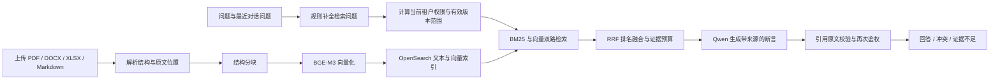

# RAG、记忆与 LangGraph 的实际分工

核查日期：2026-10-08。内容依据当前代码与本地配置，不把实验开关当作已启用功能。

## RAG 链路

1. **入库**：原文件默认存于 `.runtime/files`；PostgreSQL 保存文档、版本、分块正文与来源位置。
   PDF 保留页码/坐标，DOCX 保留标题/段落，XLSX 保留工作表/单元格。按结构分块，默认约
   700 字符、100 字符重叠；这是字符窗口，另用 token 估算限制生成上下文。
2. **索引**：本地 Ollama 的 BGE-M3 生成 1024 维向量。OpenSearch 保存检索所需的正文、
   文档标识、版本、租户与向量。索引成功并在事务中复核权限/修订号后，才发布新 active version。
3. **查询**：当前配置为 `rewrite_mode=rule`、`retrieval_mode=hybrid`。先重算用户能读的当前版本，
   把租户和版本过滤放入 BM25 与向量查询，两路排名用 RRF 融合。命中后从业务库取原文并再次鉴权。
4. **证据选择**：按题型取候选，最多 8 段；使用文档/来源配额及上下文 token 预算。多来源问题
   可按问题明确提及的来源分路检索。当前单独的 cross-encoder rerank 未启用。
5. **生成与验证**：本地 Qwen2.5 7B 输出结构化断言、证据 ID 和原文引用；程序验证引用 ID 与
   引文确实在来源中，并在返回前复核权限。证据不足可拒答，检测到冲突时保留冲突双方。
   引文存在不等于逻辑推断正确；复杂否定、比较和语义充分性仍有待正式质量验证。

单轮 `/api/chat` 与 Agent 工具共用 `app/retrieval.py`。LangGraph 的 workflow、dynamic、hybrid、planner
决定何时搜索、补搜、查版本和结束，均调用这条授权检索链路。共享任务契约（比较、条件、版本）
已默认开启：`task_contract_enabled=true`；回答契约、语义控制和若干检索实验仍是显式开关，
当前 `answer_contract_enabled=false`、`semantic_slot_control_enabled=false`。

## 三层记忆

| 记忆 | 保存位置 | 具体用途与边界 |
| --- | --- | --- |
| 短期对话上下文 | React 页面状态；最近 10 个问题随 `/api/chat` 回传 | 补全“它的时限呢”等追问；刷新后此上下文不自动恢复。回答历史另外存 PostgreSQL，不是完整对话 session |
| Agent 工作记忆 | PostgreSQL 的 LangGraph 官方检查点；任务、事件和工具审计也存 PostgreSQL | 检查点保存当前图状态、观察摘要、已检索证据和待执行节点；业务表保存结果、累计预算、租约与审计。按租户/用户/任务隔离，恢复时重新鉴权 |
| 长期用户记忆 | 独立 `llm-long-term-memory` 服务的 SQLite 与 NumPy 向量文件 | 跨会话保存用户角色、偏好和范围；按受信 `tenant:user` 命名空间隔离，不能充当企业文档证据 |

长期服务的 SQLite 保存原始 session/turn、结构化 memory、来源、类型、状态和生效时间范围；
向量保存在 `stores/*-index.npy`，ID 映射在 `*-index.ids.json`，另有校验 manifest。
数据库通常位于 `stores/*.db`，具体名称和目录由该服务的配置决定。本 RAG 仓库通过
`agent/memory_adapter.py` 调用其 REST API，复用独立记忆项目，不再另外保存一份永久偏好库。

写入是显式 `POST /api/agent/memories`，再转到记忆服务的 `/v1/messages`；不会自动把每次回答
写成长期记忆。读取需任务明确 `use_memory=true`，调用 `/v1/memories/search`，最多注入 3 条、
单条 240 字、总计 600 字。偏好正文仅供生成使用，动态策略观察只接收数量等摘要。
本地已配置记忆服务 URL 与 4 个用户命名空间 token，但任务默认 `use_memory=false`；
此核查没有验证服务当前健康，也没有写入新记忆。

## 框架复用核查

已直接使用 LangGraph 的节点、条件边、循环、子图、官方 PostgreSQL/SQLite checkpointer 和
`invoke(None, config)` 恢复。本轮又使用官方 `durability="sync"` 保证先持久化再推进节点。

仍保留 ACL、文档版本协议、证据绑定、累计预算、工具审计和 worker 队列领取。工具账本用于
鉴权后的幂等复用与崩溃窗口处理，不是一套通用图执行器。同步节点的累计总时限与框架异步
节点 timeout 有明确差异，原因已记入 [项目报告 §2.3.1](PROJECT_REPORT.md#231-langgraph-编排与恢复边界2026-10-02-迁移)。

后续新增通用能力应先用框架已有 API；这些约定写在 [AGENTS.md](AGENTS.md)。
