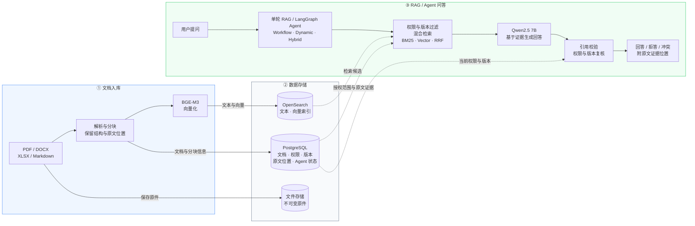

# Agentic-RAG

**面向企业知识库的 RAG 与 Agent 问答系统。**

支持多格式文档检索、权限控制、版本管理及多步问答。系统从用户有权访问的文档中检索证据，生成带有原文引用的回答；证据不足时提示无法回答，检测到资料冲突时展示冲突来源。

[在线展示](https://agentic-rag.pages.dev/) · [系统演示](https://agentic-rag.pages.dev/live) · [项目报告](PROJECT_REPORT.md)

## 核心功能

- **文档检索**：支持 PDF（文本型）、DOCX、XLSX 和 Markdown 上传与解析，结合 BM25、BGE-M3 向量检索和 RRF 排名融合，实现跨文档知识问答。
- **权限与版本管理**：按租户、用户与用户组控制文档访问，权限过滤进入检索查询，返回回答前再次鉴权；新版本先完成索引再发布，支持版本比较与权限撤销。
- **Agent 多步问答**：基于 LangGraph 实现 Workflow、Dynamic Agent 和 Hybrid Agent，支持多轮检索、信息补查和版本比较，通过官方 PostgreSQL 检查点支持任务中断恢复。
- **可验证引用**：回答关联原始文档证据，可定位 PDF 页码与区域、DOCX 标题与段落、XLSX 工作表与单元格，并校验引文与来源是否对应。
- **受控执行**：工具参数校验、调用审计、累计模型与工具调用预算及执行时限共同约束 Agent；恢复任务时重新校验权限与版本，继续累计预算。

## 技术栈

| 层次 | 技术 |
| --- | --- |
| 后端与接口 | Python、FastAPI、Pydantic |
| Agent 编排 | LangGraph、官方 PostgreSQL Checkpointer |
| 数据与检索 | PostgreSQL、SQLAlchemy、Alembic、OpenSearch |
| LLM 与混合检索 | Qwen2.5 7B Instruct、Ollama、BGE-M3、BM25、RRF |
| 文档解析 | Docling、python-docx、openpyxl |
| 前端与证据展示 | React、TypeScript、Vite、PDF.js |
| 本地环境 | Docker Compose、uv |

### 系统架构



实线表示主流程与入库写入，虚线表示存储层为检索、证据读取和校验提供数据。图中省略后台 Worker、检查点写入与审计连线，详细机制见 [项目报告](PROJECT_REPORT.md)。

- **文档入库**：解析文档、保留原文位置并生成向量；原件保存在文件存储，业务数据写入 PostgreSQL，文本与向量写入 OpenSearch。新版本完成索引并确认可检索后才发布。
- **数据存储**：PostgreSQL 管理权限、版本、证据原文及 Agent 状态，OpenSearch 负责关键词与向量检索；检索命中后从 PostgreSQL 读取原文并复核权限。
- **RAG / Agent 问答**：单轮 RAG 与 Agent 共用授权检索链路；Agent 可按观察结果补查证据或比较版本。LangGraph 负责节点调度与检查点恢复，累计预算和工具审计由业务层控制。生成后再次核对引用、权限与版本；引文存在于来源中不等于模型推理一定正确。

## 在线演示

- [项目展示](https://agentic-rag.pages.dev/)：界面截图、系统架构与设计说明。
- [系统演示](https://agentic-rag.pages.dev/live)：以虚构企业“星桥软件”为场景，体验文档问答与证据定位。访客账号只读并设有每日额度；演示通过 Cloudflare 隧道连接作者本机，本机与隧道在线时可用。

## 本地运行

环境要求：Docker、Python 3.13、Node.js 22.12+、uv。

在仓库根目录执行以下命令（macOS）：

```bash
make setup   # 安装依赖，首次创建 .env
make infra   # 启动 PostgreSQL 与 OpenSearch
make models  # 下载并校验本地 Ollama 与模型
make migrate # 执行数据库迁移
make seed    # 导入演示文档与账号
make web     # 构建前端
make run     # 启动 API、后台 Worker 与本地模型服务
```

首次运行需下载数 GB 模型。其他系统将 `make models` 替换为 `make models-cpu`，通过 Docker 启动 Ollama 并下载模型。

启动后打开 [本地应用](http://127.0.0.1:8000)。登录页列出演示账号，密码见 `.env` 中的 `RAG_DEMO_PASSWORD`；配置项参考 [.env.example](.env.example)。

## 详细文档

- [项目报告](PROJECT_REPORT.md)：系统设计、实现细节、实验记录、当前进度与局限。
- [RAG 与记忆机制](RAG_AND_MEMORY.md)：检索流程、三层记忆及 LangGraph 的职责边界。
- [Benchmark 评测包](benchmarks/enterprise_rag/v1/README.md)：统一评测设计、方法比较与审核规则。

## License

[MIT](LICENSE)
