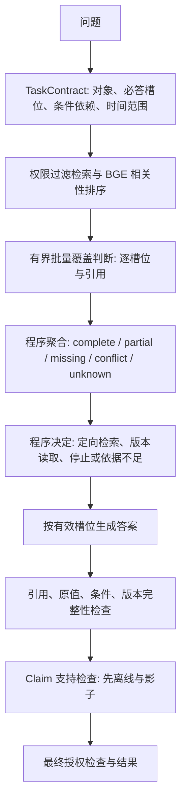

# Hybrid 与语义证据评估：现状、结果与下一阶段计划

日期：2026-10-01。本文是规划，不表示以下候选已实现或通过验收。核对依据为当前代码、PROJECT_REPORT.md §20.22–20.24，以及三份冻结实验产物。未修改运行配置、代码或历史评测结果。

2026-10-02 更新：P0 / P1 已完成工程候选与回归验证，详见 [P0 / P1 实现与验收记录](P0_P1_RESULTS.md)。答案契约仍默认关闭；下文 P2–P4 保持后续规划。原始结果段保持冻结口径，修正指标见独立派生审计。

2026-10-02 后续更新：P2–P4 工程候选、独立审核包、隔离影子和新 70 题候选已实现，详见 [P2 / P3 / P4 实现与验证记录](P2_P4_RESULTS.md)。独立人工标签仍为 0，中文尚缺独立 dev 来源；组件校准、正式成对回放及新题正式验收未完成，开关保持关闭。未提交。

2026-10-02 继续修复更新：影子已改为有界后台抽样，补齐实际 QA 生成上下文、未知前提、裁判期间撤权和缓存诊断；组件预测可逐条续跑并去重。新增 6 份隔离的合成中文开发文档，经 18 次实际问答补齐中文 dev；其代表性仍待人工审核。最新独立审核输入为 `review-r4/expanded-distinct.json` 的 2,419 条，260 条 dev-only 试点与本地审核界面已准备。430 项单元和 9 项真实集成验证通过。人工标签仍为 0，后续正式校准/成对验收/新 70 题仍未过关；下文“新增中文来源”为前期规划缺口，不表示仍无合成 dev 数据。

## 1. 当前在做什么

项目已从企业 RAG 基础建设进入“有界 Agent 与证据判断”的验证阶段。

- Hybrid v1–v3 将模型职责缩小为信息意图；ID 绑定、工具执行、版本遍历、恢复、预算与鉴权由程序执行。
- 语义证据评估试图分别判断相关性、覆盖、充分性与最终断言支持，替代影响检索和停止的字面代理。
- 已完成组件实验、Hard 30 影子运行、拆分器修复与 35 题四路冻结实验。
- 当前仍默认固定 Workflow；semantic_coverage_shadow 与 semantic_coverage_control 默认关闭。Hybrid 与语义控制均作为实验能力保留。

这不是再搭建一个 Agent 框架。下一阶段需要证明证据判断能改善真实答案，同时保持终止性、权限边界与成本。

## 2. 已有结果

### 2.1 新任务集

35 题、新租户、22 份逻辑文档、7 类任务，四路共 140 次运行。各路生成模型均为 Qwen2.5 7B；只有 Hybrid semantic 使用 Qwen3.5 9B 判断覆盖。

| 方式 | 任务成功 | 答案正确 | P50 秒 | P95 秒 |
| --- | ---: | ---: | ---: | ---: |
| RAG | 20/35 | 26/35 | 20.8 | 原始汇总 39.8，首题耗时缺失，解释需保留限制 |
| 固定 Workflow | 27/35 | 27/35 | 28.4 | 45.0 |
| Hybrid 字面 | 23/35 | 26/35 | 30.5 | 54.6 |
| Hybrid 语义 | 23/35 | 27/35 | 正常 34 题 69.1；原始 35 题汇总 68.7 | 原始汇总 144.8 |

Workflow 与 Hybrid 的任务成功配对差异 p=0.22；答案正确数的两两比较均未显著。不能宣称 Workflow 已被统计证明更好，也不能宣称语义版提高了系统质量。

“隐含链接”题面暴露了链接线索；首次检索能同时找到两份资料，但评分要求后一步才出现第二份资料，偏向额外调用工具的流程。冻结成绩保留，新的评分器应允许同一轮已获得充分证据的有效路径。

U18/U21 是条件不成立仍输出后续分支；原始 artifact 的 security_leaks 字段仍把 forbidden_present 汇总为 2。应新增区分条件违约与 ACL 泄露的派生报告，保留原始文件与旧口径。受限文档题未观察到 ACL 内容泄露。

U29 出现真实不终止缺陷。已修复重复被拒动作被算作进展的问题，新增测试在旧代码失败、新代码通过。报告记录修复后 322 passed / 25 skipped；这不是今天重新执行的测试结果。旧 unseen 成绩仍保留一次执行失败。

### 2.2 语义组件

893 个相关性对、411 个覆盖样本，覆盖 test 实际为 274 个。标签按事实串是否出现在证据中机械生成，未独立人工复核。

| 覆盖 test 指标 | 字面 | 语义规则 B |
| --- | ---: | ---: |
| macro-F1 | 0.244 | 0.639 |
| supported precision | 0.431 | 0.893 |
| supported recall | 0.901 | 0.604 |
| 非 supported 错判为 supported | 132/163 | 8/163 |

规则 B 在 dev 上未达到预设 0.85 supported precision，只是三种候选中精度最高的一种；test 总体提升不能倒过来宣布 dev 启用门禁已通过。

按语料拆分：中文 supported P/R 为 0.927/0.900，英文为 0.571/0.098。统一分数阈值存在明显迁移问题。partial 精度只有 0.25；矛盾 test 仅 5 例，不足以验证冲突边界。

Hard 30 影子中“字面足够、语义不足”的 7 题全部成功；影子没有发现可以确认的提前停止错误。每题增加约 28 秒、1.57 次 judge。新任务正常 34 题约 1.62 次 judge、35 秒判断开销；U29 的循环调用与成本必须另报，不能从系统事故成本中删除。

## 3. 原计划哪些尚未完成

1. **逐槽位结构尚未闭环。** EvidenceJudgment 有自由文本 missing_slots；尚无服务器绑定的 SlotSpec、slot_id 和逐槽位判定，不能证明复合问题每项都覆盖。
2. **充分性尚未统一驱动行为。** update_semantic_coverage 直接用 status==supported 设置 covered；aggregate_coverage 还使用模型自报 confidence>=0.6。二者可能给出不同的“完成”结果，而实验已发现 confidence 缺少判别信息。
3. **支持引用与高分证据没有严格绑定。** 规则 B 检查该子目标所有候选中的最高相关性，不要求高分片段就是 support_refs 中的片段。相关性不是蕴含证明。
4. **最终忠实度仍为相关性影子。** claim_support 复用 BGE 分数与 2.44 阈值，仅二分类，现有组件明确不适合作答案拦截。不能声称 claim entailment 门禁已完成。
5. **未知与不支持混用。** judge 故障、遗漏或无候选会返回 unsupported，可能把技术不可判定误解释为资料不足；需额外保存评估有效性。
6. **范围判断主要靠提示。** judge 获得标题和正文，主体/指标/版本/适用时间等尚未形成完整可校验结构。证据互相冲突与证据反驳某个命题也须分开。
7. **运行状态与成本留痕仍不完整。** _public 主要保存 covered，未完整持久化各槽位状态；judge 异常调用计数与重复调用预算需明确。评测 runner 只在结束时写文件，曾依赖数据库恢复。

这些是代码审计发现的设计缺口，不是已经证明会造成某一题失败的独立因果实验。

## 4. 下一阶段架构



相关性回答“有没有用”；覆盖回答“这一必答项有没有得到答案”；充分性回答“当前有效必答项是否全部满足”；忠实度回答“输出的断言是否由自己的引文支持”。它们不能共享一个相似度阈值。

拟定结构：

```text
TaskContract
  intent, subgoals, slots, conditions, requested_time_scope
SlotSpec
  slot_id, subgoal_id, subject, attribute, required, applies_if,
  value_type, unit, requested_versions
SlotJudgment
  slot_id, status: supported|partial|unsupported|contradicted,
  support_refs, quote_spans, missing_requirements, reason_code,
  evaluation_validity: evaluated|unavailable|truncated|ambiguous
ConditionState
  condition_id, predicate, operands_with_refs,
  result: true|false|unknown, active_slot_ids
SufficiencyState
  complete, partial, missing, contradicted, unknown,
  inactive_slots, version_chain_complete
ClaimJudgment
  claim_id, cited_refs, status, reason_code, evaluation_validity
```

程序持有真实 ID 与原文位置，模型引用局部编号；服务端验证字段与来源。条件判定对明确数值、日期、枚举关系使用程序计算；复杂关系保留 unknown，不能把未知当 false。SUPPORTED 是“问题所需答案被支持”；答案是 no 并不自动意味着该槽位 CONTRADICTED。

## 5. 分阶段执行

以下为建议工程工期，按单人工作量估算；人工标注等待与本地模型运行另计。各阶段以门禁完成为准，约 10–15 个工作日。

### P0：稳定运行和可解释评分（1–2 天）

- 原始冻结 artifact 保留；新增派生汇总，分别报告 answer_correct、完整性、条件违约、ACL 泄露、终止失败与过程效率。
- 缺失耗时记 unknown，不能填 0 参与分位数；正常任务成本与失败成本并列报告。
- runner 每题原子保存/追加，续跑校验全部哈希；冻结运行使用不可变代码快照，不读取开发中改动。
- 除工具步骤外另设有限的 policy attempts、judge calls、累计 judge tokens 和任务 deadline。重复请求无状态变化不得重置进展，耗尽预算必须落入终态。
- 补齐 judge attempted/succeeded/failed 调用计数、生成与裁判独立 token、模型版本与实际开关日志。

验收：重复意图、故障、取消、权限变化、进程恢复均有明确终态；保存的结果可从 checkpoint 一致恢复；指标名称与原始观察对得上。

### P1：修复所有方式共享的答案问题（3–4 天）

复用 planner.subgoals、acceptance_items、question_slots、版本工具和现有引用检查，在共同生成链路引入 TaskContract，先作为实验开关。

- **比较：** 两个对象的原值与单位是独立必答槽位；差值另算、独立输出并保留两方引用。只给差值不能算完成。缺原值最多一次定向补答，不能无限修复。
- **条件：** 显式保存前提与后续槽位的依赖；前提先取证，再由程序对明确关系判真/假。false 不激活分支；unknown 不贸然执行。最终检查答案没有把未激活分支表述成已成立。
- **版本：** 已授权版本链按 version_id 和显式适用期保存属性值；区分当前值、首次值、历次变化和指定日期值。只读当前版本不得宣称“始终不变”；不同版本的值不自动算冲突。
- **恢复：** 复查 U01 类首次检索不充分即终止的情况，在剩余预算内采用现有一次恢复机制，按新的一般性案例验证。

旧 U24/U26、U18/U21、U27–U30 仅作开发回归；另建独立开发例子覆盖不同对象、单位、否定、边界日期和多条件，不按题号或题面特例实现。

验收：比较完整性、条件真/假/未知、版本变化/不变/缺版本/撤权都有回归；同样机制在 RAG、Workflow、Hybrid 可用；已有权限与引用边界不退步。

### P2：先把语义评估器校准到实际输入（3–5 天，依赖人工标签）

- 复用 BGE、现有 EvidenceJudgment、影子事件与评测脚本；新增 SlotSpec、有效性状态和统一 aggregator，避免重复评估框架。
- 先做小规模标注试点：100 相关性对、80 覆盖样本、80 claim/evidence 对，用于审核任务定义与标签规范。试点属于开发数据。
- 扩大至建议最低 300 相关性对、240 覆盖样本、120 claim/evidence 对；这只是起始规模，置信区间过宽时扩大新的测试样本。
- 输入必须来自实际拆分后的 subgoal/slot 与实际生成证据；覆盖同义表达、仅相关、半覆盖、错误主体、否定范围、不同时间/版本与真冲突。
- 独立人工标注，争议复核；助手或模型可预标，但不计作独立人工标签。当前人工审核 0，需要安排审核者，这是外部依赖。
- 同一问题及其证据变体放在同一分区；尽量按来源/主题/版本家族隔离 dev 和 test。中文企业与英文新闻分别报告，不能用综合值掩盖某一语料退步。
- 只在 dev 选择 relevance 的召回切点、coverage 的高精度规则；模型自报 confidence 不作启用依据。基准先保留 lexical、BGE-only、当前规则 B，再比较新候选。
- 对多个槽位公平分配裁判上下文；所有引用和原文范围重新授权。没有新增证据时不重复裁判；缓存键含槽位、证据内容/版本哈希、评估器版本，缓存复用前重新检查权限。

拟议组件门槛，运行前固定：每个目标语料相关性 recall≥0.95；coverage supported precision≥0.95、recall≥0.80；macro-F1 比 lexical 至少高 0.10；partial 单列；冲突按同范围与异范围分别报告。所有指标报告置信区间；证据不足不自动算过关。

claim 忠实度单独校准，先离线与影子；现有 BGE 分数只能当候选优先级信号。四分类缺少可信标签时不启用生产拦截。评估器不可用返回 unknown，不改变事实判断。

### P3：影子与成对回放（2–3 天）

- 在已使用开发题上检验槽位完整性与语义分歧，不调 Hard 30 阈值。
- 将分歧分为：字面提前完成、语义误拒、拆分错误、裁判上下文遗漏、引用失配、真实缺证据；对分歧进行独立审核。
- 证明 shadow 开关不改变工具、证据或答案；单独记录 shadow 增加的耗时。
- 新语义组件过门槛后才做同代码快照的 lexical/semantic 成对回放；此处只切换 evaluator，生成、policy、检索保持相同。
- 再用短路、同证据缓存、歧义时单次批量判断控制成本，分别验证每项改动，不同时换模型。

拟议成本门槛：平均 judge≤0.5 次/任务；相对同版 lexical P50≤1.25 倍、P95≤1.30 倍、总 token≤1.30 倍；无终止失败与权限泄露。若实际预算做不到，则保留离线评估用途。

### P4：新的冻结正式验收（冻结后运行约 1–2 天，取决于本机速度）

- 旧 Hard 30、35 题 unseen v1 现在都只作开发/回归资产。
- 建议另建 70 题、7 类各 10 题，覆盖简单停止、多跳、隐含链接、条件、比较、时间版本、不可回答；叠加权限拒绝/撤权的受控安全验证。
- 隐含链接先做基准设计审查：问题不能直接暴露第二跳对象；仍允许一次检索偶然获得充分证据时合法停止。能力轨迹作诊断，答案质量不奖励多调用一次工具。
- 所有题由独立审核者核定问题、必答项、证据必要性、条件真值、版本范围和评分；答案正确检查包含完整性与语义支持，不能仅靠字符串。
- 冻结任务/文档/语料、完整代码依赖、运行时/模型摘要、阈值、scorer、开关、步骤/调用/token/时间预算；按题轮换各 arm 先后顺序。
- 比较三路基线 RAG、Workflow、Hybrid lexical；仅当 P2/P3 已通过才加入 Hybrid semantic。每路唯一配置，结果保存后不覆盖。
- 正式运行前在开发题验证运行间波动；如需重复 trials，应在冻结前写定。一次正式运行采用修复后的不可变代码；中断只能按相同快照恢复。

拟议系统门槛：候选相对同版基线任务成功与完整答案正确率都改善，主要指标至少 +5 个百分点；配对置信区间支持正向收益；null 误答、条件违约不增，ACL 泄露/终止失败为 0，且成本门槛通过。70 题仍可能统计功效不足；区间跨 0 时结论是证据不足，下一轮另冻新集，不放宽旧门槛。

报告必须包括逐类 Task Success、Answer Correct、Early-stop error（含未适用的分母）、Over-planning、恢复率、必需文档/实际事实片段覆盖、条件违约、ACL 泄露、执行错误、P50/P95、生成/policy/judge token、judge 调用与耗时。

## 6. 达不到门槛时怎么收敛

- 共享答案契约通过且无回退，可单独进入默认 Workflow；不以 Hybrid 胜出为先决条件。
- 语义组件好、端到端没收益：保留离线诊断/低频影子，关闭运行时控制。
- 语义组件本身不稳：先修标签与输入分布，不继续扩大 Agent。
- 可信原文已完整进入生成而答案仍错：另做“只换生成模型”的小规模上限实验；不把它归作 evaluator 或 policy 失败。
- 只有明确观察充分、动作目标明确却反复选错的未解决策略失败，才重启后训练评估。当前没有足够依据做 SFT/RL。
- 自适应路由需要新的分层数据证明“某类题适合某一路，且分类器能可靠识别”；当前四路答对率持平，不支持实现或启用新 router。

## 7. 每阶段应交付的资产

1. 状态与指标审计：旧结果的只读派生汇总、指标定义、运行事故成本与恢复一致性。
2. 共享 TaskContract、ConditionState、版本值记录、答案完整性回归及候选开关。
3. 独立标注的 relevance/slot-coverage/claim-support 数据、分区与标签来源、组件报告与冻结阈值。
4. shadow disagreement 复核包、成对开发回放与 judge 成本报告。
5. 新 unseen v2 的冻结清单、原始运行、成对统计与启用/拒绝决策。
6. 失败清单按 contract/splitter、retrieval、evaluator、controller/policy、generation、scorer、infrastructure 分层，保留多因素与未知，不强行归因。

规划结束条件是：明确哪些机制可以默认启用，哪些机制仅作实验，以及这个结论的质量、成本和安全证据。未通过门槛的实验有负结果也算阶段完成，但不能包装成质量提升。
